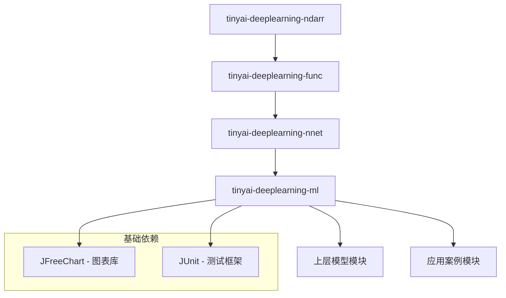
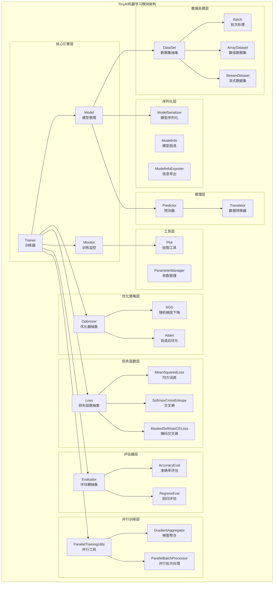
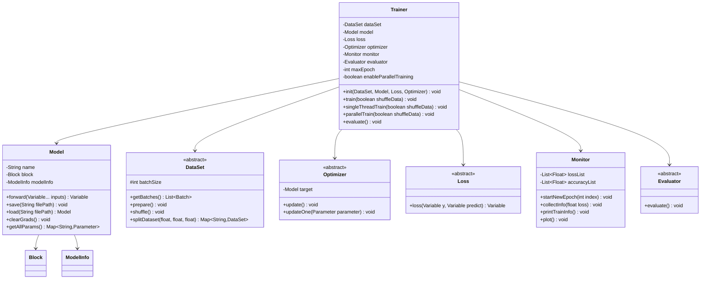
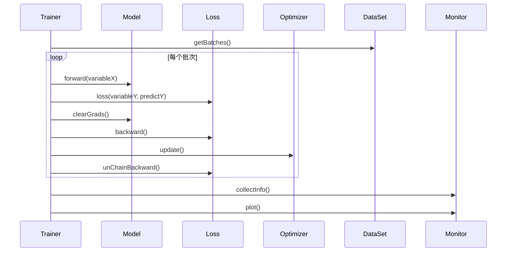
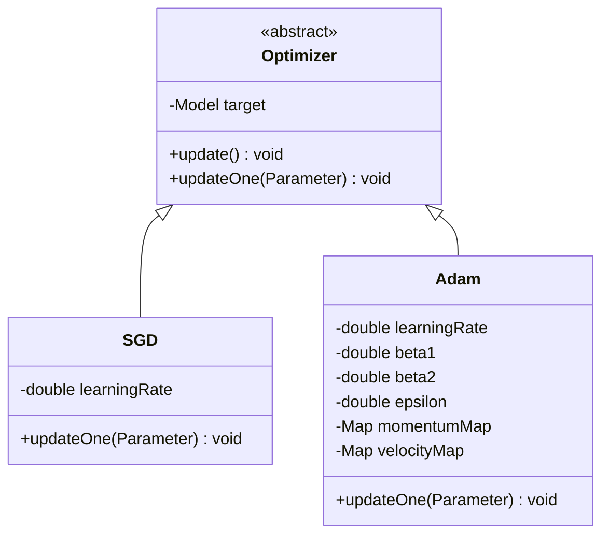
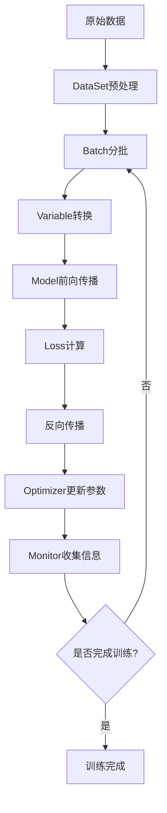
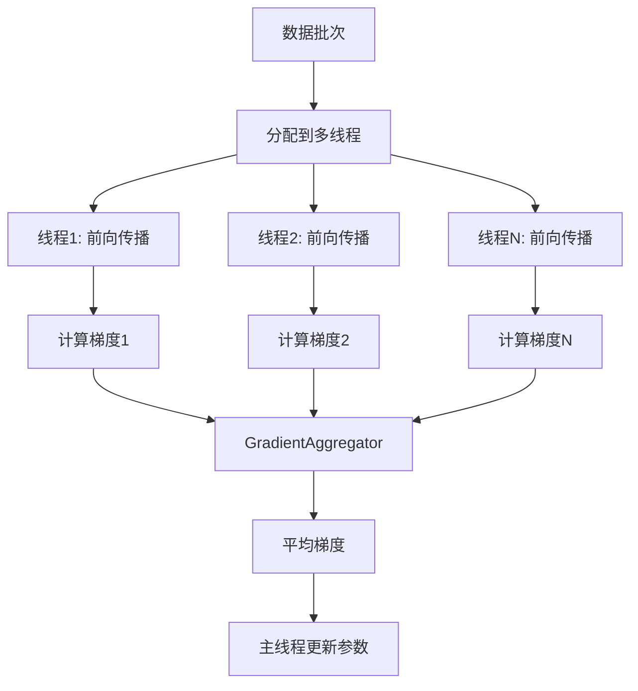

# TinyAI机器学习模块(tinyai-deeplearning-ml) 技术架构文档

## 1. 模块概述

### 1.1 模块介绍
TinyAI机器学习模块(tinyai-deeplearning-ml)是TinyAI深度学习框架的核心训练层，提供了完整的机器学习模型训练、评估和推理功能。该模块构建于基础计算层(tinyai-deeplearning-ndarr)、自动微分层(tinyai-deeplearning-func)和神经网络层(tinyai-deeplearning-nnet)之上，为上层模型实现和应用案例提供统一的机器学习接口。

### 1.2 设计理念
- **模块化设计**: 将模型管理、训练控制、优化算法、序列化存储等功能分离到不同组件
- **简洁易用**: 提供统一接口和清晰抽象层次，让开发者专注于模型设计而非底层实现
- **可扩展性**: 支持从简单线性回归到复杂深度神经网络的各种应用场景
- **高性能**: 支持单线程和并行训练两种模式，提升训练效率

### 1.3 模块依赖


## 2. 整体架构设计

### 2.1 分层架构


### 2.2 核心组件关系


## 3. 核心组件详解

### 3.1 Model - 模型管理核心
`Model`类是TinyAI框架中模型的核心表示，负责模型的完整生命周期管理。

#### 3.1.1 核心功能
- **模型结构管理**: 封装神经网络架构(Block)
- **模型序列化**: 支持完整模型、参数、检查点等多种保存方式
- **模型推理**: 提供预测接口
- **模型信息管理**: 维护模型的元数据信息

#### 3.1.2 关键方法
```java
// 模型前向传播
public Variable forward(Variable... inputs)

// 模型序列化
public void saveModel(String filePath)
public void saveParameters(String filePath)
public void saveCheckpoint(String filePath, int epoch, double loss)

// 模型加载
public static Model loadModel(String filePath)
public void loadParameters(String filePath)

// 模型状态管理
public void resetState()
public void clearGrads()
```

#### 3.1.3 设计模式应用
- **组合模式**: 通过Block组合复杂的神经网络结构
- **策略模式**: 支持不同的序列化策略
- **观察者模式**: 与Monitor配合收集训练信息

### 3.2 Trainer - 训练流程控制器
`Trainer`类是模型训练的核心组件，提供完整的训练流程管理功能。

#### 3.2.1 训练模式
- **单线程训练**: 传统的顺序训练模式
- **并行训练**: 支持多线程并行处理批次数据

#### 3.2.2 训练流程设计


#### 3.2.3 并行训练实现
- **梯度聚合**: 通过`GradientAggregator`聚合多线程梯度
- **批次并行**: 通过`ParallelBatchProcessor`并行处理批次
- **资源管理**: 自动管理线程池生命周期

### 3.3 DataSet - 数据集抽象层
数据集模块提供了灵活的数据处理能力，支持多种数据源和处理方式。

#### 3.3.1 数据集类型
- **ArrayDataset**: 基于内存数组的数据集
- **StreamDataset**: 支持流式数据处理的数据集

#### 3.3.2 数据处理能力
- 批次数据生成
- 数据随机打乱
- 数据集分割(训练/测试/验证)
- 数据预处理支持

### 3.4 优化器系统
优化器模块实现了多种参数优化算法。

#### 3.4.1 优化算法
- **SGD**: 随机梯度下降
- **Adam**: 自适应学习率优化算法

#### 3.4.2 优化器架构


### 3.5 损失函数系统
损失函数模块提供了多种损失计算方式。

#### 3.5.1 损失函数类型
- **MeanSquaredLoss**: 均方误差损失(回归任务)
- **SoftmaxCrossEntropy**: Softmax交叉熵损失(分类任务)
- **MaskedSoftmaxCELoss**: 掩码Softmax交叉熵损失(序列任务)
- **Classify**: 分类损失函数

### 3.6 评估器系统
评估器模块提供了模型性能评估功能。

#### 3.6.1 评估器类型
- **AccuracyEval**: 准确率评估器
- **RegressEval**: 回归任务评估器

### 3.7 Monitor - 训练监控器
`Monitor`类提供训练过程的监控和可视化功能。

#### 3.7.1 监控能力
- 训练损失值收集和存储
- 验证集损失值收集和存储
- 训练准确率收集和存储
- 验证集准确率收集和存储
- 训练时间记录
- 训练信息可视化展示
- 训练日志保存

#### 3.7.2 可视化功能
通过集成JFreeChart库，提供训练过程的图表展示：
- 损失曲线图
- 准确率曲线图
- 训练时间统计

## 4. 设计模式应用

### 4.1 策略模式
在优化器、损失函数、评估器等组件中广泛使用策略模式，允许在运行时选择不同的算法实现。

```java
// 优化器策略
Optimizer optimizer = new Adam(model, 0.001);
// 或者
Optimizer optimizer = new SGD(model, 0.01);

// 损失函数策略
Loss loss = new SoftmaxCrossEntropy();
// 或者
Loss loss = new MeanSquaredLoss();
```

### 4.2 组合模式
Model类通过Block组合复杂的神经网络结构，支持任意深度和复杂度的网络架构。

### 4.3 观察者模式
Monitor与训练过程配合，自动收集和记录训练信息。

### 4.4 工厂模式
在模型序列化、数据集创建等场景中使用工厂模式，简化对象创建过程。

## 5. 数据流与计算流程

### 5.1 训练数据流


### 5.2 并行训练数据流


## 6. 性能优化设计

### 6.1 并行训练优化
- **线程池管理**: 自动根据系统资源和批次数量配置线程数
- **梯度聚合**: 高效的梯度平均算法
- **内存优化**: 避免不必要的模型复制

### 6.2 内存管理
- **梯度清零**: 及时清理梯度累积，避免内存泄漏
- **计算图剪枝**: 通过`unChainBackward()`释放计算图内存
- **状态重置**: 为RNN等有状态模型提供状态清理

### 6.3 序列化优化
- **压缩存储**: 支持压缩格式的模型序列化
- **增量保存**: 支持仅保存参数而非完整模型
- **检查点机制**: 支持训练过程中的断点续训

## 7. 扩展性设计

### 7.1 接口扩展
- 所有核心组件都基于抽象接口设计，便于扩展新的实现
- 支持自定义优化器、损失函数、评估器等组件

### 7.2 模块化扩展
- 清晰的模块边界，便于添加新的功能模块
- 统一的依赖注入机制，降低组件间耦合

### 7.3 平台扩展
- 基于NdArray抽象，支持多种计算后端
- 设计支持分布式训练的扩展点

## 8. 使用示例

### 8.1 基本训练流程
```java
// 1. 创建数据集
DataSet dataSet = new ArrayDataset(batchSize);
dataSet.prepare();

// 2. 创建模型
Block block = new MlpBlock("MLP", batchSize, null, inputSize, hiddenSize, outputSize);
Model model = new Model("ClassificationModel", block);

// 3. 配置训练组件
Loss loss = new SoftmaxCrossEntropy();
Optimizer optimizer = new Adam(model, 0.001);
Monitor monitor = new Monitor();
Evaluator evaluator = new AccuracyEval(model, dataSet.getTestDataSet());

// 4. 创建训练器并训练
Trainer trainer = new Trainer(maxEpochs, monitor, evaluator);
trainer.init(dataSet, model, loss, optimizer);
trainer.train(true);

// 5. 保存模型
model.saveModel("model.bin");
```

### 8.2 并行训练配置
```java
// 启用并行训练
Trainer trainer = new Trainer(maxEpochs, monitor, evaluator, true, 4);
trainer.init(dataSet, model, loss, optimizer);
trainer.train(true);

// 训练完成后释放资源
trainer.shutdown();
```

## 9. 测试与质量保证

### 9.1 单元测试覆盖
模块提供了完整的单元测试覆盖，包括：
- 核心组件功能测试
- 并行训练正确性测试
- 序列化功能测试
- 性能基准测试

### 9.2 集成测试
- 端到端训练流程测试
- 不同组合配置的兼容性测试
- 错误处理和异常恢复测试

## 10. 总结

TinyAI机器学习模块通过清晰的分层架构和模块化设计，提供了一个功能完整、易于使用和扩展的深度学习框架核心。该模块不仅支持传统的单线程训练，还创新性地提供了并行训练能力，在保持简洁性的同时提升了训练效率。

模块的设计充分体现了软件工程的最佳实践，通过合理的设计模式应用、接口抽象和组件分离，构建了一个高内聚、低耦合的系统架构。这为上层模型实现和应用开发提供了坚实的基础，也为框架的持续演进留下了充分的扩展空间。