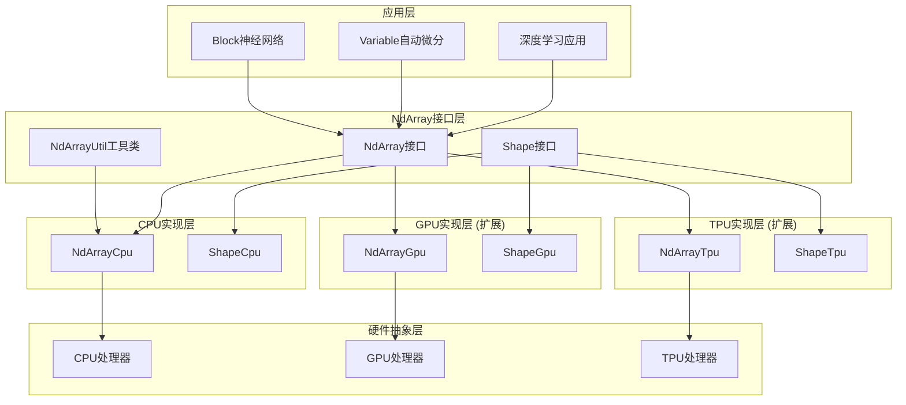

# TinyAI-NdArray多维数组库技术架构文档

## 目录
1. [项目概述](#项目概述)
2. [技术架构](#技术架构)
3. [核心组件](#核心组件)
4. [设计模式](#设计模式)
5. [数据结构设计](#数据结构设计)
6. [API设计](#api设计)
7. [性能优化](#性能优化)
8. [扩展性设计](#扩展性设计)
9. [测试架构](#测试架构)
10. [部署配置](#部署配置)

## 项目概述

### 模块定位
TinyAI-NdArray（`tinyai-deeplearning-ndarr`）是TinyAI深度学习框架的核心基础数据结构模块，提供高性能的多维数组操作和计算功能。作为整个框架的底层基础，它为上层的自动微分引擎、神经网络构建单元等提供强大的数值计算支持。

### 核心特性
- **多维度支持**：完整支持标量、向量、矩阵和高维张量操作
- **跨设备抽象**：统一的接口设计支持CPU、GPU、TPU多种计算后端
- **高性能计算**：优化的内存布局和算法实现
- **广播机制**：智能的数组形状广播支持简化运算
- **数值稳定性**：精心设计的数值算法确保计算稳定性

### 技术栈
- **开发语言**：Java 8+
- **构建工具**：Maven
- **测试框架**：JUnit 4
- **设计理念**：接口驱动设计、工厂模式、策略模式

## 技术架构

### 整体架构设计



### 分层架构详解

#### 1. 接口抽象层
- **NdArray接口**：定义所有多维数组操作的统一标准
- **Shape接口**：定义数组形状管理的标准接口
- **NdArrayUtil**：提供静态工具方法

#### 2. 实现层
- **CPU实现**：基于Java原生数组的高性能CPU实现
- **GPU实现**：预留的GPU加速计算实现接口
- **TPU实现**：预留的TPU专用计算实现接口

#### 3. 硬件抽象层
通过接口抽象屏蔽底层硬件差异，实现代码的可移植性

## 核心组件

### NdArray接口设计

NdArray接口是整个模块的核心，定义了多维数组的完整操作集合：

```java
public interface NdArray {
    // 1. 创建函数
    static NdArray of(Number number);
    static NdArray of(float[] data, Shape shape);
    static NdArray zeros(Shape shape);
    static NdArray ones(Shape shape);
    
    // 2. 基础四则运算
    NdArray add(NdArray other);
    NdArray sub(NdArray other);
    NdArray mul(NdArray other);
    NdArray div(NdArray other);
    
    // 3. 数学函数
    NdArray exp();
    NdArray log();
    NdArray sin();
    NdArray tanh();
    NdArray sigmoid();
    NdArray softMax();
    
    // 4. 张量操作
    NdArray transpose();
    NdArray reshape(Shape newShape);
    NdArray dot(NdArray other);
    NdArray broadcastTo(Shape shape);
    
    // 5. 统计聚合
    NdArray sum();
    NdArray mean(int axis);
    NdArray max(int axis);
    NdArray argMax(int axis);
}
```

### Shape形状管理

Shape接口负责管理多维数组的维度信息：

```java
public interface Shape {
    // 静态工厂方法
    static Shape of(int... dimension);
    
    // 维度查询
    int getRow();           // 获取行数（二维）
    int getColumn();        // 获取列数（二维）
    int size();             // 元素总数
    int getDimNum();        // 维度数量
    
    // 类型判断
    boolean isMatrix();     // 是否为矩阵
    boolean isScalar();     // 是否为标量
    boolean isVector();     // 是否为向量
    
    // 索引计算
    int getIndex(int... indices);  // 多维索引转一维
}
```

### NdArrayCpu核心实现

NdArrayCpu是NdArray接口的主要实现类，采用优化的内存布局：

#### 内存布局设计
```java
public class NdArrayCpu implements NdArray {
    // 形状信息
    public ShapeCpu shape;
    
    // 数据存储 - 扁平化一维数组
    public float[] buffer;
    
    // 使用float32减少内存占用并提高缓存效率
}
```

#### 关键特性
- **扁平化存储**：使用一维float数组存储多维数据，提高缓存局部性
- **形状分离**：将数据和形状信息分离，便于形状变换操作
- **类型优化**：统一使用float32类型，在精度和性能间取得平衡

### NdArrayUtil工具类

提供数组操作的高级功能：

```java
public class NdArrayUtil {
    // 数组合并
    public static NdArray merge(int axis, NdArray... arrays);
    
    // 序列生成
    public static int[] getSeq(int size);
    
    // 类型转换
    public static int[] toInt(float[] src);
}
```

## 设计模式

### 1. 接口驱动设计模式
通过接口抽象实现跨设备的统一操作，支持未来的硬件扩展。

### 2. 静态工厂模式
NdArray和Shape都采用静态工厂方法创建实例：
```java
// 简洁的创建API
NdArray array = NdArray.of(data);
Shape shape = Shape.of(3, 4);
```

### 3. 策略模式
不同硬件后端采用不同的计算策略，但对外提供统一接口。

### 4. 建造者模式思想
复杂的数组创建过程通过多个步骤完成，如多维数组的扁平化处理。

## 数据结构设计

### 内存布局优化

#### 扁平化存储策略
```
三维数组 [2][3][4] 在内存中的布局：
逻辑结构：[[[a,b,c,d], [e,f,g,h], [i,j,k,l]], 
          [[m,n,o,p], [q,r,s,t], [u,v,w,x]]]

物理存储：[a,b,c,d,e,f,g,h,i,j,k,l,m,n,o,p,q,r,s,t,u,v,w,x]
索引计算：index = i*12 + j*4 + k  (multipliers = [12,4,1])
```

#### Shape索引计算优化
ShapeCpu使用预计算的乘数数组加速多维索引转换：
```java
public class ShapeCpu {
    public final int[] dimension;    // 各维度大小
    public final int[] multipliers;  // 预计算的乘数
    
    public int getIndex(int... indices) {
        int index = 0;
        for (int i = 0; i < indices.length; i++) {
            index += indices[i] * multipliers[i];
        }
        return index;
    }
}
```

### 广播机制设计

广播机制允许不同形状的数组进行运算：

```java
// 广播示例
NdArray a = NdArray.of(Shape.of(3, 1));  // [3,1]
NdArray b = NdArray.of(Shape.of(1, 4));  // [1,4]
NdArray c = a.add(b);                    // 结果 [3,4]
```

广播规则：
1. 从右侧对齐维度
2. 大小为1的维度可以扩展
3. 缺失的维度视为1

## API设计

### 函数式编程风格

API设计采用函数式编程理念，支持链式调用：

```java
// 链式操作示例
NdArray result = NdArray.of(data)
    .reshape(Shape.of(10, 5))
    .transpose()
    .softMax()
    .sum(1);
```

### 类型安全设计

```java
// 编译时类型检查
public NdArray dot(NdArray other) {
    // 运行时验证矩阵维度匹配
    if (!this.shape.isMatrix() || !other.getShape().isMatrix()) {
        throw new IllegalArgumentException("矩阵乘法要求操作数为矩阵");
    }
    // ...
}
```

### 异常处理策略

统一的异常处理确保API的可预测性：
```java
// 参数验证
if (axis < 0 || axis >= shape.getDimNum()) {
    throw new IllegalArgumentException("轴参数超出数组维度范围");
}

// 维度检查
if (newShape.size() != this.shape.size()) {
    throw new IllegalArgumentException("新形状大小与原形状不匹配");
}
```

## 性能优化

### 内存优化策略

#### 1. 缓存友好的数据布局
- 使用连续的内存布局提高缓存命中率
- float32类型减少内存带宽需求

#### 2. 对象复用
- Shape对象的hashCode缓存机制
- 避免不必要的数组拷贝

### 计算优化策略

#### 1. 数值稳定性
Softmax函数的数值稳定实现：
```java
public NdArray softMax() {
    // 减去最大值避免指数溢出
    NdArray shifted = this.sub(this.max(1).broadcastTo(this.shape));
    NdArray exp = shifted.exp();
    return exp.div(exp.sum(1).broadcastTo(this.shape));
}
```

#### 2. 原地操作优化
某些操作支持原地修改以减少内存分配：
```java
public NdArray addTo(int i, int j, NdArray other) {
    // 直接修改当前数组，避免创建新对象
    // ...
}
```

#### 3. 批量操作
使用System.arraycopy等原生方法进行批量数据操作。

## 扩展性设计

### 硬件后端扩展

通过接口抽象支持多种硬件后端：

```java
// CPU实现
public class NdArrayCpu implements NdArray { ... }

// GPU实现（预留）
public class NdArrayGpu implements NdArray { 
    // CUDA或OpenCL实现
}

// TPU实现（预留）  
public class NdArrayTpu implements NdArray {
    // TPU专用优化实现
}
```

### 数据类型扩展

当前使用float32，未来可扩展支持：
- float64（双精度）
- int32/int64（整数类型）
- bfloat16（半精度）

### 算子扩展

通过函数式接口支持自定义算子：
```java
// 元素级操作扩展
NdArray apply(UnaryOperator<Float> operator);
NdArray apply(NdArray other, BinaryOperator<Float> operator);
```

## 测试架构

### 测试覆盖策略

```
测试模块组织：
├── NdArrayTest.java        # 核心数组操作测试
├── ShapeTest.java         # 形状管理测试  
├── NdArrayUtilTest.java   # 工具类测试
├── TestBroadcast.java     # 广播机制测试
├── TestBroadcastTo.java   # 广播操作测试
└── TestMean.java          # 统计函数测试
```

### 测试分类

#### 1. 单元测试
- 基础API功能测试
- 边界条件测试
- 异常情况测试

#### 2. 集成测试
- 跨组件协作测试
- 复杂运算流程测试

#### 3. 性能测试
- 大规模数据处理性能
- 内存使用效率测试

### 测试数据管理

```java
// 测试用例示例
@Test
public void testMatrixMultiplication() {
    // 准备测试数据
    NdArray a = NdArray.of(new float[][]{{1,2}, {3,4}});
    NdArray b = NdArray.of(new float[][]{{5,6}, {7,8}});
    
    // 执行操作
    NdArray result = a.dot(b);
    
    // 验证结果
    float[][] expected = {{19,22}, {43,50}};
    assertArrayEquals(expected, result.getMatrix());
}
```

## 部署配置

### Maven配置

```xml
<project>
    <groupId>io.leavesfly.tinyai</groupId>
    <artifactId>tinyai-deeplearning-ndarr</artifactId>
    <version>1.0-SNAPSHOT</version>
    <packaging>jar</packaging>
    
    <dependencies>
        <dependency>
            <groupId>junit</groupId>
            <artifactId>junit</artifactId>
            <scope>test</scope>
        </dependency>
    </dependencies>
</project>
```

### 构建配置

#### Java版本要求
- 最低要求：Java 8
- 推荐版本：Java 11+

#### 编译配置
```xml
<plugin>
    <groupId>org.apache.maven.plugins</groupId>
    <artifactId>maven-compiler-plugin</artifactId>
    <configuration>
        <source>8</source>
        <target>8</target>
        <encoding>UTF-8</encoding>
    </configuration>
</plugin>
```

### 运行时配置

#### JVM参数优化
```bash
# 生产环境推荐JVM参数
-Xmx4g                    # 最大堆内存
-XX:+UseG1GC             # 使用G1垃圾收集器
-XX:+UseStringDeduplication  # 字符串去重
-XX:+OptimizeStringConcat    # 字符串连接优化
```

#### 依赖管理
作为基础模块，本模块不依赖外部库（除测试框架），确保：
- 最小化依赖冲突
- 快速启动和加载
- 良好的可移植性

## 总结

TinyAI-NdArray模块通过精心设计的分层架构和优化策略，为TinyAI深度学习框架提供了强大而高效的多维数组计算基础。其接口驱动的设计保证了良好的扩展性，而CPU优化实现则确保了当前的高性能表现。随着GPU和TPU实现的逐步完善，该模块将能够充分发挥现代硬件的计算优势，成为深度学习应用的可靠基石。

### 关键优势
1. **统一抽象**：跨硬件平台的统一编程接口
2. **高性能**：优化的内存布局和算法实现  
3. **易用性**：简洁优雅的API设计
4. **可扩展**：面向未来的架构设计
5. **稳定性**：完善的测试覆盖和异常处理

该技术架构为深度学习框架的进一步发展奠定了坚实的基础。