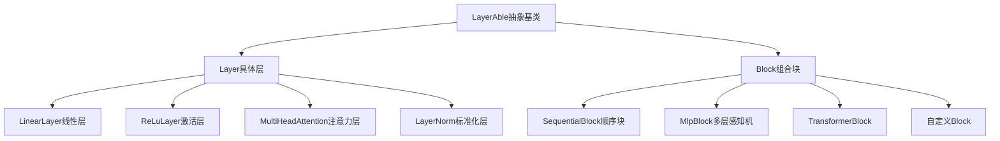
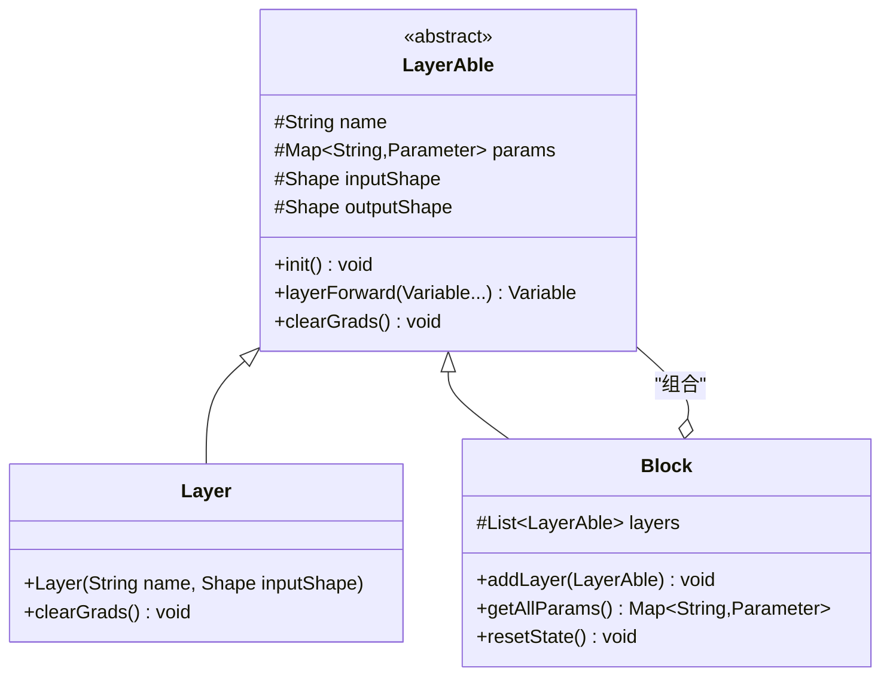
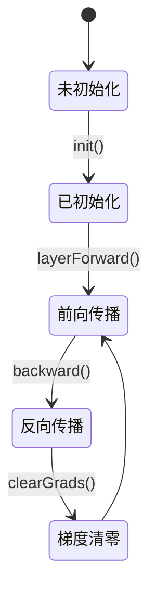

# TinyAI神经网络模块技术架构文档

## 1. 模块概述

### 1.1 模块基本信息
- **模块名称**: tinyai-deeplearning-nnet
- **版本**: 1.0-SNAPSHOT
- **描述**: TinyAI深度学习神经网络核心模块，提供神经网络层和块的实现
- **依赖模块**: 
  - tinyai-deeplearning-ndarr (多维数组基础库)
  - tinyai-deeplearning-func (自动微分引擎)

### 1.2 模块定位
神经网络模块是TinyAI深度学习框架的核心组件之一，负责提供：
- 基础神经网络层的实现
- 复杂网络块的组合机制
- 多种经典网络架构的实现
- 参数管理和梯度传播机制

## 2. 架构设计

### 2.1 核心设计理念

#### 组合模式架构
采用组合模式(Composite Pattern)设计，将神经网络的构建抽象为层(Layer)和块(Block)的组合：



#### 三层架构体系


### 2.2 模块结构设计

#### 目录结构
```
tinyai-deeplearning-nnet/
├── src/main/java/io/leavesfly/tinyai/nnet/
│   ├── LayerAble.java          # 抽象基类
│   ├── Layer.java              # 具体层基类
│   ├── Block.java              # 组合块基类
│   ├── Parameter.java          # 参数封装
│   ├── RnnLayer.java           # RNN层接口
│   ├── Uml.java               # UML图生成
│   ├── layer/                  # 具体层实现
│   │   ├── activate/          # 激活函数层
│   │   ├── cnn/               # 卷积神经网络层
│   │   ├── dnn/               # 深度神经网络层
│   │   ├── embedd/            # 嵌入层
│   │   ├── norm/              # 标准化层
│   │   ├── rnn/               # 循环神经网络层
│   │   └── transformer/       # Transformer层
│   └── block/                  # 复合块实现
│       ├── GruBlock.java
│       ├── LstmBlock.java
│       ├── MlpBlock.java
│       ├── SequentialBlock.java
│       ├── SimpleConvNet.java
│       ├── SimpleRnnBlock.java
│       ├── seq2seq/           # 序列到序列模型
│       └── transformer/       # Transformer模型
```

## 3. 核心组件设计

### 3.1 LayerAble抽象基类

#### 设计职责
- 定义神经网络组件的通用接口
- 提供参数管理机制
- 统一前向传播接口
- 继承自Function类，支持自动微分

#### 核心特性
```java
public abstract class LayerAble extends Function {
    // 核心属性
    protected String name;                      // 组件名称
    protected Map<String, Parameter> params;   // 参数管理
    protected Shape inputShape;                 // 输入形状
    protected Shape outputShape;                // 输出形状
    
    // 核心方法
    public abstract void init();                           // 参数初始化
    public abstract Variable layerForward(Variable...);   // 前向传播
    public abstract void clearGrads();                    // 梯度清零
}
```

### 3.2 Layer具体层

#### 设计特点
- 表示神经网络中的原子计算单元
- 对应数学中的一个函数变换
- 包含可训练参数(权重、偏置等)

#### 参数管理机制
```java
public class Layer extends LayerAble {
    public Layer(String name, Shape inputShape) {
        this.name = name;
        this.params = new HashMap<>();
        this.inputShape = inputShape;
    }
    
    @Override
    public void clearGrads() {
        for (Parameter parameter : params.values()) {
            parameter.clearGrad();  // 清除所有参数梯度
        }
    }
}
```

### 3.3 Block组合块

#### 组合模式实现
- 可以包含多个Layer或其他Block
- 提供递归的参数管理和梯度传播
- 支持复杂网络结构的构建

#### 核心机制
```java
public abstract class Block extends LayerAble {
    protected List<LayerAble> layers;  // 子组件列表
    
    // 添加子组件
    public void addLayer(LayerAble layerAble) {
        layerAble.init();
        layers.add(layerAble);
    }
    
    // 顺序前向传播
    public Variable layerForward(Variable... inputs) {
        Variable x = inputs[0];
        Variable y = layers.get(0).layerForward(x);
        for (int i = 1; i < layers.size(); i++) {
            y = layers.get(i).layerForward(y);
        }
        return y;
    }
    
    // 递归参数收集
    public Map<String, Parameter> getAllParams() {
        Map<String, Parameter> allParams = new HashMap<>();
        putAll(allParams);
        return allParams;
    }
}
```

## 4. 层类型实现

### 4.1 基础层类型

#### 4.1.1 深度神经网络层(DNN)
- **LinearLayer**: 线性变换层，实现 y = xW + b
- **AffineLayer**: 仿射变换层，支持权重和偏置

#### 4.1.2 激活函数层
- **ReLuLayer**: ReLU激活函数 f(x) = max(0, x)
- **SigmoidLayer**: Sigmoid激活函数 f(x) = 1/(1+e^-x)
- **TanhLayer**: Tanh激活函数
- **SoftMaxLayer**: SoftMax激活函数

#### 4.1.3 标准化层
- **LayerNorm**: 层标准化，提高训练稳定性

#### 4.1.4 嵌入层
- **EmbeddingLayer**: 词嵌入层，将离散输入映射到连续向量空间

### 4.2 高级网络层

#### 4.2.1 循环神经网络层(RNN)
- **SimpleRNN**: 基础循环神经网络
- **LSTM**: 长短期记忆网络
- **GRU**: 门控循环单元

#### 4.2.2 卷积神经网络层(CNN)
- **ConvLayer**: 卷积层
- **PoolingLayer**: 池化层
- **BatchNorm**: 批标准化层

#### 4.2.3 Transformer层
- **MultiHeadAttention**: 多头注意力机制
- **PositionalEncoding**: 位置编码
- **FeedForward**: 前馈网络
- **TransformerEncoderLayer**: Transformer编码器层
- **TransformerDecoderLayer**: Transformer解码器层

## 5. 组合块架构

### 5.1 基础组合块

#### 5.1.1 SequentialBlock
- 顺序连接多个层的容器
- 支持链式构建复杂网络

#### 5.1.2 MlpBlock
```java
public class MlpBlock extends Block {
    // 构建多层感知机
    public MlpBlock(String name, int batchSize, 
                   Config.ActiveFunc activeFunc, int... layerSizes) {
        super(name, Shape.of(batchSize, layerSizes[0]), 
              Shape.of(-1, layerSizes[layerSizes.length - 1]));
        
        // 构建隐藏层
        for (int i = 1; i < layerSizes.length - 1; i++) {
            addLayer(new LinearLayer("layer" + i, 
                     layerSizes[i-1], layerSizes[i], true));
            addLayer(createActivationLayer(activeFunc));
        }
        
        // 输出层
        addLayer(new LinearLayer("output", 
                layerSizes[layerSizes.length-2], 
                layerSizes[layerSizes.length-1], true));
    }
}
```

### 5.2 高级组合块

#### 5.2.1 RNN相关块
- **SimpleRnnBlock**: 简单RNN块
- **LstmBlock**: LSTM网络块
- **GruBlock**: GRU网络块

#### 5.2.2 序列到序列模型
- **Seq2SeqEncoder**: 编码器
- **Seq2SeqDecoder**: 解码器
- **Seq2SeqModel**: 完整的seq2seq模型

#### 5.2.3 Transformer模型
- **TransformerEncoder**: Transformer编码器
- **TransformerDecoder**: Transformer解码器
- **Transformer**: 完整的Transformer模型

### 5.3 卷积网络
- **SimpleConvNet**: 简单卷积神经网络，集成卷积、池化、全连接层

## 6. 设计模式应用

### 6.1 组合模式
- **应用场景**: Layer和Block的层次结构
- **优势**: 
  - 统一处理单个层和复合块
  - 支持任意深度的网络嵌套
  - 简化网络构建和管理

### 6.2 模板方法模式
- **应用场景**: LayerAble抽象类定义通用流程
- **优势**: 
  - 统一的初始化和前向传播流程
  - 子类只需实现特定的计算逻辑

### 6.3 策略模式
- **应用场景**: 激活函数的选择和配置
- **优势**: 
  - 运行时选择不同的激活函数
  - 易于扩展新的激活函数

## 7. 参数管理机制

### 7.1 参数生命周期



### 7.2 参数管理特性
- **层次化管理**: Block递归收集所有子组件参数
- **命名空间**: 参数名包含层名前缀，避免冲突
- **梯度管理**: 统一的梯度清零机制
- **状态重置**: RNN层支持状态重置

## 8. 核心算法实现

### 8.1 多头注意力机制

#### 算法原理
```
Attention(Q,K,V) = softmax(QK^T/√d_k)V
MultiHead(Q,K,V) = Concat(head_1,...,head_h)W^O
其中 head_i = Attention(QW_i^Q, KW_i^K, VW_i^V)
```

#### 实现特点
- 支持可配置的头数和维度
- 实现因果掩码机制(解码器用)
- 高效的张量重塑和计算

### 8.2 层标准化
```
LayerNorm(x) = γ * (x - μ) / σ + β
其中 μ = mean(x), σ = std(x)
```

### 8.3 位置编码
```
PE(pos,2i) = sin(pos/10000^(2i/d_model))
PE(pos,2i+1) = cos(pos/10000^(2i/d_model))
```

## 9. 扩展性设计

### 9.1 新层的添加
1. 继承Layer抽象类
2. 实现init()方法初始化参数
3. 实现layerForward()方法定义前向计算
4. 实现clearGrads()方法清理梯度

### 9.2 新块的添加
1. 继承Block抽象类
2. 在构造函数中配置子组件
3. 可选择重写layerForward()实现特殊逻辑

### 9.3 自定义网络架构
```java
public class ResidualBlock extends Block {
    private LayerAble mainPath;
    private LayerAble shortcut;
    
    @Override
    public Variable layerForward(Variable... inputs) {
        Variable x = inputs[0];
        Variable mainOutput = mainPath.layerForward(x);
        Variable shortcutOutput = shortcut.layerForward(x);
        return mainOutput.add(shortcutOutput); // 残差连接
    }
}
```

## 10. 性能优化

### 10.1 内存管理
- 参数共享机制减少内存占用
- 梯度及时清理避免内存泄漏
- 张量重塑操作优化

### 10.2 计算优化
- 矩阵运算批量化处理
- 避免不必要的数据拷贝
- 利用NdArray的高效计算能力

## 11. 测试与验证

### 11.1 单元测试覆盖
- 各种层的前向传播测试
- 参数初始化和管理测试
- 组合块的构建和运行测试
- Transformer相关组件测试

### 11.2 集成测试
- 完整网络的端到端测试
- 不同网络架构的组合测试
- 梯度传播正确性验证

## 12. 总结

### 12.1 架构优势
1. **模块化设计**: 清晰的层次结构，易于理解和维护
2. **高度可扩展**: 基于组合模式，支持灵活的网络构建
3. **统一接口**: LayerAble提供一致的使用体验
4. **完整功能**: 覆盖从基础层到复杂模型的全链路

### 12.2 技术特色
1. **组合模式**: 优雅地处理复杂网络结构
2. **参数管理**: 完善的参数生命周期管理
3. **现代架构**: 支持Transformer等前沿网络结构
4. **Java实现**: 充分利用Java的面向对象特性

### 12.3 应用价值
- 为TinyAI框架提供坚实的神经网络基础
- 支持快速原型开发和实验
- 便于教学和算法研究
- 可扩展到生产环境使用

---

*文档版本: 1.0*  
*最后更新: 2025-01-05*  
*作者: 山泽*