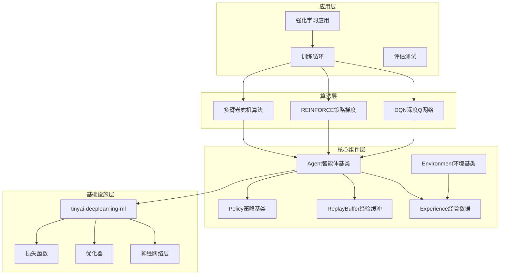

# TinyAI Reinforcement Learning 技术架构文档

## 概述

`tinyai-deeplearning-rl` 是 TinyAI 深度学习框架中的强化学习核心模块，实现了从经典多臂老虎机到现代深度强化学习算法的完整解决方案。本模块采用标准化的强化学习架构设计，遵循 OpenAI Gym 接口规范，为构建智能决策系统提供了可靠的基础。

## 技术架构

### 核心设计理念

本模块采用经典的智能体-环境交互范式（Agent-Environment Interaction Paradigm），将强化学习问题分解为以下核心组件：

- **Agent（智能体）**：决策制定者，负责策略学习和动作选择
- **Environment（环境）**：交互环境，提供状态转移和奖励反馈
- **Policy（策略）**：动作选择机制，平衡探索与利用
- **Experience（经验）**：交互记录，支持经验回放学习
- **ReplayBuffer（经验缓冲区）**：经验存储和采样管理

### 架构层次设计



## 核心组件详解

### 1. Agent 智能体架构

#### 抽象基类 Agent

`Agent` 是所有智能体的抽象基类，定义了强化学习智能体的标准接口：

**核心属性：**
- `name`: 智能体名称标识
- `stateDim`: 状态空间维度
- `actionDim`: 动作空间维度
- `model`: 主要神经网络模型
- `learningRate`: 学习率参数
- `epsilon`: 探索率（ε-贪心策略）
- `gamma`: 折扣因子
- `trainingStep`: 训练步数计数器

**核心方法：**
```java
// 动作选择
public abstract Variable selectAction(Variable state);

// 单步学习
public abstract void learn(Experience experience);

// 批量学习
public abstract void learnBatch(Experience[] experiences);

// 经验存储
public abstract void storeExperience(Experience experience);
```

#### 深度强化学习智能体

##### DQNAgent - 深度Q网络

**算法特点：**
- 使用神经网络逼近Q函数
- 经验回放机制打破数据相关性
- 目标网络稳定训练过程
- ε-贪心策略平衡探索与利用

**核心实现：**
```java
// 主要成员变量
private final int batchSize;              // 批次大小
private final int targetUpdateFreq;       // 目标网络更新频率
private final ReplayBuffer replayBuffer;  // 经验回放缓冲区
private final Model targetModel;          // 目标网络
private final EpsilonGreedyPolicy policy; // ε-贪心策略
private final Optimizer optimizer;        // 优化器
private final Loss lossFunction;          // 损失函数
```

**学习过程：**
1. 经验存储：将(s,a,r,s',done)存入回放缓冲区
2. 批量采样：从缓冲区随机采样训练批次
3. 目标计算：使用目标网络计算Q目标值
4. 损失计算：计算当前Q值与目标Q值的MSE损失
5. 反向传播：更新主网络参数
6. 网络同步：定期将主网络权重复制到目标网络

##### REINFORCEAgent - 策略梯度

**算法特点：**
- 直接优化策略函数
- 支持连续和离散动作空间
- 基线函数减少方差
- 蒙特卡洛采样估计梯度

#### 多臂老虎机智能体

##### BanditAgent - 老虎机基类

**核心功能：**
- 维护每个臂的统计信息
- 计算动作选择次数和累积奖励
- 提供共同的奖励估计机制

**统计信息：**
```java
protected int[] actionCounts;        // 每个臂被选择的次数
protected float[] totalRewards;      // 每个臂的累积奖励
protected float[] estimatedRewards;  // 每个臂的估计平均奖励
protected int totalActions;          // 总的动作选择次数
```

##### EpsilonGreedyBanditAgent - ε-贪心老虎机

**算法原理：**
- 以概率 ε 随机探索
- 以概率 (1-ε) 选择当前最优臂
- 简单有效的探索-利用平衡策略

##### UCBBanditAgent - 上置信区间

**算法原理：**
- 基于上置信区间的选择策略
- 同时考虑奖励均值和不确定性
- 具有理论最优的遗憾界限

**UCB公式：**
```
UCB(i) = Q(i) + c * sqrt(ln(t) / N(i))
```
其中 Q(i) 是臂i的估计奖励，N(i) 是臂i被选择的次数，t 是总时间步数，c 是探索参数。

##### ThompsonSamplingBanditAgent - 汤普森采样

**算法原理：**
- 基于贝叶斯推理的采样策略
- 维护每个臂的后验分布
- 根据后验分布采样进行决策

### 2. Environment 环境架构

#### 抽象基类 Environment

**核心属性：**
- `stateDim`: 状态空间维度
- `actionDim`: 动作空间维度
- `currentState`: 当前状态
- `done`: 回合是否结束
- `currentStep`: 当前步数
- `maxSteps`: 最大步数限制

**标准接口：**
```java
// 环境重置
public abstract Variable reset();

// 状态转移
public abstract StepResult step(Variable action);

// 随机动作采样
public abstract Variable sampleAction();

// 动作有效性检查
public abstract boolean isValidAction(Variable action);
```

#### 环境实现

##### CartPoleEnvironment - 倒立摆环境

**物理模型：**
- 状态空间：4维 [位置, 速度, 角度, 角速度]
- 动作空间：2维 [向左推, 向右推]
- 物理参数：重力、质量、长度等物理常数
- 终止条件：杆子倒下或小车超出边界

**状态更新方程：**
基于经典物理方程的数值积分，使用欧拉方法进行状态转移计算。

##### GridWorldEnvironment - 网格世界环境

**环境特性：**
- 离散网格状态空间
- 4方向移动动作（上、下、左、右）
- 可配置奖励和障碍物
- 适合测试基础强化学习算法

##### MultiArmedBanditEnvironment - 多臂老虎机环境

**环境设置：**
- 多个老虎机臂（动作选择）
- 每个臂有不同的奖励分布
- 支持高斯分布奖励生成
- 记录悔恨值和性能指标

### 3. Policy 策略架构

#### EpsilonGreedyPolicy - ε-贪心策略

**策略机制：**
- 可配置的探索率 ε
- 自动探索率衰减
- 支持不同衰减策略
- Q值函数依赖

**动作选择逻辑：**
```java
public Variable selectAction(Variable state) {
    if (random.nextFloat() < epsilon) {
        // 探索：随机选择动作
        return sampleRandomAction();
    } else {
        // 利用：选择Q值最大的动作
        return selectGreedyAction(state);
    }
}
```

### 4. 经验管理系统

#### Experience - 经验数据结构

**数据组成：**
```java
private final Variable state;      // 当前状态
private final Variable action;     // 执行的动作
private final float reward;        // 获得的奖励
private final Variable nextState;  // 下一状态
private final boolean done;        // 是否为终止状态
private final int timeStep;        // 时间步索引
```

#### ReplayBuffer - 经验回放缓冲区

**核心功能：**
- 固定大小的循环缓冲区
- 随机采样防止数据相关性
- 高效的内存管理
- 支持批量采样和获取最近经验

**缓冲区特性：**
- 容量管理：当缓冲区满时覆盖最旧的经验
- 采样策略：均匀随机采样确保数据独立性
- 性能监控：提供使用率和大小统计信息

## 技术特性

### 算法丰富性

1. **多臂老虎机算法系列**
   - ε-贪心：简单有效的探索策略
   - UCB：理论最优的置信区间方法
   - 汤普森采样：贝叶斯推理的采样策略

2. **深度强化学习算法**
   - DQN：开创性的深度Q网络算法
   - REINFORCE：经典的策略梯度方法

### 设计优势

1. **标准化接口**
   - 遵循 OpenAI Gym 标准
   - 统一的智能体-环境交互模式
   - 可扩展的算法实现框架

2. **高性能实现**
   - 高效的经验回放机制
   - 优化的内存管理
   - 支持批量学习

3. **易用性设计**
   - 简洁的API接口
   - 丰富的预置环境和算法
   - 完善的文档和示例

## 依赖关系

### 内部依赖

- **tinyai-deeplearning-ml**：提供模型训练、优化器、损失函数等机器学习核心功能
- **tinyai-deeplearning-func**：提供自动微分和变量系统
- **tinyai-deeplearning-ndarr**：提供多维数组数据结构
- **tinyai-deeplearning-nnet**：提供神经网络层和块

### 外部依赖

- **JUnit 4**：单元测试框架，用于算法正确性验证

## 算法性能对比

### 多臂老虎机算法对比

| 算法 | 探索策略 | 理论保证 | 计算复杂度 | 适用场景 |
|------|----------|----------|------------|----------|
| ε-贪心 | 固定概率探索 | 简单遗憾界 | O(1) | 在线学习、快速决策 |
| UCB | 置信区间探索 | 最优遗憾界 | O(1) | 理论最优、稳定环境 |
| 汤普森采样 | 贝叶斯采样 | 最优遗憾界 | O(k) | 贝叶斯优化、不确定环境 |

### 深度强化学习算法特点

| 算法 | 类型 | 状态空间 | 动作空间 | 样本效率 | 稳定性 |
|------|------|----------|----------|----------|---------|
| DQN | 值函数 | 连续 | 离散 | 中等 | 较好 |
| REINFORCE | 策略梯度 | 连续 | 连续/离散 | 较低 | 一般 |

## 测试体系

### 单元测试覆盖

1. **组件级测试**
   - `ExperienceTest`: 经验数据结构测试
   - `ReplayBufferTest`: 经验缓冲区功能测试
   - 各算法智能体的正确性测试

2. **集成测试**
   - `RLIntegrationTest`: 完整训练流程测试
   - 智能体-环境交互测试
   - 多回合学习收敛性测试

3. **性能测试**
   - 算法性能对比测试
   - 训练效率和稳定性测试

### 测试策略

```java
// 示例：完整训练循环测试
@Test
public void testCompleteTrainingLoop() {
    Variable state = environment.reset();
    
    while (!environment.isDone()) {
        Variable action = agent.selectAction(state);
        Environment.StepResult result = environment.step(action);
        
        Experience experience = new Experience(
            state, action, result.getReward(), 
            result.getNextState(), result.isDone()
        );
        agent.learn(experience);
        
        state = result.getNextState();
    }
    
    // 验证学习效果
    assertTrue(agent.getOptimalActionRate() > 0);
}
```

## 使用指南

### 基本使用流程

1. **创建环境和智能体**
```java
// 创建环境
CartPoleEnvironment env = new CartPoleEnvironment();

// 创建DQN智能体
DQNAgent agent = new DQNAgent(
    "CartPole-DQN", env.getStateDim(), env.getActionDim(),
    new int[]{128, 128}, 0.001f, 1.0f, 0.99f,
    32, 10000, 100
);
```

2. **训练循环**
```java
for (int episode = 0; episode < 1000; episode++) {
    Variable state = env.reset();
    
    while (!env.isDone()) {
        Variable action = agent.selectAction(state);
        Environment.StepResult result = env.step(action);
        
        Experience experience = new Experience(
            state, action, result.getReward(),
            result.getNextState(), result.isDone()
        );
        
        agent.learn(experience);
        state = result.getNextState();
    }
    
    agent.decayEpsilon(0.995f);
}
```

### 扩展开发指南

#### 添加新的智能体算法

```java
public class CustomAgent extends Agent {
    
    public CustomAgent(String name, int stateDim, int actionDim, 
                      float learningRate, float epsilon, float gamma) {
        super(name, stateDim, actionDim, learningRate, epsilon, gamma);
        // 初始化自定义参数
    }
    
    @Override
    public Variable selectAction(Variable state) {
        // 实现动作选择逻辑
        return customActionSelection(state);
    }
    
    @Override
    public void learn(Experience experience) {
        // 实现学习更新逻辑
        customLearningUpdate(experience);
    }
    
    // 其他必需方法的实现...
}
```

#### 添加新的环境

```java
public class CustomEnvironment extends Environment {
    
    public CustomEnvironment() {
        super(stateDim, actionDim, maxSteps);
        // 环境特定的初始化
    }
    
    @Override
    public Variable reset() {
        // 实现环境重置逻辑
        return initialState;
    }
    
    @Override
    public StepResult step(Variable action) {
        // 实现状态转移逻辑
        return new StepResult(nextState, reward, done, info);
    }
    
    // 其他必需方法的实现...
}
```

## 性能优化建议

### 训练稳定性优化

1. **经验回放优化**
   - 使用足够大的缓冲区（10000-100000）
   - 合理设置批次大小（32-128）
   - 确保充分的预热期

2. **网络更新策略**
   - 合理设置目标网络更新频率
   - 使用梯度裁剪防止梯度爆炸
   - 适当的学习率调度

3. **探索策略调优**
   - 合理设置初始探索率（0.9-1.0）
   - 适当的探索率衰减（0.995-0.999）
   - 保持最小探索率（0.01-0.05）

### 超参数调优指南

| 参数 | 推荐范围 | 说明 |
|------|----------|------|
| 学习率 | 0.0001-0.01 | 从小开始，根据收敛情况调整 |
| 批次大小 | 32-128 | 平衡计算效率和梯度稳定性 |
| 缓冲区大小 | 10000-100000 | 根据内存限制和任务复杂度选择 |
| 探索率衰减 | 0.995-0.999 | 保持适度探索能力 |
| 折扣因子 | 0.9-0.99 | 根据任务的时间跨度调整 |

## 版本信息

- **模块版本**: 1.0-SNAPSHOT
- **Java版本**: 17+
- **构建工具**: Maven 3.6+
- **依赖框架**: TinyAI DeepLearning Framework

## 未来发展方向

### 算法扩展计划

1. **高级DQN变种**
   - Double DQN：解决Q值过估计问题
   - Dueling DQN：分离值函数和优势函数
   - Rainbow DQN：集成多种改进技术

2. **策略梯度算法**
   - Actor-Critic：结合值函数和策略函数
   - PPO：近端策略优化
   - SAC：软演员-评论家算法

3. **高级老虎机算法**
   - Contextual Bandits：上下文多臂老虎机
   - Adversarial Bandits：对抗性多臂老虎机

### 性能优化计划

1. **并行化支持**
   - 多线程训练
   - 分布式学习
   - GPU加速计算

2. **内存优化**
   - 优先经验回放
   - 压缩存储
   - 流式学习

---

**TinyAI Reinforcement Learning 模块** - 构建智能决策系统的核心基础 🎯