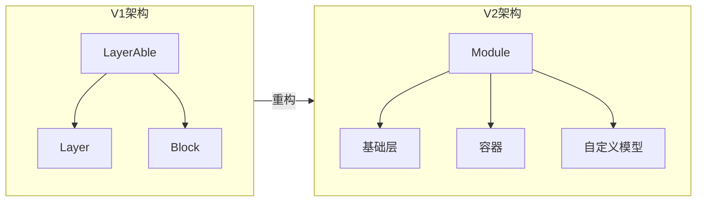
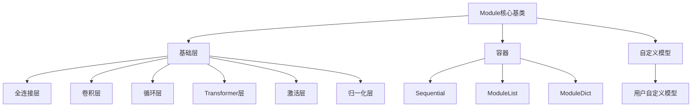

# TinyAI 神经网络模块 (tinyai-deeplearning-nnet)

[](https://github.com/leavesfly/TinyAI)
[](https://www.oracle.com/java/technologies/downloads/)
[](https://maven.apache.org/)

> TinyAI深度学习框架的神经网络构建核心，提供PyTorch风格的模块化API，支持从基础层到复杂网络的灵活构建。

---

## 📋 目录

- [模块概述](#模块概述)
- [重构更新](#重构更新)
- [核心架构](#核心架构)
- [功能特性](#功能特性)
- [快速开始](#快速开始)
- [完整示例](#完整示例)
- [API参考](#api参考)
- [技术依赖](#技术依赖)
- [开发指南](#开发指南)

---

## 模块概述

**tinyai-deeplearning-nnet** 是TinyAI深度学习框架的神经网络核心模块，负责神经网络层和模型的构建。本模块专注于：

- 🧱 **神经网络层实现** - 提供全连接、卷积、循环、Transformer等各类网络层
- 🔧 **模块化构建** - 支持层的灵活组合和嵌套，构建复杂网络架构
- 🎯 **参数管理** - 统一的参数注册、初始化和梯度管理机制
- 🔄 **训练/推理模式** - 支持模式切换，自动调整Dropout、BatchNorm等层的行为

### 模块定位

在TinyAI框架中，`tinyai-deeplearning-nnet`专注于深度神经网络的构建，而`tinyai-deeplearning-ml`负责通用机器学习任务（训练循环、优化器、损失函数等）。两者分工明确，配合使用。

---

## 重构更新

### V2版本架构升级 ✨

本模块经历了全面重构，从V1的Layer/Block体系升级为V2的Module统一体系：

#### 架构对比



#### 核心改进

| 特性 | V1 | V2 |
|------|----|----|
| **核心抽象** | LayerAble/Layer/Block | 统一Module基类 |
| **API风格** | 自定义 | PyTorch风格 |
| **参数管理** | 手动管理 | 自动注册和收集 |
| **模式切换** | 不支持 | train()/eval()模式 |
| **延迟初始化** | 不支持 | LazyModule支持 |
| **状态管理** | 分散 | stateDict统一管理 |
| **容器支持** | SequentialBlock | Sequential/ModuleList/ModuleDict |

#### 重构成果统计

- ✅ **核心组件**: Module基类、Parameter、LazyModule
- ✅ **基础层**: 20+ 层实现（全连接、卷积、激活、归一化等）
- ✅ **RNN系列**: LSTM、GRU、SimpleRNN完整实现
- ✅ **Transformer**: 编码器、解码器、多头注意力等组件
- ✅ **容器**: Sequential、ModuleList、ModuleDict
- ✅ **初始化器**: 7种参数初始化方法
- ✅ **示例代码**: 6个完整示例，覆盖所有主要功能

#### 迁移建议

**V1用户请注意**：V2版本提供了更现代的API和更强大的功能，建议新项目使用V2。V1代码暂时保留以供参考，但不再维护。

```java
// V1风格（已过时）
LayerAble layer = new LinearLayer("fc", inputSize, outputSize);
Variable output = layer.layerForward(input);

// V2风格（推荐）
Module layer = new Linear("fc", inputSize, outputSize);
Variable output = layer.forward(input);
```

---

## 核心架构

### 设计理念

V2模块采用**统一Module抽象**，参考PyTorch的设计理念：

- **Module统一抽象** - 所有层、容器、模型都继承自Module
- **组合模式** - 支持模块的任意层次组合和嵌套
- **自动参数管理** - registerModule/registerParameter自动收集参数
- **状态字典** - stateDict支持参数序列化和迁移学习

### 架构图



### 目录结构

```
tinyai-deeplearning-nnet/
├── src/main/java/io/leavesfly/tinyai/nnet/v2/
│   ├── core/                    # 核心抽象
│   │   ├── Module.java          # 模块基类
│   │   ├── Parameter.java       # 参数封装
│   │   └── LazyModule.java      # 延迟初始化基类
│   ├── layer/                   # 神经网络层
│   │   ├── dnn/                 # 全连接层
│   │   │   ├── Linear.java
│   │   │   ├── LazyLinear.java
│   │   │   └── Dropout.java
│   │   ├── conv/                # 卷积层
│   │   │   ├── Conv2d.java
│   │   │   ├── LazyConv2d.java
│   │   │   └── MaxPool2d.java
│   │   ├── rnn/                 # 循环层
│   │   │   ├── LSTM.java
│   │   │   ├── GRU.java
│   │   │   └── SimpleRNN.java
│   │   ├── transformer/         # Transformer组件
│   │   │   ├── MultiHeadAttention.java
│   │   │   ├── TransformerEncoder.java
│   │   │   ├── TransformerDecoder.java
│   │   │   └── Transformer.java
│   │   ├── activation/          # 激活函数
│   │   │   ├── ReLU.java
│   │   │   ├── Sigmoid.java
│   │   │   ├── Tanh.java
│   │   │   └── SoftMax.java
│   │   ├── norm/                # 归一化层
│   │   │   ├── LayerNorm.java
│   │   │   └── BatchNorm1d.java
│   │   └── embedding/           # 嵌入层
│   │       └── Embedding.java
│   ├── container/               # 容器
│   │   ├── Sequential.java
│   │   ├── ModuleList.java
│   │   └── ModuleDict.java
│   ├── init/                    # 参数初始化
│   │   └── Initializers.java
│   ├── functional/              # 函数式API
│   └── examples/                # 示例代码
│       ├── BasicUsage.java
│       ├── CNNClassifier.java
│       ├── RNNSequenceModeling.java
│       ├── TransformerModel.java
│       ├── LazyInitialization.java
│       └── ModelSerialization.java
└── doc/                         # 文档
    └── 技术架构文档.md
```

---

## 功能特性

### 🧱 丰富的神经网络层

#### 全连接层 (dnn)
- **Linear** - 标准全连接层 `y = xW^T + b`
- **LazyLinear** - 延迟初始化全连接层，自动推断输入维度
- **Dropout** - 随机失活层，防止过拟合

#### 卷积层 (conv)
- **Conv2d** - 2D卷积层
- **LazyConv2d** - 延迟初始化卷积层
- **MaxPool2d** - 最大池化层

#### 循环神经网络 (rnn)
- **LSTM** - 长短期记忆网络
- **GRU** - 门控循环单元
- **SimpleRNN** - 基础循环神经网络

#### Transformer组件 (transformer)
- **MultiHeadAttention** - 多头注意力机制
- **PositionalEncoding** - 位置编码
- **TransformerEncoder** - Transformer编码器
- **TransformerDecoder** - Transformer解码器
- **Transformer** - 完整Transformer模型

#### 激活函数 (activation)
- **ReLU** - 修正线性单元
- **Sigmoid** - Sigmoid函数
- **Tanh** - 双曲正切函数
- **SoftMax** - Softmax归一化
- **LeakyReLU** - 泄露ReLU
- **ELU** - 指数线性单元
- **GELU** - 高斯误差线性单元

#### 归一化层 (norm)
- **LayerNorm** - 层归一化
- **BatchNorm1d** - 批归一化（1D）

#### 嵌入层 (embedding)
- **Embedding** - 词嵌入层

### 🔧 灵活的容器

- **Sequential** - 顺序容器，按顺序执行子模块
- **ModuleList** - 模块列表，像List一样管理子模块
- **ModuleDict** - 模块字典，像Map一样管理子模块

### 🎨 参数初始化

`Initializers`类提供多种初始化方法：

- `zeros()` / `ones()` - 零/单位初始化
- `uniform()` / `normal()` - 均匀/正态分布初始化
- `xavierUniform()` / `xavierNormal()` - Xavier初始化
- `kaimingUniform()` / `kaimingNormal()` - Kaiming初始化（He初始化）

### 💾 模型序列化

- `stateDict()` - 导出模型参数字典
- `loadStateDict()` - 加载模型参数字典
- 支持模型保存、加载和迁移学习

---

## 快速开始

### 安装依赖

确保已添加到项目的pom.xml：

```xml
<dependency>
    <groupId>io.leavesfly.tinyai</groupId>
    <artifactId>tinyai-deeplearning-nnet</artifactId>
    <version>1.0-SNAPSHOT</version>
</dependency>
```

### 简单示例

#### 1. 创建基础全连接网络

```java
import io.leavesfly.tinyai.nnet.v2.core.Module;
import io.leavesfly.tinyai.nnet.v2.layer.dnn.Linear;
import io.leavesfly.tinyai.nnet.v2.layer.activation.ReLU;
import io.leavesfly.tinyai.func.Variable;

// 定义模型
class SimpleNet extends Module {
    private final Linear fc1;
    private final ReLU relu;
    private final Linear fc2;
    
    public SimpleNet(String name, int inputSize, int hiddenSize, int outputSize) {
        super(name);
        
        // 创建层
        fc1 = new Linear("fc1", inputSize, hiddenSize);
        relu = new ReLU("relu");
        fc2 = new Linear("fc2", hiddenSize, outputSize);
        
        // 注册子模块
        registerModule("fc1", fc1);
        registerModule("relu", relu);
        registerModule("fc2", fc2);
    }
    
    @Override
    public Variable forward(Variable... inputs) {
        Variable x = inputs[0];
        x = fc1.forward(x);
        x = relu.forward(x);
        x = fc2.forward(x);
        return x;
    }
}

// 使用模型
SimpleNet model = new SimpleNet("simple_net", 784, 256, 10);
model.train();  // 训练模式
Variable output = model.forward(input);
```

#### 2. 使用Sequential容器

```java
import io.leavesfly.tinyai.nnet.v2.container.Sequential;

Sequential model = new Sequential("mlp");
model.add(new Linear("fc1", 784, 256));
model.add(new ReLU("relu1"));
model.add(new Dropout("dropout", 0.5f));
model.add(new Linear("fc2", 256, 128));
model.add(new ReLU("relu2"));
model.add(new Linear("fc3", 128, 10));

model.train();
Variable output = model.forward(input);
```

#### 3. 使用LazyModule延迟初始化

```java
import io.leavesfly.tinyai.nnet.v2.layer.dnn.LazyLinear;

// 无需指定输入维度，首次forward时自动推断
LazyLinear fc = new LazyLinear("lazy_fc", 10);
Variable output = fc.forward(input);  // 自动根据input的形状初始化参数
```

---

## 完整示例

### CNN图像分类器

```java
// LeNet-5风格的卷积神经网络
class LeNet5 extends Module {
    private final Conv2d conv1, conv2;
    private final MaxPool2d pool1, pool2;
    private final Linear fc1, fc2, fc3;
    private final ReLU relu1, relu2, relu3, relu4;
    private final Dropout dropout;
    
    public LeNet5(String name, int numClasses) {
        super(name);
        
        // 卷积层1
        conv1 = new Conv2d("conv1", 1, 6, 5, 5, 1, 0, true);
        relu1 = new ReLU("relu1");
        pool1 = new MaxPool2d("pool1", 2, 2, 0);
        
        // 卷积层2
        conv2 = new Conv2d("conv2", 6, 16, 5, 5, 1, 0, true);
        relu2 = new ReLU("relu2");
        pool2 = new MaxPool2d("pool2", 2, 2, 0);
        
        // 全连接层
        fc1 = new Linear("fc1", 16 * 4 * 4, 120, true);
        relu3 = new ReLU("relu3");
        dropout = new Dropout("dropout", 0.5f);
        fc2 = new Linear("fc2", 120, 84, true);
        relu4 = new ReLU("relu4");
        fc3 = new Linear("fc3", 84, numClasses, true);
        
        // 注册所有子模块
        registerModule("conv1", conv1);
        registerModule("relu1", relu1);
        registerModule("pool1", pool1);
        registerModule("conv2", conv2);
        registerModule("relu2", relu2);
        registerModule("pool2", pool2);
        registerModule("fc1", fc1);
        registerModule("relu3", relu3);
        registerModule("dropout", dropout);
        registerModule("fc2", fc2);
        registerModule("relu4", relu4);
        registerModule("fc3", fc3);
    }
    
    @Override
    public Variable forward(Variable... inputs) {
        Variable x = inputs[0];
        
        // 卷积块1
        x = conv1.forward(x);
        x = relu1.forward(x);
        x = pool1.forward(x);
        
        // 卷积块2
        x = conv2.forward(x);
        x = relu2.forward(x);
        x = pool2.forward(x);
        
        // 展平
        x = flatten(x);
        
        // 全连接块
        x = fc1.forward(x);
        x = relu3.forward(x);
        x = dropout.forward(x);
        x = fc2.forward(x);
        x = relu4.forward(x);
        x = fc3.forward(x);
        
        return x;
    }
}
```

### RNN序列建模

```java
// LSTM序列分类器
class LSTMClassifier extends Module {
    private final LSTM lstm;
    private final Linear fc;
    
    public LSTMClassifier(String name, int inputSize, int hiddenSize, int numClasses) {
        super(name);
        
        lstm = new LSTM("lstm", inputSize, hiddenSize, true);
        fc = new Linear("fc", hiddenSize, numClasses, true);
        
        registerModule("lstm", lstm);
        registerModule("fc", fc);
    }
    
    @Override
    public Variable forward(Variable... inputs) {
        Variable x = inputs[0];  // (batch, seq_len, input_size)
        
        // LSTM处理序列
        Variable output = lstm.forward(x);  // (batch, seq_len, hidden_size)
        
        // 取最后一个时间步
        Variable lastOutput = getLastTimeStep(output);
        
        // 分类
        return fc.forward(lastOutput);
    }
}
```

### Transformer模型

```java
// 完整的Transformer编码器-解码器模型
Transformer transformer = new Transformer(
    "transformer",
    512,        // dModel: 模型维度
    8,          // numHeads: 注意力头数
    6,          // numEncoderLayers: 编码器层数
    6,          // numDecoderLayers: 解码器层数
    2048,       // dFF: 前馈网络隐藏层维度
    0.1f,       // dropout: dropout比率
    true        // preLayerNorm: 是否使用Pre-LayerNorm
);

// 前向传播
Variable output = transformer.forward(srcInput, tgtInput);
```

更多示例请参考 [examples目录](src/main/java/io/leavesfly/tinyai/nnet/v2/examples/)。

---

## API参考

### Module核心API

#### 模块注册

```java
// 注册子模块（自动收集参数）
Module registerModule(String name, Module module)

// 注册可训练参数
Parameter registerParameter(String name, Parameter param)

// 注册非可训练缓冲区
NdArray registerBuffer(String name, NdArray buffer)
```

#### 参数访问

```java
// 获取所有参数（包括子模块）
Map<String, Parameter> namedParameters()
Map<String, Parameter> parameters()

// 获取所有子模块
Map<String, Module> namedModules()
List<Module> modules()

// 获取所有缓冲区
Map<String, NdArray> namedBuffers()
```

#### 模式切换

```java
// 设置训练模式
Module train()
Module train(boolean mode)

// 设置推理模式
Module eval()

// 检查当前模式
boolean isTraining()
```

#### 参数操作

```java
// 冻结所有参数
Module freeze()

// 解冻所有参数
Module unfreeze()

// 设置所有参数的requires_grad
Module requiresGrad(boolean requiresGrad)

// 清零所有梯度
void zeroGrad()

// 统计参数数量
long numParameters()
long numParameters(boolean onlyTrainable)

// 获取参数摘要
String parameterSummary()
```

#### 状态管理

```java
// 导出状态字典
Map<String, NdArray> stateDict()

// 加载状态字典
void loadStateDict(Map<String, NdArray> stateDict)
```

#### 前向传播

```java
// 子类必须实现
Variable forward(Variable... inputs)
```

### Parameter类

```java
// 创建参数
Parameter param = new Parameter(ndarray);
param.setRequiresGrad(true);

// 访问数据和梯度
NdArray data();
Variable grad();

// 清零梯度
void zeroGrad();
```

### 初始化器API

```java
// 使用Kaiming初始化
Initializers.kaimingUniform(parameter.data(), 0, "fan_in", "relu");

// 使用Xavier初始化
Initializers.xavierNormal(parameter.data());

// 零初始化
Initializers.zeros(parameter.data());
```

---

## 技术依赖

### 内部依赖

- **tinyai-deeplearning-ndarr** - 多维数组基础库，提供NdArray张量计算
- **tinyai-deeplearning-func** - 自动微分引擎，提供Variable和反向传播

### 外部依赖

- **JUnit Jupiter** - 单元测试框架（仅测试）

### 版本要求

- Java 17+
- Maven 3.6+

---

## 开发指南

### 添加新的层

1. 继承`Module`基类：

```java
public class MyLayer extends Module {
    private Parameter weight;
    
    public MyLayer(String name, int inputSize, int outputSize) {
        super(name);
        
        // 创建参数
        NdArray weightData = NdArray.of(Shape.of(outputSize, inputSize));
        this.weight = registerParameter("weight", new Parameter(weightData));
        
        // 初始化参数
        init();
    }
    
    @Override
    public void resetParameters() {
        // 参数初始化逻辑
        Initializers.xavierUniform(weight.data());
    }
    
    @Override
    public Variable forward(Variable... inputs) {
        // 前向传播逻辑
        Variable x = inputs[0];
        return x.matMul(weight);
    }
}
```

2. 添加单元测试

3. 在examples中添加使用示例

### 添加新的容器

继承`Module`并实现特定的组合逻辑：

```java
public class MyContainer extends Module {
    private final List<Module> layers;
    
    public MyContainer(String name) {
        super(name);
        this.layers = new ArrayList<>();
    }
    
    public void add(Module module) {
        String moduleName = "module_" + layers.size();
        registerModule(moduleName, module);
        layers.add(module);
    }
    
    @Override
    public Variable forward(Variable... inputs) {
        // 自定义组合逻辑
        Variable x = inputs[0];
        for (Module layer : layers) {
            x = layer.forward(x);
        }
        return x;
    }
}
```

### 实现延迟初始化

继承`LazyModule`并实现`initialize`方法：

```java
public class MyLazyLayer extends LazyModule {
    private Parameter weight;
    private final int outputSize;
    
    public MyLazyLayer(String name, int outputSize) {
        super(name);
        this.outputSize = outputSize;
    }
    
    @Override
    protected void initialize(Shape... inputShapes) {
        Shape inputShape = inputShapes[0];
        int inputSize = inputShape.getShapeDims()[inputShape.ndim() - 1];
        
        // 根据输入形状创建参数
        NdArray weightData = NdArray.of(Shape.of(outputSize, inputSize));
        this.weight = registerParameter("weight", new Parameter(weightData));
        
        Initializers.xavierUniform(weight.data());
    }
    
    @Override
    public Variable forward(Variable... inputs) {
        ensureInitialized(inputs);
        Variable x = inputs[0];
        return x.matMul(weight);
    }
}
```

### 测试建议

- 测试不同batch size的输入
- 测试训练和推理模式的行为差异
- 测试参数的正确注册和收集
- 测试stateDict的保存和加载
- 测试梯度计算的正确性

---

## 学习资源

### 文档

- [技术架构文档](doc/技术架构文档.md) - 详细的架构设计和实现原理
- [示例代码README](src/main/java/io/leavesfly/tinyai/nnet/v2/examples/README.md) - 完整的示例说明

### 示例代码

1. [BasicUsage.java](src/main/java/io/leavesfly/tinyai/nnet/v2/examples/BasicUsage.java) - 基础使用
2. [LazyInitialization.java](src/main/java/io/leavesfly/tinyai/nnet/v2/examples/LazyInitialization.java) - 延迟初始化
3. [CNNClassifier.java](src/main/java/io/leavesfly/tinyai/nnet/v2/examples/CNNClassifier.java) - CNN分类器
4. [RNNSequenceModeling.java](src/main/java/io/leavesfly/tinyai/nnet/v2/examples/RNNSequenceModeling.java) - RNN序列建模
5. [ModelSerialization.java](src/main/java/io/leavesfly/tinyai/nnet/v2/examples/ModelSerialization.java) - 模型序列化
6. [TransformerModel.java](src/main/java/io/leavesfly/tinyai/nnet/v2/examples/TransformerModel.java) - Transformer模型

### 运行示例

```bash
# 编译项目
mvn compile

# 运行示例
mvn exec:java -Dexec.mainClass="io.leavesfly.tinyai.nnet.v2.examples.BasicUsage"

# 运行测试
mvn test
```

---

## 相关模块

- [tinyai-deeplearning-ml](../tinyai-deeplearning-ml/README.md) - 机器学习核心（训练器、优化器、损失函数）
- [tinyai-deeplearning-func](../tinyai-deeplearning-func/README.md) - 自动微分引擎
- [tinyai-deeplearning-ndarr](../tinyai-deeplearning-ndarr/README.md) - 多维数组基础库

---

## 许可证

本项目遵循TinyAI项目的许可协议。

---

**TinyAI神经网络模块** - 用Java构建现代深度学习网络 🚀