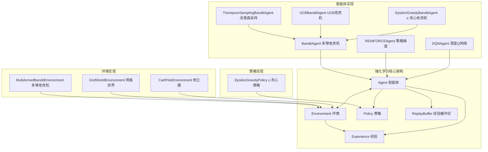
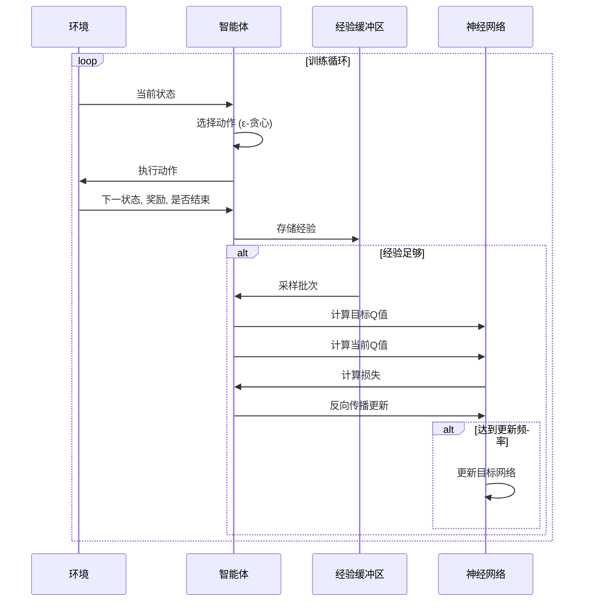

# TinyAI Reinforcement Learning 强化学习模块 (tinyai-deeplearning-rl)

## 模块概述

`tinyai-deeplearning-rl` 是 TinyAI 深度学习框架的强化学习核心模块，提供了完整的强化学习算法实现和环境管理功能。本模块实现了从经典的多臂老虎机问题到现代深度强化学习算法的全套解决方案，是构建智能决策系统的核心组件。

## 核心架构

### 设计理念

本模块采用标准的强化学习架构设计，遵循 OpenAI Gym 接口规范，通过智能体-环境交互框架构建完整的强化学习系统：

- **Agent（智能体）**：决策制定者，负责选择动作和学习策略
- **Environment（环境）**：交互对象，提供状态转移和奖励信号
- **Policy（策略）**：动作选择机制，平衡探索与利用
- **Experience（经验）**：交互记录，支持经验回放学习
- **ReplayBuffer（经验缓冲区）**：经验存储和采样管理

### 算法分类体系 - 教学性设计

**设计目标**: 通过清晰的继承层次帮助学习者理解强化学习算法的内在逻辑和差异

```
Agent (抽象基类)
 │
 ├── ValueBasedAgent (基于值函数) ← 统一经验回放+TD学习流程
 │    ├── DQNAgent: 深度Q网络
 │    ├── DoubleDQNAgent: 双Q网络(解决Q值过估计)
 │    └── DuelingDQNAgent: 对偶网络(分离状态价值和优势函数)
 │
 ├── PolicyBasedAgent (基于策略) ← 统一回合采样+策略梯度流程
 │    ├── REINFORCEAgent: 蒙特卡罗策略梯度
 │    ├── A2CAgent: Advantage Actor-Critic
 │    └── PPOAgent: 近端策略优化
 │
 └── BanditAgent (多臂老虎机) ← 无状态依赖的探索算法
      ├── EpsilonGreedyBanditAgent: ε-贪心策略
      ├── UCBBanditAgent: 上置信区间算法
      └── ThompsonSamplingBanditAgent: 汤普森采样
```

**教学价值**:
1. **清晰的分类**: Value-Based vs Policy-Based vs Bandit 三大类别
2. **统一的框架**: 每个类别有统一的训练流程模板
3. **最小差异**: 同类算法只在关键方法上有差异(如DQN vs DoubleDQN仅目标Q值计算不同)
4. **易于扩展**: 新增算法只需继承对应基类,实现2-3个抽象方法

### 公共组件 - 消除代码重复

为提升代码质量和教学清晰度,抽取了公共工具组件:

#### TrainingStatistics - 训练统计
**作用**: 统一管理训练指标(损失、奖励、探索率等)  
**消除重复**: DQN/DoubleDQN中相同的统计代码  
**使用示例**:
```java
TrainingStatistics stats = new TrainingStatistics();
stats.updateLoss(lossValue);
stats.updateReward(episodeReward);
Map<String, Object> statsMap = stats.toMap();
```

#### QValueComputer - Q值计算工具
**作用**: 提供Q值相关的通用计算方法  
**消除重复**: 贪婪动作选择、最大Q值提取、Variable堆叠等  
**使用示例**:
```java
// 选择Q值最大的动作
Variable action = QValueComputer.selectGreedyAction(qValues, actionDim);

// 提取最大Q值(保持计算图)
Variable maxQ = QValueComputer.findMaxQValue(qValues);

// 堆叠批次Variable
Variable batchQValues = QValueComputer.stackVariables(qArray, batchSize);
```

#### ModelUtil - 模型操作工具
**作用**: 统一网络创建和权重操作  
**消除重复**: MLP构建、权重复制、目标网络同步  
**使用示例**:
```java
// 创建Q网络
Model qNetwork = ModelUtil.createQNetwork("DQN_Q", stateDim, actionDim, hiddenSizes);

// 权重复制(目标网络同步)
ModelUtil.copyWeights(onlineNetwork, targetNetwork);

// 软更新
ModelUtil.softUpdateWeights(onlineNetwork, targetNetwork, tau=0.005f);
```

### 统一训练流程 - 体现通用框架

**ValueBasedAgent训练流程**:
```java
@Override
public void learn(Experience experience) {
    // 1. 存储经验到缓冲区
    storeExperience(experience);
    
    // 2. 检查是否有足够经验
    if (shouldLearn()) {
        // 3. 采样批次
        Experience[] batch = sampleBatch();
        
        // 4. 批量学习
        Variable targetQ = computeTargetQValues(batch);  // 子类实现
        Variable currentQ = computeCurrentQValues(batch); // 子类实现
        Variable loss = lossFunction.loss(targetQ, currentQ);
        
        // 5. 反向传播更新
        model.clearGrads();
        loss.backward();
        optimizer.update();
        
        // 6. 定期同步目标网络
        if (shouldUpdateTarget()) {
            updateTargetNetwork();
        }
    }
}
```

**PolicyBasedAgent训练流程**:
```java
@Override
public void learn(Experience experience) {
    // 1. 存储回合经验
    storeEpisodeExperience(experience);
    
    // 2. 回合结束时学习
    if (experience.isDone()) {
        // 3. 计算回报
        List<Float> returns = computeReturns(rewards);
        
        // 4. 计算策略损失
        Variable policyLoss = computePolicyLoss(returns);  // 子类实现
        
        // 5. 更新策略
        model.clearGrads();
        policyLoss.backward();
        optimizer.update();
        
        // 6. 清空回合缓冲区
        clearEpisodeData();
    }
}
```

### 代码精简效果

通过架构重构,显著提升了代码质量:

| Agent类 | 原始行数 | 重构后行数 | 精简比例 | 提升点 |
|---------|---------|-----------|---------|--------|
| DQNAgent | 459 | 158 | 65.6% | 继承ValueBasedAgent,使用工具类 |
| DoubleDQNAgent | 363 | 177 | 51.2% | 只需实现目标Q值计算差异(解耦动作选择和评估) |
| REINFORCEAgent | 563 | 340 | 39.6% | 继承PolicyBasedAgent,复用回合管理和回报计算 |

**精简来源**:
- 删除重复的训练统计代码 → TrainingStatistics
- 删除重复的Q值计算方法 → QValueComputer
- 删除重复的网络创建代码 → ModelUtil
- 删除重复的训练循环代码 → 继承基类的统一流程

## 核心架构(旧版,已废弃)

### 设计理念

本模块采用标准的强化学习架构设计，遵循 OpenAI Gym 接口规范，通过智能体-环境交互框架构建完整的强化学习系统：

- **Agent（智能体）**：决策制定者，负责选择动作和学习策略
- **Environment（环境）**：交互对象，提供状态转移和奖励信号
- **Policy（策略）**：动作选择机制，平衡探索与利用
- **Experience（经验）**：交互记录，支持经验回放学习
- **ReplayBuffer（经验缓冲区）**：经验存储和采样管理



### 核心组件

#### 1. 基础抽象类
- [`Agent`](src/main/java/io/leavesfly/tinyai/rl/Agent.java) - 智能体抽象基类
- [`Environment`](src/main/java/io/leavesfly/tinyai/rl/Environment.java) - 环境抽象基类
- [`Policy`](src/main/java/io/leavesfly/tinyai/rl/Policy.java) - 策略抽象基类
- [`Experience`](src/main/java/io/leavesfly/tinyai/rl/Experience.java) - 经验数据结构
- [`ReplayBuffer`](src/main/java/io/leavesfly/tinyai/rl/ReplayBuffer.java) - 经验回放缓冲区

## 功能特性

### 🤖 多样化智能体算法

#### 深度强化学习智能体 (agent)

##### DQN 深度Q网络
[`DQNAgent`](src/main/java/io/leavesfly/tinyai/rl/agent/DQNAgent.java) - 深度Q网络算法实现

**核心特性：**
- 使用神经网络逼近Q函数
- 经验回放机制提高数据利用率  
- 目标网络稳定训练过程
- ε-贪婪策略平衡探索与利用

**算法原理：**
- 目标Q值: `y = r + γ * max_a' Q_target(s', a')`
- 损失函数: `L = (y - Q(s,a))^2`
- 关键创新: 目标网络延迟更新,打破数据相关性

**代码示例：**
```java
// 创建DQN智能体
DQNAgent dqnAgent = new DQNAgent(
    "CartPole-DQN",      // 智能体名称
    4,                   // 状态空间维度
    2,                   // 动作空间维度  
    new int[]{128, 128}, // 隐藏层尺寸
    0.001f,              // 学习率
    1.0f,                // 初始探索率
    0.99f,               // 折扣因子
    32,                  // 批次大小
    10000,               // 经验缓冲区大小
    100                  // 目标网络更新频率
);
```

**架构优势:**
- 继承 `ValueBasedAgent`,统一经验回放+TD学习流程
- 代码从459行精简到158行(减少65.6%)
- 只需实现 `computeTargetQValues()` 和 `computeCurrentQValues()` 两个方法

##### DoubleDQN 双Q网络
[`DoubleDQNAgent`](src/main/java/io/leavesfly/tinyai/rl/agent/DoubleDQNAgent.java) - 解决Q值过估计问题

**核心特性：**
- 解耦动作选择和Q值评估
- 减少Q值过估计偏差
- 提升学习稳定性和性能
- 与DQN相比仅需修改目标Q值计算

**算法原理：**
```
DQN问题: max操作同时负责选择和评估,容易高估
  y = r + γ * max_a' Q_target(s', a')

DoubleDQN解决方案: 分离选择和评估
  a_best = argmax_a' Q_online(s', a')  // 在线网络选择动作
  y = r + γ * Q_target(s', a_best)     // 目标网络评估Q值
```

**代码示例：**
```java
// 创建DoubleDQN智能体
DoubleDQNAgent doubleDqnAgent = new DoubleDQNAgent(
    "CartPole-DoubleDQN",
    4,                   // 状态空间维度
    2,                   // 动作空间维度
    new int[]{128, 128}, // 隐藏层尺寸
    0.001f,              // 学习率
    1.0f,                // 初始探索率
    0.99f,               // 折扣因子
    32,                  // 批次大小
    10000,               // 经验缓冲区大小
    100                  // 目标网络更新频率
);
```

**架构优势:**
- 同样继承 `ValueBasedAgent`,复用所有训练流程
- 代码从363行精简到177行(减少51.2%)
- 与DQN相比仅 `computeTargetQValues()` 方法实现不同(约20行差异)
- 完美展示架构设计带来的可扩展性

**与DQN对比:**
| 特性 | DQN | DoubleDQN |
|------|-----|-----------|
| 动作选择 | 目标网络 | 在线网络 |
| Q值评估 | 目标网络 | 目标网络 |
| 过估计问题 | 存在 | 缓解 |
| 代码差异 | - | 仅目标Q值计算不同 |

##### REINFORCE 策略梯度
[`REINFORCEAgent`](src/main/java/io/leavesfly/tinyai/rl/agent/REINFORCEAgent.java) - 蒙特卡罗策略梯度算法

**核心特性：**
- 直接优化策略函数 π(a|s)
- 支持连续和离散动作空间
- 可选基线函数减少方差
- 蒙特卡罗回报估计

**算法原理：**
- 策略梯度定理: `∇J(θ) = E[∇log π(a|s) * G_t]`
- 损失函数: `L = -Σ log π(a_t|s_t) * G_t`
- 蒙特卡罗回报: `G_t = Σ_{k=0}^∞ γ^k * r_{t+k}`
- 基线减方差: `L = -Σ log π(a_t|s_t) * (G_t - V(s_t))`

**代码示例：**
```java
// 创建REINFORCE智能体
REINFORCEAgent reinforceAgent = new REINFORCEAgent(
    "CartPole-REINFORCE",
    4,                   // 状态空间维度
    2,                   // 动作空间维度
    new int[]{128, 64},  // 隐藏层尺寸
    0.001f,              // 学习率
    0.99f,               // 折扣因子
    true                 // 使用基线
);
```

**架构优势:**
- 继承 `PolicyBasedAgent`,统一回合采样+策略梯度流程
- 代码从563行精简到340行(减少39.6%)
- 自动管理回合缓冲区、对数概率存储、回报计算
- 基线网络自动训练和管理

**与Value-Based对比:**
| 特性 | Value-Based (DQN) | Policy-Based (REINFORCE) |
|------|------------------|-------------------------|
| 学习目标 | Q值函数 | 策略函数 |
| 动作空间 | 离散 | 连续/离散 |
| 数据采样 | 经验回放 | 回合采样 |
| 学习方式 | TD学习 | 蒙特卡罗 |
| 方差 | 较低 | 较高(可用基线减少) |

#### 多臂老虎机智能体

##### 基础老虎机智能体
[`BanditAgent`](src/main/java/io/leavesfly/tinyai/rl/agent/BanditAgent.java) - 多臂老虎机基类

##### ε-贪心策略
[`EpsilonGreedyBanditAgent`](src/main/java/io/leavesfly/tinyai/rl/agent/EpsilonGreedyBanditAgent.java) - ε-贪心老虎机

**算法原理：**
- 以概率 ε 随机探索
- 以概率 (1-ε) 选择当前最优臂
- 简单有效的探索-利用平衡策略

##### UCB 上置信区间
[`UCBBanditAgent`](src/main/java/io/leavesfly/tinyai/rl/agent/UCBBanditAgent.java) - UCB算法实现

**算法原理：**
- 基于上置信区间的选择策略
- 考虑均值估计和不确定性
- 理论上有最优的遗憾界限

##### 汤普森采样
[`ThompsonSamplingBanditAgent`](src/main/java/io/leavesfly/tinyai/rl/agent/ThompsonSamplingBanditAgent.java) - 贝叶斯采样算法

**算法原理：**
- 基于贝叶斯推理的采样策略
- 维护每个臂的后验分布
- 根据后验分布采样进行决策

### 🌍 多样化环境实现

#### 经典控制环境

##### CartPole 倒立摆环境
[`CartPoleEnvironment`](src/main/java/io/leavesfly/tinyai/rl/environment/CartPoleEnvironment.java) - 经典控制问题

**环境特性：**
- 4维连续状态空间（位置、速度、角度、角速度）
- 2维离散动作空间（左推、右推）
- 目标：保持杆子平衡尽可能长时间
- 适合测试深度强化学习算法

```java
// 创建CartPole环境
CartPoleEnvironment env = new CartPoleEnvironment();
Variable state = env.reset();

// 环境交互循环
while (!env.isDone()) {
    Variable action = agent.selectAction(state);
    Environment.StepResult result = env.step(action);
    
    agent.learn(new Experience(state, action, result.getNextState(), 
                              result.getReward(), result.isDone()));
    state = result.getNextState();
}
```

##### GridWorld 网格世界环境
[`GridWorldEnvironment`](src/main/java/io/leavesfly/tinyai/rl/environment/GridWorldEnvironment.java) - 离散状态空间环境

**环境特性：**
- 离散网格状态空间
- 4方向移动动作（上、下、左、右）
- 可配置奖励和障碍物
- 适合测试基础强化学习算法

##### MultiArmedBandit 多臂老虎机环境
[`MultiArmedBanditEnvironment`](src/main/java/io/leavesfly/tinyai/rl/environment/MultiArmedBanditEnvironment.java) - 经典决策问题

**环境特性：**
- 多个老虎机臂（动作选择）
- 每个臂有不同的奖励分布
- 探索-利用权衡的典型场景
- 适合测试老虎机算法

### 🎯 策略机制 (policy)

#### ε-贪心策略
[`EpsilonGreedyPolicy`](src/main/java/io/leavesfly/tinyai/rl/policy/EpsilonGreedyPolicy.java) - 经典探索策略

**策略特性：**
- 可配置的探索率 ε
- 自动探索率衰减
- 支持不同的衰减策略
- 简单高效的实现

```java
// 创建ε-贪心策略
EpsilonGreedyPolicy policy = new EpsilonGreedyPolicy(
    stateDim, actionDim, 0.1f,  // 状态维度、动作维度、探索率
    state -> model.forward(state) // Q值函数
);

// 选择动作
Variable action = policy.selectAction(currentState);
```

### 💾 经验管理系统

#### 经验回放缓冲区
[`ReplayBuffer`](src/main/java/io/leavesfly/tinyai/rl/ReplayBuffer.java) - 高效的经验存储和采样

**核心功能：**
- 固定大小的循环缓冲区
- 随机采样防止数据相关性
- 高效的内存管理
- 灵活的采样策略

```java
// 创建经验缓冲区
ReplayBuffer buffer = new ReplayBuffer(10000);

// 存储经验
buffer.push(experience);

// 批量采样学习
if (buffer.canSample(batchSize)) {
    Experience[] batch = buffer.sample(batchSize);
    agent.learnBatch(batch);
}
```

#### 经验数据结构
[`Experience`](src/main/java/io/leavesfly/tinyai/rl/Experience.java) - 标准化的经验表示

**数据字段：**
- 状态 (State)
- 动作 (Action) 
- 下一状态 (Next State)
- 奖励 (Reward)
- 是否结束 (Done)

## 智能体-环境交互模式

### 标准交互流程



## 技术依赖

本模块依赖以下 TinyAI 核心模块：

- `tinyai-dl-ml` - 机器学习核心模块，提供模型训练和优化支持

外部依赖：
- `jfreechart` - 图表可视化库，用于训练过程监控
- `junit` - 单元测试框架

## 📚 演示代码 (Demo)

本模块提供了一系列精心设计的演示程序,帮助您快速上手强化学习:

### 演示代码清单

#### 基础入门演示

| 演示代码 | 难度 | 时长 | 说明 |
|---------|------|------|------|
| **QuickStartDemo** | ⭐ | 3分钟 | 最简单的入门示例,3分钟了解强化学习 |
| **BasicConceptsDemo** | ⭐⭐ | 10分钟 | 详解状态、动作、奖励、策略、价值函数 |
| **BanditAlgorithmsDemo** | ⭐⭐ | 15分钟 | ε-贪心、UCB、汤普森采样算法对比 |
| **DQNCartPoleDemo** | ⭐⭐⭐ | 20分钟 | DQN完整训练流程,解决CartPole问题 |
| **CustomDevelopmentDemo** | ⭐⭐⭐⭐ | 30分钟 | 自定义环境和智能体,扩展框架 |

#### 🎓 教育性增强演示 (新增)

| 演示代码 | 难度 | 时长 | 说明 |
|---------|------|------|------|
| **AlgorithmVisualizationDemo** | ⭐⭐ | 15分钟 | 可视化展示DQN内部机制,Q值变化、损失曲线 |
| **InteractiveLearningDemo** | ⭐⭐ | 20分钟 | 交互式实验,调整参数观察学习效果 |
| **AlgorithmComparisonDemo** | ⭐⭐⭐ | 15分钟 | 并排对比多种算法,累积遗憾分析 |
| **StepByStepDebugDemo** | ⭐⭐⭐ | 25分钟 | 逐步调试DQN算法,理解每一步计算 |
| **LearningAnimationDemo** | ⭐⭐ | 10分钟 | 动画展示智能体学习过程 |

### 快速开始

```bash
# 1. 快速入门 (推荐第一个运行)
mvn exec:java -Dexec.mainClass="io.leavesfly.tinyai.rl.demo.QuickStartDemo" \
  -pl tinyai-deeplearning-rl

# 2. 核心概念
mvn exec:java -Dexec.mainClass="io.leavesfly.tinyai.rl.demo.BasicConceptsDemo" \
  -pl tinyai-deeplearning-rl

# 3. 算法对比
mvn exec:java -Dexec.mainClass="io.leavesfly.tinyai.rl.demo.BanditAlgorithmsDemo" \
  -pl tinyai-deeplearning-rl

# 4. DQN实战
mvn exec:java -Dexec.mainClass="io.leavesfly.tinyai.rl.demo.DQNCartPoleDemo" \
  -pl tinyai-deeplearning-rl

# 5. 自定义开发
mvn exec:java -Dexec.mainClass="io.leavesfly.tinyai.rl.demo.CustomDevelopmentDemo" \
  -pl tinyai-deeplearning-rl

# 🎓 教育性增强演示
# 6. 算法可视化 (展示DQN内部机制)
mvn exec:java -Dexec.mainClass="io.leavesfly.tinyai.rl.demo.AlgorithmVisualizationDemo" \
  -pl tinyai-deeplearning-rl

# 7. 交互式学习 (调整参数观察效果)
mvn exec:java -Dexec.mainClass="io.leavesfly.tinyai.rl.demo.InteractiveLearningDemo" \
  -pl tinyai-deeplearning-rl

# 8. 算法对比分析 (并排对比多种算法)
mvn exec:java -Dexec.mainClass="io.leavesfly.tinyai.rl.demo.AlgorithmComparisonDemo" \
  -pl tinyai-deeplearning-rl

# 9. 逐步调试 (理解每一步计算)
mvn exec:java -Dexec.mainClass="io.leavesfly.tinyai.rl.demo.StepByStepDebugDemo" \
  -pl tinyai-deeplearning-rl

# 10. 学习动画 (动画展示学习过程)
mvn exec:java -Dexec.mainClass="io.leavesfly.tinyai.rl.demo.LearningAnimationDemo" \
  -pl tinyai-deeplearning-rl
```

### 学习路径

**零基础用户 (约30分钟):**
1. QuickStartDemo → 理解强化学习基本流程
2. BasicConceptsDemo → 掌握核心概念
3. BanditAlgorithmsDemo → 学习简单算法
4. DQNCartPoleDemo → 尝试深度强化学习

**有基础用户 (约1小时):**
1. BanditAlgorithmsDemo → 算法对比分析
2. DQNCartPoleDemo → DQN深入学习
3. CustomDevelopmentDemo → 自定义开发
4. 参考 `tinyai-deeplearning-case` 中的完整案例

**深入学习用户 (约2小时):**
1. AlgorithmVisualizationDemo → 可视化理解DQN内部机制
2. InteractiveLearningDemo → 交互式实验探索参数影响
3. AlgorithmComparisonDemo → 系统对比多种算法
4. StepByStepDebugDemo → 深入理解算法每一步计算
5. LearningAnimationDemo → 直观感受学习过程

**开发者:**
- 直接查看 CustomDevelopmentDemo 了解扩展方法
- 参考 `src/main/java/io/leavesfly/tinyai/rl/demo/README.java` 获取完整文档

---

## 使用示例

### DQN算法完整示例

```java
import io.leavesfly.tinyai.rl.agent.DQNAgent;
import io.leavesfly.tinyai.rl.environment.CartPoleEnvironment;
import io.leavesfly.tinyai.rl.Experience;

// 1. 创建环境
CartPoleEnvironment env = new CartPoleEnvironment();

// 2. 创建DQN智能体
DQNAgent agent = new DQNAgent(
    "CartPole-DQN",           // 名称
    env.getStateDim(),        // 状态维度 (4)
    env.getActionDim(),       // 动作维度 (2)
    new int[]{128, 128},      // 隐藏层
    0.001f,                   // 学习率
    1.0f,                     // 初始探索率
    0.99f,                    // 折扣因子
    32,                       // 批次大小
    10000,                    // 缓冲区大小
    100                       // 目标网络更新频率
);

// 3. 训练循环
int episodes = 1000;
for (int episode = 0; episode < episodes; episode++) {
    Variable state = env.reset();
    float episodeReward = 0f;
    
    while (!env.isDone()) {
        // 选择动作
        Variable action = agent.selectAction(state);
        
        // 执行动作
        Environment.StepResult result = env.step(action);
        
        // 创建经验
        Experience experience = new Experience(
            state, action, result.getNextState(),
            result.getReward(), result.isDone()
        );
        
        // 学习
        agent.learn(experience);
        
        // 更新状态
        state = result.getNextState();
        episodeReward += result.getReward();
    }
    
    // 探索率衰减
    agent.decayEpsilon(0.995f);
    
    // 打印训练信息
    if (episode % 100 == 0) {
        System.out.printf("Episode %d: Reward = %.2f, Epsilon = %.3f%n",
                         episode, episodeReward, agent.getEpsilon());
    }
}
```

### DoubleDQN算法完整示例

```java
import io.leavesfly.tinyai.rl.agent.DoubleDQNAgent;
import io.leavesfly.tinyai.rl.environment.CartPoleEnvironment;
import io.leavesfly.tinyai.rl.Experience;

// 1. 创建环境
CartPoleEnvironment env = new CartPoleEnvironment();

// 2. 创建DoubleDQN智能体
DoubleDQNAgent agent = new DoubleDQNAgent(
    "CartPole-DoubleDQN",     // 名称
    env.getStateDim(),        // 状态维度 (4)
    env.getActionDim(),       // 动作维度 (2)
    new int[]{128, 128},      // 隐藏层
    0.001f,                   // 学习率
    1.0f,                     // 初始探索率
    0.99f,                    // 折扣因子
    32,                       // 批次大小
    10000,                    // 缓冲区大小
    100                       // 目标网络更新频率
);

// 3. 训练循环 (与DQN完全相同!)
int episodes = 1000;
for (int episode = 0; episode < episodes; episode++) {
    Variable state = env.reset();
    float episodeReward = 0f;
    
    while (!env.isDone()) {
        Variable action = agent.selectAction(state);
        Environment.StepResult result = env.step(action);
        
        Experience experience = new Experience(
            state, action, result.getNextState(),
            result.getReward(), result.isDone()
        );
        
        agent.learn(experience);  // 内部自动使用DoubleDQN算法
        
        state = result.getNextState();
        episodeReward += result.getReward();
    }
    
    agent.decayEpsilon(0.995f);
    
    if (episode % 100 == 0) {
        System.out.printf("Episode %d: Reward = %.2f, Epsilon = %.3f%n",
                         episode, episodeReward, agent.getEpsilon());
    }
}

// 提示: 使用相同的训练代码,DoubleDQN通常能达到更稳定的性能!
```

### REINFORCE算法完整示例

```java
import io.leavesfly.tinyai.rl.agent.REINFORCEAgent;
import io.leavesfly.tinyai.rl.environment.CartPoleEnvironment;
import io.leavesfly.tinyai.rl.Experience;

// 1. 创建环境
CartPoleEnvironment env = new CartPoleEnvironment();

// 2. 创建REINFORCE智能体
REINFORCEAgent agent = new REINFORCEAgent(
    "CartPole-REINFORCE",     // 名称
    env.getStateDim(),        // 状态维度 (4)
    env.getActionDim(),       // 动作维度 (2)
    new int[]{128, 64},       // 隐藏层
    0.001f,                   // 学习率
    0.99f,                    // 折扣因子
    true                      // 使用基线减少方差
);

// 3. 训练循环 (基于回合的学习)
int episodes = 1000;
for (int episode = 0; episode < episodes; episode++) {
    Variable state = env.reset();
    float episodeReward = 0f;
    
    // 收集完整回合的数据
    while (!env.isDone()) {
        Variable action = agent.selectAction(state);
        Environment.StepResult result = env.step(action);
        
        Experience experience = new Experience(
            state, action, result.getNextState(),
            result.getReward(), result.isDone()
        );
        
        // 存储回合数据,回合结束时自动学习
        agent.learn(experience);
        
        state = result.getNextState();
        episodeReward += result.getReward();
    }
    
    // 打印训练信息
    if (episode % 100 == 0) {
        System.out.printf("Episode %d: Reward = %.2f%n",
                         episode, episodeReward);
    }
}

// 提示: REINFORCE需要完整回合才能学习,适合回合式任务!
```

### 算法对比示例 - 教学价值

通过相同的环境测试不同算法,直观感受算法差异:

```java
import io.leavesfly.tinyai.rl.agent.*;
import io.leavesfly.tinyai.rl.environment.CartPoleEnvironment;

// 创建环境
CartPoleEnvironment env = new CartPoleEnvironment();

// 创建三个不同的智能体
Agent[] agents = {
    new DQNAgent("DQN", 4, 2, new int[]{128, 128}, 0.001f, 1.0f, 0.99f, 32, 10000, 100),
    new DoubleDQNAgent("DoubleDQN", 4, 2, new int[]{128, 128}, 0.001f, 1.0f, 0.99f, 32, 10000, 100),
    new REINFORCEAgent("REINFORCE", 4, 2, new int[]{128, 64}, 0.001f, 0.99f, true)
};

// 对比训练
for (Agent agent : agents) {
    System.out.println("\n训练 " + agent.getName() + "...");
    
    for (int episode = 0; episode < 500; episode++) {
        Variable state = env.reset();
        float episodeReward = 0f;
        
        while (!env.isDone()) {
            Variable action = agent.selectAction(state);
            Environment.StepResult result = env.step(action);
            
            agent.learn(new Experience(state, action, result.getNextState(),
                                      result.getReward(), result.isDone()));
            
            state = result.getNextState();
            episodeReward += result.getReward();
        }
        
        if (agent instanceof ValueBasedAgent) {
            ((ValueBasedAgent) agent).decayEpsilon(0.995f);
        }
        
        if (episode % 100 == 0) {
            System.out.printf("  Episode %d: Reward = %.2f%n", episode, episodeReward);
        }
    }
}

// 观察: DQN vs DoubleDQN vs REINFORCE 的性能和稳定性差异
```

### 多臂老虎机算法示例

```java
import io.leavesfly.tinyai.rl.agent.UCBBanditAgent;
import io.leavesfly.tinyai.rl.environment.MultiArmedBanditEnvironment;

// 1. 创建多臂老虎机环境
MultiArmedBanditEnvironment env = new MultiArmedBanditEnvironment(
    new float[]{0.1f, 0.4f, 0.8f, 0.3f}  // 每个臂的奖励期望
);

// 2. 创建UCB智能体
UCBBanditAgent agent = new UCBBanditAgent(
    "UCB-Bandit",            // 名称
    env.getActionDim(),      // 臂的数量
    2.0f                     // UCB参数
);

// 3. 学习循环
int steps = 10000;
for (int step = 0; step < steps; step++) {
    Variable state = env.getCurrentState();
    Variable action = agent.selectAction(state);
    
    Environment.StepResult result = env.step(action);
    
    Experience experience = new Experience(
        state, action, result.getNextState(),
        result.getReward(), false
    );
    
    agent.learn(experience);
}

// 4. 输出结果
System.out.println("最终策略分布：");
for (int i = 0; i < env.getActionDim(); i++) {
    System.out.printf("臂 %d: 平均奖励 = %.3f%n", i, agent.getAverageReward(i));
}
```

### 自定义环境示例

```java
public class CustomEnvironment extends Environment {
    
    public CustomEnvironment() {
        super(customStateDim, customActionDim, maxSteps);
    }
    
    @Override
    public Variable reset() {
        // 重置环境到初始状态
        currentState = generateInitialState();
        done = false;
        currentStep = 0;
        return currentState;
    }
    
    @Override
    public StepResult step(Variable action) {
        // 状态转移逻辑
        Variable nextState = computeNextState(currentState, action);
        float reward = computeReward(currentState, action, nextState);
        boolean done = isTerminal(nextState) || currentStep >= maxSteps;
        
        currentState = nextState;
        currentStep++;
        this.done = done;
        
        return new StepResult(nextState, reward, done, getInfo());
    }
    
    @Override
    public Variable sampleAction() {
        // 随机动作采样
        return new Variable(NdArray.of(random.nextInt(actionDim)));
    }
    
    @Override
    public boolean isValidAction(Variable action) {
        // 动作有效性检查
        int actionValue = (int) action.getValue().getNumber().floatValue();
        return actionValue >= 0 && actionValue < actionDim;
    }
}
```

## 算法对比分析

### 多臂老虎机算法对比

| 算法 | 探索策略 | 理论保证 | 计算复杂度 | 适用场景 |
|------|----------|----------|------------|----------|
| **ε-贪心** | 固定概率探索 | 简单遗憾界 | O(1) | 在线学习、快速决策 |
| **UCB** | 置信区间探索 | 最优遗憾界 | O(1) | 理论最优、稳定环境 |
| **汤普森采样** | 贝叶斯采样 | 最优遗憾界 | O(k) | 贝叶斯优化、不确定环境 |

### 深度强化学习算法对比

| 算法 | 类型 | 状态空间 | 动作空间 | 样本效率 | 稳定性 |
|------|------|----------|----------|----------|---------|
| **DQN** | 值函数 | 连续 | 离散 | 中等 | 较好 |
| **REINFORCE** | 策略梯度 | 连续 | 连续/离散 | 较低 | 一般 |

## 测试覆盖

模块包含完整的单元测试，覆盖：
- 各种智能体算法的正确性测试
- 环境交互逻辑验证
- 经验缓冲区功能测试
- 策略机制有效性验证
- 端到端集成测试

运行测试：
```bash
cd /Users/yefei.yf/Qoder/TinyAI
export JAVA_HOME=/Library/Java/JavaVirtualMachines/jdk-17.jdk/Contents/Home
mvn test -pl tinyai-deeplearning-rl
```

## 模块特色

### 🏗️ 标准化设计
- 遵循 OpenAI Gym 接口规范
- 统一的智能体-环境交互模式
- 可扩展的算法实现框架

### 🧠 算法丰富性
- 从经典老虎机到现代深度强化学习
- 多种探索策略和学习算法
- 理论与实践相结合的实现

### ⚡ 高性能实现
- 高效的经验回放机制
- 优化的内存管理
- 支持批量学习和并行训练

### 🔧 易用性设计
- 简洁的API接口
- 丰富的预置环境和算法
- 详细的文档和示例

## 开发指南

### 添加新的智能体算法

```java
public class CustomAgent extends Agent {
    
    public CustomAgent(String name, int stateDim, int actionDim, 
                      float learningRate, float epsilon, float gamma) {
        super(name, stateDim, actionDim, learningRate, epsilon, gamma);
        // 初始化自定义参数
    }
    
    @Override
    public Variable selectAction(Variable state) {
        // 实现动作选择逻辑
        return customActionSelection(state);
    }
    
    @Override
    public void learn(Experience experience) {
        // 实现学习更新逻辑
        customLearningUpdate(experience);
    }
    
    @Override
    public void learnBatch(Experience[] experiences) {
        // 实现批量学习逻辑
        customBatchLearning(experiences);
    }
    
    @Override
    public void storeExperience(Experience experience) {
        // 实现经验存储逻辑
        customExperienceStorage(experience);
    }
}
```

### 添加新的环境

```java
public class NewEnvironment extends Environment {
    
    public NewEnvironment() {
        super(stateDim, actionDim, maxSteps);
        // 环境特定的初始化
    }
    
    @Override
    public Variable reset() {
        // 实现环境重置逻辑
        return initialState;
    }
    
    @Override
    public StepResult step(Variable action) {
        // 实现状态转移逻辑
        return new StepResult(nextState, reward, done, info);
    }
    
    @Override
    public Variable sampleAction() {
        // 实现随机动作采样
        return randomAction;
    }
    
    @Override
    public boolean isValidAction(Variable action) {
        // 实现动作有效性检查
        return isValid;
    }
}
```

## 性能优化建议

### 训练稳定性优化
- **经验回放**：使用足够大的缓冲区打破数据相关性
- **目标网络**：定期更新目标网络稳定训练
- **探索策略**：合理设置探索率和衰减策略
- **奖励设计**：设计合理的奖励函数引导学习

### 超参数调优
- **学习率**：从 0.001 开始，根据收敛情况调整
- **批次大小**：32-128，平衡计算效率和梯度稳定性
- **缓冲区大小**：10000-100000，根据内存限制选择
- **探索率**：从 1.0 衰减到 0.01，保持适度探索

## 版本信息

- **当前版本**: 1.0-SNAPSHOT
- **Java 版本**: 17+
- **构建工具**: Maven 3.6+
- **算法支持**: DQN、REINFORCE、多臂老虎机系列

## 相关模块

- [`tinyai-dl-ml`](../tinyai-dl-ml/README.md) - 机器学习核心模块
- [`tinyai-dl-case`](../tinyai-dl-case/README.md) - 应用示例模块
- [`tinyai-dl-nnet`](../tinyai-dl-nnet/README.md) - 神经网络层模块

---

**TinyAI Reinforcement Learning 模块** - 让智能决策变得简单、高效、可靠 🎯