# TinyAI Deep Learning Cases 应用示例模块 (tinyai-dl-case)

## 模块概述

`tinyai-dl-case` 是 TinyAI 深度学习框架的应用示例模块，提供了涵盖机器学习、深度学习、强化学习、计算机视觉、自然语言处理等多个领域的完整示例代码。本模块旨在帮助开发者快速理解和使用 TinyAI 框架，通过丰富的实践案例展示最佳实践和常见用法模式。

## 核心架构

### 设计理念

本模块采用分类组织的方式，将不同类型的应用示例按照技术领域和应用场景进行分组，每个示例都是完整可运行的端到端解决方案：

- **分类任务（classify）**：监督学习中的分类问题示例
- **回归任务（regress）**：监督学习中的回归问题示例  
- **强化学习（rl）**：智能体与环境交互的决策学习示例
- **计算机视觉（cv）**：图像处理和识别应用示例
- **自然语言处理（embedd）**：文本处理和嵌入学习示例
- **循环神经网络（rnn）**：序列建模应用示例
- **并行训练（parallel）**：高性能计算和分布式训练示例
- **模型管理**：模型序列化、监控和管理示例

```mermaid
graph TB
    subgraph "TinyAI 应用示例架构"
        Case[tinyai-dl-case 示例模块]
        
        subgraph "分类学习示例"
            MnistMlp[MnistMlpExam MNIST手写数字识别]
            SpiralMlp[SpiralMlpExam 螺旋数据分类]
        end
        
        subgraph "回归学习示例"
            LineRegress[LineExam 线性回归]
            MlpSin[MlpSinExam MLP正弦回归]
            RnnCos[RnnCosExam RNN余弦回归]
        end
        
        subgraph "强化学习示例"
            CartPoleDQN[CartPoleDQNExample DQN倒立摆]
            GridWorldREINFORCE[GridWorldREINFORCEExample 策略梯度]
            MultiArmedBandit[MultiArmedBanditExample 多臂老虎机]
            RLComparison[RLAlgorithmComparison 算法对比]
        end
        
        subgraph "计算机视觉示例"
            SimpleConvNet[SimpleConvNetExample 卷积神经网络]
        end
        
        subgraph "自然语言处理示例"
            EmbeddingFull[EmbeddingFullExample 词嵌入学习]
        end
        
        subgraph "高级特性示例"
            ParallelTraining[ParallelTrainingTest 并行训练]
            ModelSerialization[ModelSerializationExample 模型序列化]
            MonitorExample[MonitorExample 训练监控]
        end
    end
    
    subgraph "依赖的核心模块"
        MLCore[tinyai-dl-ml 机器学习核心]
        RLCore[tinyai-dl-rl 强化学习]
    end
    
    Case --> MLCore
    Case --> RLCore
    
    MnistMlp --> MLCore
    SpiralMlp --> MLCore
    LineRegress --> MLCore
    MlpSin --> MLCore
    RnnCos --> MLCore
    CartPoleDQN --> RLCore
    GridWorldREINFORCE --> RLCore
    MultiArmedBandit --> RLCore
    SimpleConvNet --> MLCore
    EmbeddingFull --> MLCore
    ParallelTraining --> MLCore
    ModelSerialization --> MLCore
    MonitorExample --> MLCore
```



### 核心组件

#### 1. 通用示例
- [`ModelSerializationExample`](src/main/java/io/leavesfly/tinyai/example/ModelSerializationExample.java) - 模型序列化完整示例
- [`MonitorExample`](src/main/java/io/leavesfly/tinyai/example/MonitorExample.java) - 训练监控器使用示例

## 功能特性

### 📊 分类学习示例 (classify)

#### MNIST 手写数字识别
[`MnistMlpExam`](src/main/java/io/leavesfly/tinyai/example/classify/MnistMlpExam.java) - 经典图像分类任务

**技术特点：**
- 使用 MLP 网络处理 28×28 像素图像
- Softmax交叉熵损失函数
- SGD 优化器训练
- 准确率评估

```java
// 核心配置
int inputSize = 28 * 28;        // 784个像素
int hiddenSize1 = 100;          // 第一隐藏层
int hiddenSize2 = 100;          // 第二隐藏层  
int outputSize = 10;            // 10个数字类别
float learRate = 0.1f;          // 学习率

// 模型定义
Block block = new MlpBlock("MlpBlock", batchSize, 
                          Config.ActiveFunc.Sigmoid, 
                          inputSize, hiddenSize1, hiddenSize2, outputSize);
Model model = new Model("MnistMlpExam", block);
```

**预期效果：**
- 训练准确率：91.4%+
- 收敛速度：约10个epoch内收敛

#### 螺旋数据分类
[`SpiralMlpExam`](src/main/java/io/leavesfly/tinyai/example/classify/SpiralMlpExam.java) - 非线性分类数据集

**应用场景：**
- 非线性可分数据
- 多类别分类
- 决策边界可视化

### 📈 回归学习示例 (regress)

#### 线性回归
[`LineExam`](src/main/java/io/leavesfly/tinyai/example/regress/LineExam.java) - 基础线性拟合

**特性：**
- 简单线性关系学习
- 均方误差损失
- 梯度下降优化

#### MLP 正弦回归  
[`MlpSinExam`](src/main/java/io/leavesfly/tinyai/example/regress/MlpSinExam.java) - 非线性函数拟合

**技术亮点：**
- 非线性函数逼近
- 多层感知机回归
- 函数拟合能力验证

#### RNN 余弦回归
[`RnnCosExam`](src/main/java/io/leavesfly/tinyai/example/regress/RnnCosExam.java) - 序列预测任务

**特性：**
- 时间序列建模
- 循环神经网络应用
- 序列到序列预测

### 🎮 强化学习示例 (rl)

#### CartPole DQN 示例
[`CartPoleDQNExample`](src/main/java/io/leavesfly/tinyai/example/rl/CartPoleDQNExample.java) - 深度Q网络应用

**环境描述：**
- **状态空间**：4维连续（位置、速度、角度、角速度）
- **动作空间**：2维离散（左推、右推）
- **目标**：保持杆子平衡尽可能长时间
- **奖励**：每保持一步获得+1奖励

**算法配置：**
```java
// DQN参数
int[] hiddenSizes = {128, 128};     // 神经网络结构
float learningRate = 0.001f;        // 学习率
float epsilon = 1.0f;               // 初始探索率
float gamma = 0.99f;                // 折扣因子
int batchSize = 32;                 // 批次大小
int bufferSize = 10000;             // 经验回放缓冲区
int targetUpdateFreq = 100;         // 目标网络更新频率
```

**训练效果：**
- 成功标准：450+ 步
- 典型训练：1000个回合
- 收敛性能：90%+ 成功率

#### GridWorld REINFORCE 示例
[`GridWorldREINFORCEExample`](src/main/java/io/leavesfly/tinyai/example/rl/GridWorldREINFORCEExample.java) - 策略梯度算法

**环境特性：**
- 离散网格世界
- 4方向移动动作
- 目标导向任务
- 策略直接优化

#### 多臂老虎机示例
[`MultiArmedBanditExample`](src/main/java/io/leavesfly/tinyai/example/rl/MultiArmedBanditExample.java) - 经典决策问题

**算法类型：**
- ε-贪心策略
- UCB（上置信区间）
- 汤普森采样
- 算法性能对比

#### 强化学习算法对比
[`RLAlgorithmComparison`](src/main/java/io/leavesfly/tinyai/example/rl/RLAlgorithmComparison.java) - 算法性能分析

**对比维度：**
- 收敛速度
- 最终性能
- 稳定性分析
- 样本效率

### 🖼️ 计算机视觉示例 (cv)

#### 卷积神经网络示例
[`SimpleConvNetExample`](src/main/java/io/leavesfly/tinyai/example/cv/SimpleConvNetExample.java) - CNN图像识别

**网络特性：**
- 卷积层特征提取
- 池化层降维
- 全连接层分类
- 支持MNIST和CIFAR-10

**适用场景：**
- 图像分类
- 特征学习
- 模式识别

### 📝 自然语言处理示例 (embedd)

#### 词嵌入学习示例
[`EmbeddingFullExample`](src/main/java/io/leavesfly/tinyai/example/embedd/EmbeddingFullExample.java) - 文本表示学习

**技术特点：**
- 词向量训练
- 语义相似性学习
- 文本特征提取
- 嵌入空间可视化

### ⚡ 高级特性示例

#### 并行训练示例
[`ParallelTrainingTest`](src/main/java/io/leavesfly/tinyai/example/parallel/ParallelTrainingTest.java) - 多线程训练

**特性：**
- 数据并行训练
- 梯度聚合
- 性能优化
- 多核利用

#### 模型序列化示例
[`ModelSerializationExample`](src/main/java/io/leavesfly/tinyai/example/ModelSerializationExample.java) - 完整的模型管理

**功能覆盖：**
- 模型保存和加载
- 参数管理
- 检查点机制
- 模型信息导出
- 压缩存储

```java
// 保存不同格式的模型
model.saveModel("models/sample_model.model");                    // 完整模型
model.saveModelCompressed("models/sample_model_compressed.model"); // 压缩模型
model.saveParameters("models/sample_model.params");              // 仅参数
model.saveCheckpoint("models/checkpoint.ckpt", epoch, loss);     // 检查点
```

#### 训练监控示例
[`MonitorExample`](src/main/java/io/leavesfly/tinyai/example/MonitorExample.java) - 训练过程监控

**监控功能：**
- 损失值跟踪
- 准确率监控
- 训练时间统计
- 日志文件保存
- 可视化图表

## 技术依赖

本模块依赖以下 TinyAI 核心模块：

- `tinyai-dl-rl` - 强化学习模块，提供智能体和环境实现
- `tinyai-dl-ml` - 机器学习核心模块，提供训练和模型管理

外部依赖：
- `jfreechart` - 图表可视化库，用于训练监控和结果展示
- `junit` - 单元测试框架

## 使用指南

### 🚀 快速开始

#### 运行 MNIST 分类示例

```bash
cd /Users/yefei.yf/Qoder/TinyAI
export JAVA_HOME=/Library/Java/JavaVirtualMachines/jdk-17.jdk/Contents/Home

# 编译项目
mvn compile -pl tinyai-dl-case

# 运行MNIST示例
mvn exec:java -pl tinyai-dl-case \
  -Dexec.mainClass="io.leavesfly.tinyai.example.classify.MnistMlpExam"
```

#### 运行 CartPole 强化学习示例

```bash
# 运行DQN示例
mvn exec:java -pl tinyai-dl-case \
  -Dexec.mainClass="io.leavesfly.tinyai.example.rl.CartPoleDQNExample"
```

#### 运行模型序列化示例

```bash
# 运行模型管理示例
mvn exec:java -pl tinyai-dl-case \
  -Dexec.mainClass="io.leavesfly.tinyai.example.ModelSerializationExample"
```

### 📋 示例选择指南

#### 按技术领域选择

| 技术领域 | 推荐示例 | 难度级别 | 适用场景 |
|----------|----------|----------|----------|
| **深度学习入门** | MnistMlpExam | ⭐⭐⭐ | 图像分类、监督学习 |
| **回归分析** | LineExam | ⭐⭐ | 函数拟合、预测任务 |
| **强化学习** | CartPoleDQNExample | ⭐⭐⭐⭐ | 决策学习、控制任务 |
| **计算机视觉** | SimpleConvNetExample | ⭐⭐⭐⭐ | 图像识别、特征学习 |
| **序列建模** | RnnCosExam | ⭐⭐⭐⭐ | 时间序列、序列预测 |
| **高性能训练** | ParallelTrainingTest | ⭐⭐⭐⭐⭐ | 分布式计算、性能优化 |

#### 按学习目标选择

**初学者路径：**
1. [`LineExam`](src/main/java/io/leavesfly/tinyai/example/regress/LineExam.java) - 理解基础概念
2. [`MnistMlpExam`](src/main/java/io/leavesfly/tinyai/example/classify/MnistMlpExam.java) - 掌握分类任务
3. [`MonitorExample`](src/main/java/io/leavesfly/tinyai/example/MonitorExample.java) - 学习训练监控

**进阶用户路径：**
1. [`CartPoleDQNExample`](src/main/java/io/leavesfly/tinyai/example/rl/CartPoleDQNExample.java) - 强化学习入门
2. [`SimpleConvNetExample`](src/main/java/io/leavesfly/tinyai/example/cv/SimpleConvNetExample.java) - 深度网络应用
3. [`ParallelTrainingTest`](src/main/java/io/leavesfly/tinyai/example/parallel/ParallelTrainingTest.java) - 性能优化

**研究者路径：**
1. [`RLAlgorithmComparison`](src/main/java/io/leavesfly/tinyai/example/rl/RLAlgorithmComparison.java) - 算法对比分析
2. [`ModelSerializationExample`](src/main/java/io/leavesfly/tinyai/example/ModelSerializationExample.java) - 模型管理
3. [`EmbeddingFullExample`](src/main/java/io/leavesfly/tinyai/example/embedd/EmbeddingFullExample.java) - 高级应用

### 🔧 自定义示例开发

#### 创建新的分类示例

```java
public class CustomClassificationExample {
    public static void main(String[] args) {
        // 1. 定义超参数
        int inputSize = 特征维度;
        int hiddenSize = 隐藏层大小;
        int outputSize = 类别数量;
        float learningRate = 学习率;
        
        // 2. 创建模型
        Block block = new MlpBlock("CustomMLP", batchSize, 
                                   激活函数, inputSize, hiddenSize, outputSize);
        Model model = new Model("CustomModel", block);
        
        // 3. 准备数据
        DataSet dataSet = new CustomDataSet(数据参数);
        
        // 4. 配置训练器
        Optimizer optimizer = new SGD(model, learningRate);
        Loss loss = new SoftmaxCrossEntropy();
        Evaluator evaluator = new AccuracyEval(new Classify(), model, dataSet);
        Monitor monitor = new Monitor();
        
        // 5. 执行训练
        Trainer trainer = new Trainer(maxEpoch, monitor, evaluator);
        trainer.init(dataSet, model, loss, optimizer);
        trainer.train(true);
        trainer.evaluate();
    }
}
```

#### 创建新的强化学习示例

```java
public class CustomRLExample {
    public static void main(String[] args) {
        // 1. 创建环境
        Environment env = new CustomEnvironment(环境参数);
        
        // 2. 创建智能体
        DQNAgent agent = new DQNAgent(
            "CustomAgent", 
            env.getStateDim(), env.getActionDim(),
            隐藏层配置, 学习率, 探索率, 折扣因子,
            批次大小, 缓冲区大小, 更新频率
        );
        
        // 3. 训练循环
        for (int episode = 0; episode < 训练回合数; episode++) {
            Variable state = env.reset();
            
            while (!env.isDone()) {
                Variable action = agent.selectAction(state);
                Environment.StepResult result = env.step(action);
                
                Experience experience = new Experience(
                    state, action, result.getReward(),
                    result.getNextState(), result.isDone(), step
                );
                
                agent.learn(experience);
                state = result.getNextState();
            }
        }
    }
}
```

## 最佳实践

### 🎯 训练技巧

#### 超参数调优建议

**学习率设置：**
- 分类任务：0.01 - 0.1
- 回归任务：0.001 - 0.01  
- 强化学习：0.0001 - 0.001

**批次大小选择：**
- 小数据集：16 - 64
- 中等数据集：64 - 128
- 大数据集：128 - 512

**网络结构设计：**
- 隐藏层数：2-4层适合大多数任务
- 隐藏单元：64, 128, 256常用配置
- 激活函数：ReLU适合大多数情况

#### 训练监控策略

```java
// 设置详细监控
Monitor monitor = new Monitor("training_log.txt");

// 定期保存检查点
if (epoch % 100 == 0) {
    model.saveCheckpoint("checkpoint_epoch_" + epoch + ".ckpt", epoch, currentLoss);
}

// 早停策略
if (monitor.getBestLoss() < targetLoss) {
    System.out.println("目标达成，提前停止训练");
    break;
}
```

### 🔍 调试和优化

#### 常见问题诊断

**训练不收敛：**
1. 检查学习率是否过大
2. 验证数据预处理是否正确
3. 确认网络结构是否合理
4. 检查梯度是否正常传播

**过拟合问题：**
1. 增加训练数据
2. 使用正则化技术
3. 减少网络复杂度
4. 提前停止训练

**内存不足：**
1. 减小批次大小
2. 优化数据加载
3. 使用梯度累积
4. 启用并行训练

#### 性能优化技巧

```java
// 1. 启用并行训练
Trainer trainer = new Trainer(maxEpoch, monitor, evaluator, 
                              true, // 启用并行
                              4);   // 线程数

// 2. 使用合适的数据结构
ArrayDataset dataSet = new ArrayDataset(xData, yData);
dataSet.setBatchSize(optimalBatchSize);

// 3. 定期清理内存
if (epoch % 50 == 0) {
    System.gc(); // 建议垃圾回收
}
```

## 示例输出

### MNIST 分类示例输出

```
=== MNIST MLP 训练示例 ===
epoch = 0, loss: 1.8379626
epoch = 1, loss: 0.70686436  
epoch = 2, loss: 0.4548468
epoch = 3, loss: 0.36916062
epoch = 4, loss: 0.32379228
epoch = 5, loss: 0.29304275
...
avg-accuracy rate is: 0.9143001
```

### CartPole DQN 示例输出

```
=== CartPole DQN 训练示例 ===
创建DQN智能体...
状态维度: 4
动作维度: 2
网络结构: 4 -> 128 -> 128 -> 2

开始训练...
Episode 0: 奖励=23.00, 步数=23, Epsilon=1.000, 损失=0.000000, 缓冲区使用率=0.23%
Episode 50: 奖励=187.00, 步数=187, Epsilon=0.951, 损失=0.002341, 缓冲区使用率=18.70%
Episode 100: 奖励=435.00, 步数=435, Epsilon=0.905, 损失=0.001892, 缓冲区使用率=43.50%

--- 中期评估 (Episode 100) ---
评估回合 1: 奖励=456.00, 步数=456
评估回合 2: 奖励=483.00, 步数=483
...
评估结果:
  平均奖励: 467.20
  平均步数: 467.20  
  成功率: 100.0% (5/5)
```

## 版本信息

- **当前版本**: 1.0-SNAPSHOT
- **Java 版本**: 17+
- **构建工具**: Maven 3.6+
- **示例覆盖**: 机器学习、强化学习、计算机视觉、自然语言处理

## 相关模块

- [`tinyai-dl-ml`](../tinyai-dl-ml/README.md) - 机器学习核心模块
- [`tinyai-dl-rl`](../tinyai-dl-rl/README.md) - 强化学习模块
- [`tinyai-dl-nnet`](../tinyai-dl-nnet/README.md) - 神经网络层模块
- [`tinyai-dl-func`](../tinyai-dl-func/README.md) - 自动微分引擎
- [`tinyai-dl-ndarr`](../tinyai-dl-ndarr/README.md) - 多维数组基础库

## 贡献指南

欢迎为 TinyAI 案例库贡献新的示例：

1. **选择应用领域**：确定示例所属的技术领域
2. **设计完整流程**：包含数据准备、模型训练、评估验证
3. **添加详细注释**：使用中文注释说明关键步骤
4. **验证可运行性**：确保示例可以独立运行并产生预期结果
5. **更新文档**：在README中添加示例说明

---

**TinyAI Deep Learning Cases 模块** - 让深度学习实践变得简单、直观、高效 🚀