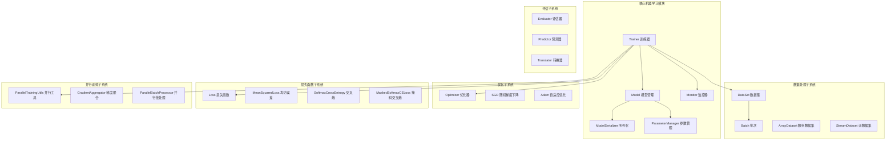

# TinyAI Machine Learning 机器学习核心模块 (tinyai-dl-ml)

## 模块概述

`tinyai-dl-ml` 是 TinyAI 深度学习框架的机器学习核心模块，提供了完整的深度学习模型训练、评估和管理功能。本模块是框架的核心大脑，整合了其他基础模块（ndarr、func、nnet），构建了一个高度可扩展和易于使用的机器学习平台。

## 核心架构

### 设计理念

本模块采用分层架构设计，通过模块化组件提供完整的机器学习工作流：

- **Model（模型）**：模型的完整生命周期管理
- **Trainer（训练器）**：训练流程控制和并行训练支持
- **DataSet（数据集）**：数据管理和批次处理
- **Optimizer（优化器）**：参数更新算法
- **Loss（损失函数）**：模型性能评估
- **Evaluator（评估器）**：模型效果评估



### 核心组件

#### 1. 模型管理
- [`Model`](src/main/java/io/leavesfly/tinyai/ml/Model.java) - 模型核心类，封装神经网络架构
- [`ModelInfo`](src/main/java/io/leavesfly/tinyai/ml/ModelInfo.java) - 模型元数据管理
- [`ModelSerializer`](src/main/java/io/leavesfly/tinyai/ml/ModelSerializer.java) - 模型序列化与反序列化
- [`ParameterManager`](src/main/java/io/leavesfly/tinyai/ml/ParameterManager.java) - 参数管理和优化

#### 2. 训练系统
- [`Trainer`](src/main/java/io/leavesfly/tinyai/ml/Trainer.java) - 训练流程控制器
- [`Monitor`](src/main/java/io/leavesfly/tinyai/ml/Monitor.java) - 训练过程监控
- [`Plot`](src/main/java/io/leavesfly/tinyai/ml/Plot.java) - 训练可视化

## 功能特性

### 🧠 模型生命周期管理

#### 模型创建与配置
```java
// 创建模型
Model model = new Model("myModel", networkBlock);

// 模型信息管理
ModelInfo info = model.getModelInfo();
info.setDescription("深度学习分类模型");
info.setVersion("1.0");
```

#### 模型序列化
- **完整模型保存**：保存模型结构和参数
- **参数保存**：仅保存模型参数
- **检查点保存**：保存训练状态，支持断点续训
- **压缩存储**：支持模型压缩存储

```java
// 保存完整模型
model.saveModel("model.bin");

// 保存压缩模型
model.saveModelCompressed("model_compressed.bin");

// 保存检查点
model.saveCheckpoint("checkpoint.bin", epoch, loss);

// 仅保存参数
model.saveParameters("params.bin");
```

### 🚀 高性能训练系统

#### 单线程训练
传统的顺序训练模式，适合调试和小规模数据：

```java
Trainer trainer = new Trainer(maxEpoch, monitor, evaluator);
trainer.init(dataSet, model, loss, optimizer);
trainer.singleThreadTrain(true); // 打乱数据
```

#### 并行训练
支持多线程并行处理，提升训练效率：

```java
// 启用并行训练
Trainer trainer = new Trainer(maxEpoch, monitor, evaluator, 
                              true, 4); // 启用并行，4个线程
trainer.init(dataSet, model, loss, optimizer);
trainer.train(true); // 自动选择并行训练
```

#### 并行训练特性
- **自动线程数优化**：根据CPU核心数和批次数量自动计算
- **梯度聚合**：多线程梯度自动聚合
- **内存优化**：高效的模型深拷贝机制
- **容错机制**：自动回退到单线程模式

### 📊 数据管理系统

#### 数据集类型 (dataset)
- [`DataSet`](src/main/java/io/leavesfly/tinyai/ml/dataset/DataSet.java) - 数据集基类
- [`ArrayDataset`](src/main/java/io/leavesfly/tinyai/ml/dataset/ArrayDataset.java) - 数组数据集
- [`StreamDataset`](src/main/java/io/leavesfly/tinyai/ml/dataset/StreamDataset.java) - 流式数据集
- [`Batch`](src/main/java/io/leavesfly/tinyai/ml/dataset/Batch.java) - 批次数据管理

#### 简单数据集 (simple)
预定义的标准数据集，便于快速开始：
- 螺旋数据集
- 线性回归数据集
- 分类数据集

```java
// 使用数据集
DataSet dataSet = new ArrayDataset(xData, yData);
dataSet.prepare();
dataSet.setBatchSize(32);

// 批次处理
List<Batch> batches = dataSet.getTrainDataSet().getBatches();
```

### ⚡ 优化算法 (optimize)

#### 支持的优化器
- [`SGD`](src/main/java/io/leavesfly/tinyai/ml/optimize/SGD.java) - 随机梯度下降
- [`Adam`](src/main/java/io/leavesfly/tinyai/ml/optimize/Adam.java) - 自适应矩估计优化器

```java
// SGD 优化器
Optimizer sgd = new SGD(0.01f); // 学习率 0.01

// Adam 优化器
Optimizer adam = new Adam(0.001f, 0.9f, 0.999f); // 学习率, beta1, beta2
```

### 📈 损失函数 (loss)

#### 支持的损失函数
- [`MeanSquaredLoss`](src/main/java/io/leavesfly/tinyai/ml/loss/MeanSquaredLoss.java) - 均方误差损失
- [`SoftmaxCrossEntropy`](src/main/java/io/leavesfly/tinyai/ml/loss/SoftmaxCrossEntropy.java) - Softmax交叉熵损失
- [`MaskedSoftmaxCELoss`](src/main/java/io/leavesfly/tinyai/ml/loss/MaskedSoftmaxCELoss.java) - 带掩码的Softmax交叉熵
- [`Classify`](src/main/java/io/leavesfly/tinyai/ml/loss/Classify.java) - 分类损失

```java
// 回归任务
Loss mse = new MeanSquaredLoss();

// 分类任务
Loss crossEntropy = new SoftmaxCrossEntropy();

// 序列任务（支持变长序列）
Loss maskedCE = new MaskedSoftmaxCELoss();
```

### 🔍 模型评估 (evaluator)

#### 评估组件
- [`Evaluator`](src/main/java/io/leavesfly/tinyai/ml/evaluator/Evaluator.java) - 评估器基类
- **准确率评估**：分类模型准确率计算
- **回归评估**：回归模型误差分析

### 🔮 模型推理 (inference)

#### 推理组件
- [`Predictor`](src/main/java/io/leavesfly/tinyai/ml/inference/Predictor.java) - 模型预测器
- [`Translator`](src/main/java/io/leavesfly/tinyai/ml/inference/Translator.java) - 输出转换器

```java
// 模型推理
Variable prediction = model.forward(inputVariable);

// 使用预测器
Predictor predictor = new Predictor(model);
NdArray result = predictor.predict(inputData);
```

## 技术依赖

本模块依赖以下 TinyAI 核心模块：

- `tinyai-dl-func` - 自动微分引擎，提供反向传播支持
- `tinyai-dl-ndarr` - 多维数组基础库，提供张量计算
- `tinyai-dl-nnet` - 神经网络层，提供网络构建组件

外部依赖：
- `jfreechart` - 图表可视化库，用于训练监控
- `junit` - 单元测试框架

## 使用示例

### 完整训练流程示例

```java
import io.leavesfly.tinyai.ml.*;
import io.leavesfly.tinyai.ml.dataset.ArrayDataset;
import io.leavesfly.tinyai.ml.loss.SoftmaxCrossEntropy;
import io.leavesfly.tinyai.ml.optimize.Adam;
import io.leavesfly.tinyai.nnet.block.MlpBlock;

// 1. 准备数据
NdArray xData = ...; // 输入数据
NdArray yData = ...; // 标签数据
DataSet dataSet = new ArrayDataset(xData, yData);

// 2. 创建模型
MlpBlock mlpBlock = new MlpBlock("classifier", 
                                 inputShape, 
                                 new int[]{128, 64, 10});
Model model = new Model("mnist_classifier", mlpBlock);

// 3. 配置训练组件
Loss loss = new SoftmaxCrossEntropy();
Optimizer optimizer = new Adam(0.001f);
Monitor monitor = new Monitor();
Evaluator evaluator = new ClassificationEvaluator();

// 4. 创建训练器（启用并行训练）
Trainer trainer = new Trainer(100, monitor, evaluator, true, 4);
trainer.init(dataSet, model, loss, optimizer);

// 5. 开始训练
trainer.train(true);

// 6. 保存模型
model.saveModel("trained_model.bin");
```

### 模型加载和推理

```java
// 加载训练好的模型
Model loadedModel = Model.loadModel("trained_model.bin");

// 推理
Variable input = new Variable(inputData);
Variable prediction = loadedModel.forward(input);

// 获取预测结果
NdArray result = prediction.getValue();
```

### 模型信息管理

```java
// 获取模型详细信息
ModelInfo info = model.getModelInfo();
System.out.println("模型名称: " + info.getName());
System.out.println("参数数量: " + info.getTotalParameters());
System.out.println("架构类型: " + info.getArchitectureType());

// 导出模型信息
ModelInfoExporter exporter = new ModelInfoExporter();
exporter.exportToMarkdown(info, "model_info.md");
```

## 并行训练详解

### 并行训练架构

TinyAI 的并行训练系统采用数据并行策略：

1. **批次分割**：将大批次数据分割给多个线程
2. **并行处理**：每个线程使用独立的模型副本计算梯度
3. **梯度聚合**：收集所有线程的梯度并进行平均
4. **参数更新**：使用聚合后的梯度更新主模型参数

### 性能优化特性

- **智能线程数计算**：根据CPU核心数和数据量自动优化
- **内存效率**：高效的模型深拷贝机制
- **负载均衡**：动态分配批次到各个线程
- **异常处理**：自动回退机制保证训练稳定性

## 测试覆盖

模块包含完整的单元测试，覆盖：
- 模型序列化和反序列化测试
- 参数管理器功能测试
- 并行训练性能测试
- 各种损失函数测试
- 优化器收敛性测试

运行测试：
```bash
cd /Users/yefei.yf/Qoder/TinyAI
export JAVA_HOME=/Library/Java/JavaVirtualMachines/jdk-17.jdk/Contents/Home
mvn test -pl tinyai-dl-ml
```

## 模块特色

### 🏗️ 企业级架构
- 完整的模型生命周期管理
- 生产就绪的序列化机制
- 丰富的监控和日志功能

### ⚡ 高性能计算
- 多线程并行训练支持
- 内存优化的数据处理
- GPU兼容的张量计算基础

### 🔧 易用性设计
- 简洁的API设计
- 丰富的预置组件
- 详细的文档和示例

### 🛡️ 可靠性保证
- 广泛的单元测试覆盖
- 异常处理和容错机制
- 持续的性能优化

## 开发指南

### 添加新的优化器

```java
public class CustomOptimizer extends Optimizer {
    @Override
    public void update() {
        // 实现自定义优化算法
    }
}
```

### 添加新的损失函数

```java
public class CustomLoss extends Loss {
    @Override
    public Variable loss(Variable y, Variable predictY) {
        // 实现自定义损失计算
        return customLossVariable;
    }
}
```

### 自定义评估器

```java
public class CustomEvaluator extends Evaluator {
    @Override
    public void evaluate() {
        // 实现自定义评估逻辑
    }
}
```

## 版本信息

- **当前版本**: 1.0-SNAPSHOT
- **Java 版本**: 17+
- **构建工具**: Maven 3.6+
- **并行训练**: 支持多线程数据并行

## 相关模块

- [`tinyai-dl-nnet`](../tinyai-dl-nnet/README.md) - 神经网络层模块
- [`tinyai-dl-func`](../tinyai-dl-func/README.md) - 自动微分引擎
- [`tinyai-dl-ndarr`](../tinyai-dl-ndarr/README.md) - 多维数组基础库
- [`tinyai-dl-case`](../tinyai-dl-case/README.md) - 应用示例模块

---

**TinyAI Machine Learning 模块** - 让深度学习训练变得简单、高效、可靠 🚀