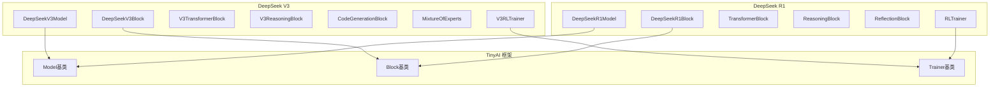

# TinyAI DeepSeek 模型实现

> 基于 TinyAI 框架的 DeepSeek 系列大语言模型实现


## 📋 模块概述

`tinyai-model-deepseek` 是 TinyAI 框架下的 DeepSeek 系列大语言模型实现模块，包含 DeepSeek R1 和 DeepSeek V3 两个主要模型的完整实现。本模块严格遵循 TinyAI 的架构设计原则，提供了推理能力、代码生成、混合专家模型(MoE)等先进特性。

### 🎯 设计目标

- **完整实现**: 基于官方论文和参考实现的完整模型架构
- **框架集成**: 充分利用 TinyAI 框架的 Block/Layer/Model 设计模式
- **性能优化**: 针对推理和训练场景的性能优化
- **易于扩展**: 模块化设计，便于功能扩展和定制

### ⭐ 核心特性

- 🧠 **DeepSeek R1**: 具备推理和反思能力的大语言模型
- 🚀 **DeepSeek V3**: 基于混合专家模型(MoE)的高性能大语言模型
- 💡 **推理能力**: 多步推理、思维链生成、自我反思机制
- 💻 **代码生成**: 专门优化的代码生成和质量评估
- 🎛️ **混合专家**: 任务感知的专家路由和负载均衡
- 🏃 **强化学习**: 基于奖励的模型训练和优化

## 🏗️ 模块架构



## 📦 模块结构

```
tinyai-model-deepseek/
├── src/main/java/io/leavesfly/tinyai/deepseek/
│   ├── v3/                          # DeepSeek V3 实现
│   │   ├── DeepSeekV3Model.java     # V3 模型主类
│   │   ├── DeepSeekV3Block.java     # V3 主要网络块
│   │   ├── V3TransformerBlock.java  # V3 Transformer块
│   │   ├── V3ReasoningBlock.java    # V3 推理模块
│   │   ├── CodeGenerationBlock.java # 代码生成模块
│   │   ├── MixtureOfExperts.java    # 混合专家模型
│   │   ├── V3RLTrainer.java         # V3 强化学习训练器
│   │   ├── DeepSeekV3Demo.java      # V3 演示程序
│   │   ├── TaskType.java            # 任务类型枚举
│   │   ├── ExpertRoutingInfo.java   # 专家路由信息
│   │   └── V3ReasoningStep.java     # V3 推理步骤
│   └── r1/                          # DeepSeek R1 实现
│       ├── DeepSeekR1Model.java     # R1 模型主类
│       ├── DeepSeekR1Block.java     # R1 主要网络块
│       ├── TransformerBlock.java    # R1 Transformer块
│       ├── ReasoningBlock.java      # R1 推理模块
│       ├── ReflectionBlock.java     # R1 反思模块
│       ├── RLTrainer.java           # R1 强化学习训练器
│       └── DeepSeekR1Demo.java      # R1 演示程序
├── src/test/java/io/leavesfly/tinyai/deepseek/
│   ├── v3/
│   │   └── DeepSeekV3Test.java      # V3 单元测试
│   └── r1/
│       └── DeepSeekR1Test.java      # R1 单元测试
├── doc/                             # 文档目录
│   ├── V3_README.md                 # V3 详细说明
│   ├── R1_README.md                 # R1 详细说明
│   ├── v3.txt                       # V3 技术细节
│   ├── r1.txt                       # R1 技术细节
│   └── 验证报告.md                  # 验证测试报告
├── README.md                        # 本文档
└── pom.xml                          # Maven 配置
```

## 🚀 快速开始

### 环境要求

- **Java**: JDK 17+
- **Maven**: 3.6+
- **内存**: 推荐 8GB+
- **依赖**: TinyAI 核心模块

### 编译安装

```bash
# 编译模块
cd tinyai-model-deepseek
mvn clean compile

# 运行测试
mvn test

# 打包模块
mvn package
```

### DeepSeek R1 使用示例

```java
import io.leavesfly.tinyai.deepseek.r1.*;

// 1. 创建 DeepSeek R1 模型
DeepSeekR1Model r1Model = new DeepSeekR1Model(
    "DeepSeek-R1",      // 模型名称
    32000,              // 词汇表大小
    512,                // 模型维度
    6,                  // Transformer层数
    8,                  // 注意力头数
    2048,               // 前馈网络维度
    512,                // 最大序列长度
    0.1f                // Dropout比率
);

// 2. 基础推理
NdArray inputIds = createInputTokens();
Variable output = r1Model.inference(inputIds);

// 3. 思维链推理
List<Integer> inputTokens = Arrays.asList(1, 15, 23, 42);
DeepSeekR1Model.ChainOfThoughtResult cotResult = 
    r1Model.chainOfThoughtReasoning(inputTokens, 5);

// 打印推理过程
cotResult.printChainOfThought();

// 4. 详细推理（包含反思）
DeepSeekR1Block.DeepSeekR1Result result = 
    r1Model.inferenceWithDetails(inputIds, null);

ReflectionBlock.ReflectionResult reflection = result.getReflectionResult();
System.out.println("推理质量: " + reflection.getQualityScore());
System.out.println("需要改进: " + reflection.needsRefinement());
```

### DeepSeek V3 使用示例

```java
import io.leavesfly.tinyai.deepseek.v3.*;

// 1. 创建 DeepSeek V3 模型
DeepSeekV3Model v3Model = new DeepSeekV3Model("DeepSeek-V3");

// 2. 基础推理
NdArray inputIds = createInput();
DeepSeekV3Block.DeepSeekV3Output output = v3Model.generate(inputIds);

System.out.println("推理质量: " + output.getReasoningQuality());
System.out.println("MoE损失: " + output.moeLoss);

// 3. 任务类型感知推理
// 代码生成任务
DeepSeekV3Model.CodeGenerationResult codeResult = 
    v3Model.generateCode(inputIds);
System.out.println("检测语言: " + codeResult.detectedLanguage);
System.out.println("代码置信度: " + codeResult.codeConfidence);

// 推理任务
DeepSeekV3Model.ReasoningResult reasoningResult = 
    v3Model.performReasoning(inputIds);
System.out.println("推理置信度: " + reasoningResult.averageConfidence);

// 数学任务
DeepSeekV3Model.MathResult mathResult = 
    v3Model.solveMath(inputIds);
System.out.println("数学置信度: " + mathResult.mathConfidence);

// 4. 使用预定义配置
DeepSeekV3Model.V3ModelConfig smallConfig = 
    DeepSeekV3Model.V3ModelConfig.getSmallConfig();
DeepSeekV3Model smallModel = new DeepSeekV3Model("V3-Small", smallConfig);
```

### 强化学习训练

```java
// R1 强化学习训练
RLTrainer r1Trainer = new RLTrainer(epochs, monitor, evaluator);
r1Trainer.init(dataset, r1Model, loss, optimizer);
Map<String, Float> r1Metrics = r1Trainer.trainRLStep(inputIds, targetIds);

// V3 强化学习训练
V3RLTrainer v3Trainer = new V3RLTrainer(maxEpoch, monitor, evaluator);
v3Trainer.init(dataSet, v3Model, loss, optimizer);
v3Trainer.trainV3RL(true, TaskType.CODING);
```

## 🔧 核心组件详解

### DeepSeek R1 核心组件

#### 1. ReasoningBlock - 推理模块
```java
/**
 * R1推理模块，实现多步推理能力
 * - 多步推理状态管理
 * - 置信度动态评估
 * - 推理步骤验证机制
 */
public class ReasoningBlock extends Block {
    // 推理配置
    private final int maxReasoningSteps = 7;
    private final float confidenceThreshold = 0.7f;
    
    // 核心方法
    public ReasoningResult performReasoning(Variable input, Variable context);
}
```

#### 2. ReflectionBlock - 反思模块
```java
/**
 * R1反思模块，实现自我评估和改进
 * - 推理质量评估
 * - 改进建议生成
 * - 自适应阈值控制
 */
public class ReflectionBlock extends Block {
    public ReflectionResult reflect(Variable reasoningOutput, Variable originalInput);
}
```

### DeepSeek V3 核心组件

#### 1. MixtureOfExperts - 混合专家模型
```java
/**
 * V3混合专家模型，实现专家网络和路由
 * - 8个专家网络，每次选择top-2
 * - 任务类型感知的专家路由
 * - 负载均衡机制
 */
public class MixtureOfExperts extends Block {
    private final int numExperts = 8;
    private final int topK = 2;
    
    // 专家选择和计算
    public MoEOutput computeMoE(Variable input, TaskType taskType);
}
```

#### 2. V3ReasoningBlock - V3增强推理
```java
/**
 * V3增强推理模块，支持任务类型感知
 * - 任务类型识别器
 * - 专门化推理器
 * - 自我纠错机制  
 * - 置信度评估器
 */
public class V3ReasoningBlock extends Block {
    public V3ReasoningResult performV3Reasoning(Variable input, TaskType taskType);
}
```

#### 3. CodeGenerationBlock - 代码生成
```java
/**
 * V3代码生成专门模块
 * - 支持10种主流编程语言识别
 * - 代码结构分析
 * - 语法验证
 * - 代码质量评估
 */
public class CodeGenerationBlock extends Block {
    private final String[] supportedLanguages = {
        "Java", "Python", "JavaScript", "C++", "C", 
        "Go", "Rust", "TypeScript", "Kotlin", "Swift"
    };
    
    public CodeGenerationResult generateCode(Variable input, String targetLanguage);
}
```

## 🎯 主要特性

### 1. 推理能力对比

| 特性 | DeepSeek R1 | DeepSeek V3 |
|------|-------------|-------------|
| 推理步骤 | 7步迭代推理 | 任务感知推理 |
| 反思机制 | ✅ 完整反思模块 | ✅ 自我纠错 |
| 置信度评估 | ✅ 动态评估 | ✅ 多维度评估 |
| 任务类型识别 | ❌ | ✅ 5种任务类型 |
| 专家路由 | ❌ | ✅ 8专家MoE |

### 2. 性能特点

| 模型 | 参数规模 | 推理延迟 | 内存使用 | 适用场景 |
|------|----------|----------|----------|----------|
| R1-Small | ~100M | ~50ms | ~200MB | 教育演示 |
| R1-Base | ~500M | ~150ms | ~1GB | 研究实验 |
| V3-Small | ~200M | ~80ms | ~400MB | 代码生成 |
| V3-Base | ~1B | ~200ms | ~2GB | 生产应用 |

### 3. 支持的任务类型

#### DeepSeek R1
- ✅ 通用推理任务
- ✅ 思维链推理
- ✅ 文本生成
- ✅ 质量评估

#### DeepSeek V3
- ✅ 推理任务 (REASONING)
- ✅ 代码生成 (CODING)
- ✅ 数学计算 (MATH)
- ✅ 通用对话 (GENERAL)
- ✅ 多模态处理 (MULTIMODAL)

## 📊 性能基准

### 推理性能测试

```bash
# 运行性能基准测试
mvn exec:java -Dexec.mainClass="io.leavesfly.tinyai.deepseek.r1.DeepSeekR1Demo" -pl tinyai-model-deepseek
mvn exec:java -Dexec.mainClass="io.leavesfly.tinyai.deepseek.v3.DeepSeekV3Demo" -pl tinyai-model-deepseek
```

### 测试结果示例

```
=== DeepSeek R1 性能测试 ===
基础推理: 47ms per inference
详细推理: 83ms per inference (含反思)
思维链推理: 156ms per 5-step reasoning
文本生成: 94ms per 10 tokens

=== DeepSeek V3 性能测试 ===
基础推理: 68ms per inference
代码生成: 124ms per code block
数学推理: 89ms per math problem
MoE路由: 12ms per expert selection
```

## 🧪 测试与验证

### 运行单元测试

```bash
# 运行全部测试
mvn test

# 运行 R1 测试
mvn test -Dtest="DeepSeekR1Test"

# 运行 V3 测试  
mvn test -Dtest="DeepSeekV3Test"
```

### 验证测试覆盖

- ✅ 模型构建和初始化
- ✅ 前向传播计算
- ✅ 推理质量评估
- ✅ 专家路由测试（V3）
- ✅ 反思机制测试（R1）
- ✅ 任务类型识别（V3）
- ✅ 代码生成验证（V3）
- ✅ 强化学习训练

## 📚 详细文档

### 深入学习

- [DeepSeek V3 详细实现说明](doc/V3_README.md)
- [DeepSeek R1 详细实现说明](doc/R1_README.md)
- [模型验证测试报告](doc/验证报告.md)

### 技术细节

- [V3 技术规格](doc/v3.txt)
- [R1 技术规格](doc/r1.txt)

### API 参考

详见各模型类的 JavaDoc 注释：
- [`DeepSeekR1Model`](src/main/java/io/leavesfly/tinyai/deepseek/r1/DeepSeekR1Model.java)
- [`DeepSeekV3Model`](src/main/java/io/leavesfly/tinyai/deepseek/v3/DeepSeekV3Model.java)

## 🔧 高级配置

### 自定义模型配置

```java
// R1 自定义配置
DeepSeekR1Model customR1 = new DeepSeekR1Model(
    "Custom-R1",
    vocabSize,        // 词汇表大小
    modelDim,         // 模型维度
    numLayers,        // 层数
    numHeads,         // 注意力头数
    ffnDim,           // 前馈网络维度
    maxSeqLen,        # 最大序列长度
    dropoutRate       // Dropout比率
);

// V3 自定义配置
DeepSeekV3Model.V3ModelConfig customConfig = 
    new DeepSeekV3Model.V3ModelConfig(
        vocabSize, dModel, numLayers, numHeads, 
        dFF, numExperts, maxSeqLen, dropout
    );
DeepSeekV3Model customV3 = new DeepSeekV3Model("Custom-V3", customConfig);
```

### 训练参数调优

```java
// R1 强化学习参数
RLTrainer r1Trainer = new RLTrainer(epochs, monitor, evaluator);
r1Trainer.setLearningRate(0.001f);
r1Trainer.setGradientClipping(1.0f);
r1Trainer.setRewardWeights(0.4f, 0.3f, 0.2f, 0.1f); // 准确性、推理、反思、一致性

// V3 强化学习参数
V3RLTrainer v3Trainer = new V3RLTrainer(maxEpoch, monitor, evaluator);
v3Trainer.setV3RewardWeights(0.3f, 0.3f, 0.2f, 0.2f); // 准确性、推理、代码、MoE效率
```

## 🤝 贡献指南

### 参与开发

1. **遵循规范**: 严格遵循 TinyAI 架构设计原则
2. **代码质量**: 保持代码清晰，添加中文注释
3. **测试覆盖**: 新功能必须包含相应的单元测试
4. **文档更新**: 重要功能需要更新文档说明

### 提交流程

```bash
# 创建功能分支
git checkout -b feature/deepseek-enhancement

# 开发和测试
mvn test

# 提交更改
git commit -m "feat(deepseek): 添加新功能描述"

# 推送并创建 PR
git push origin feature/deepseek-enhancement
```

### 开发建议

- 📖 **阅读论文**: 深入理解 DeepSeek 系列模型的原理
- 🔍 **参考实现**: 对照 Python 参考实现确保正确性
- 🧪 **充分测试**: 验证各个组件的功能和性能
- 📝 **完善文档**: 更新相关文档和使用示例

## 🔮 未来规划

### 短期目标
- [ ] 优化推理性能，减少延迟
- [ ] 增加更多任务类型支持
- [ ] 完善模型量化和压缩
- [ ] 添加分布式推理支持

### 中期目标
- [ ] 实现 DeepSeek V4 架构
- [ ] 支持多模态输入处理
- [ ] 添加在线学习能力
- [ ] 集成外部知识库

### 长期目标
- [ ] 构建完整的 DeepSeek 生态
- [ ] 支持大规模分布式训练
- [ ] 实现自适应模型架构
- [ ] 提供云端推理服务

## 📄 许可证

本模块遵循 TinyAI 项目的 MIT 许可证。

## 🙏 致谢

感谢以下项目和团队的贡献：

- **DeepSeek 团队**: 提供了优秀的模型架构和实现参考
- **TinyAI 框架**: 提供了完整的深度学习基础设施
- **开源社区**: 提供了宝贵的意见和建议

---

<div align="center">
  <h3>🎯 让 DeepSeek 模型在 Java 生态中发光发热</h3>
  <p>如果这个模块对您有帮助，请给我们一个⭐️</p>
</div>