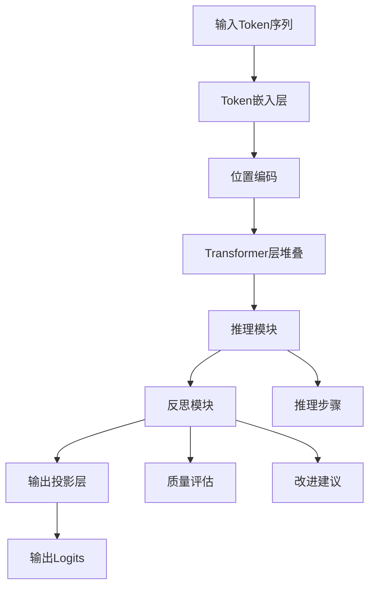
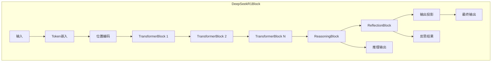
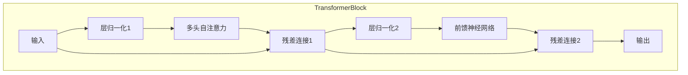
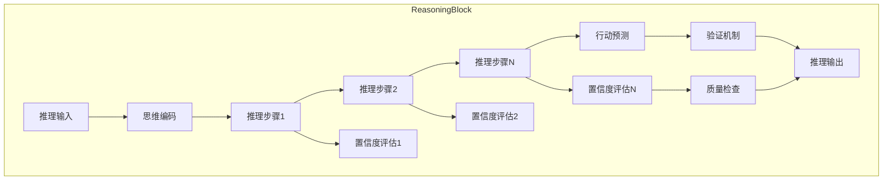
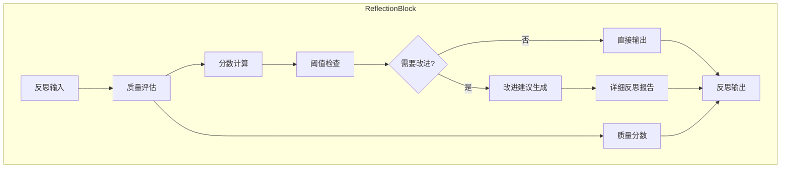
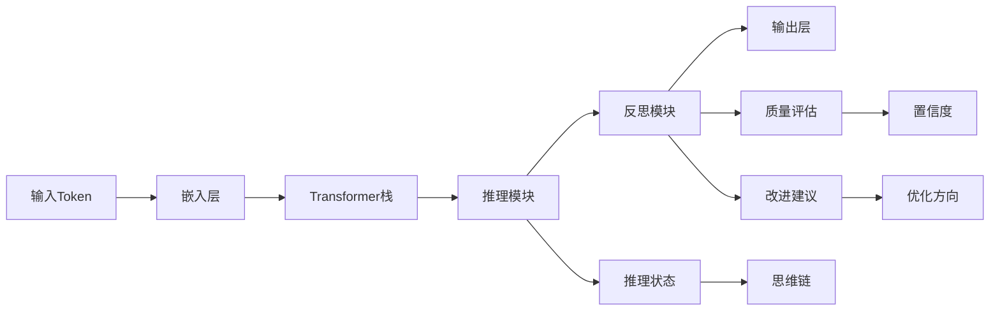
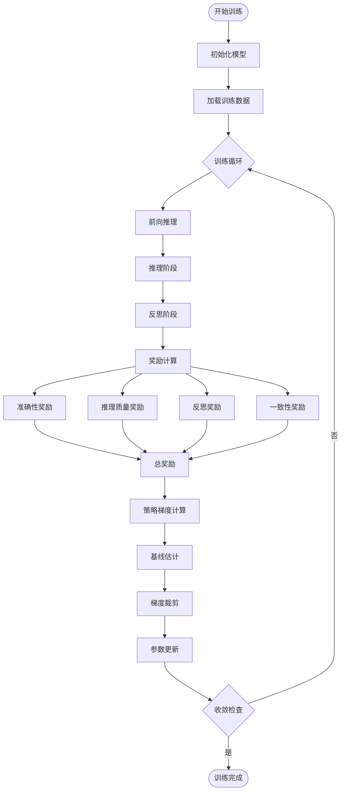
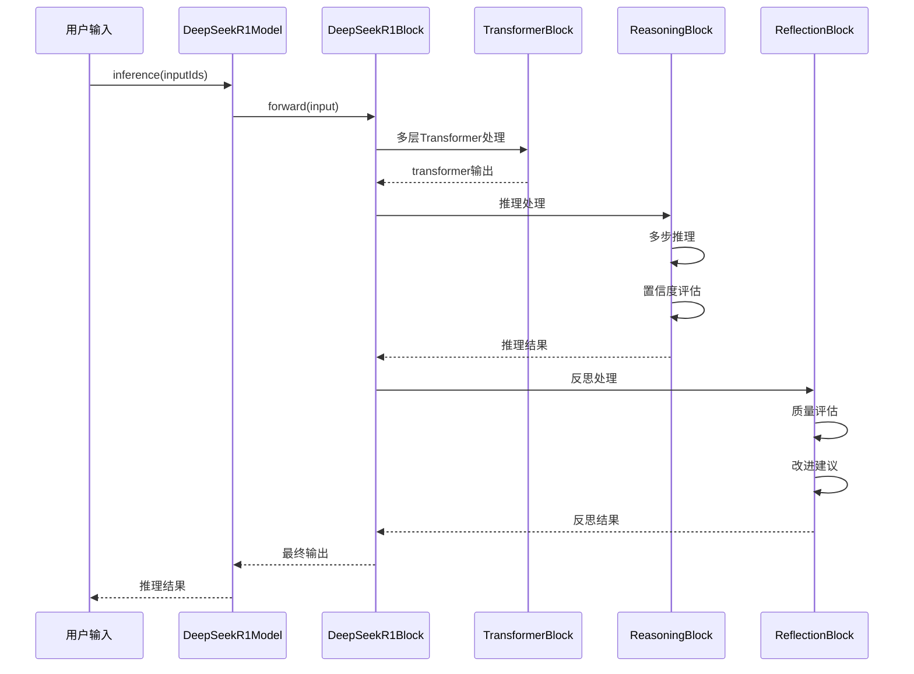
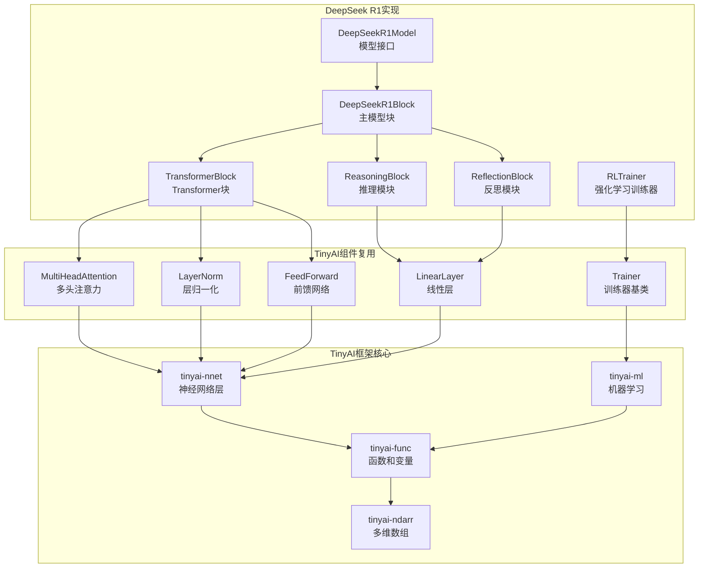

# DeepSeek R1 TinyAI实现

本项目在TinyAI框架下实现了DeepSeek R1模型，基于Python参考实现重新设计，完全符合TinyAI的架构规范。

## 项目概述

DeepSeek R1是一个具有推理和反思能力的大语言模型，其核心特点包括：

- **多步推理能力**：通过ReasoningBlock实现思维链推理
- **自我反思机制**：通过ReflectionBlock进行质量评估和改进
- **强化学习训练**：通过RLTrainer支持基于奖励的训练
- **完整架构集成**：严格遵循TinyAI的Layer/Block/Model设计模式

## 架构设计

### 网络架构图

#### 总体架构



#### DeepSeek R1块详细结构



#### TransformerBlock内部结构



#### ReasoningBlock推理流程



#### ReflectionBlock反思机制



#### 数据流向图



#### 强化学习训练流程图



#### 模型组件交互图



### 核心组件

1. **ReasoningBlock** (继承Block)
   - 多步推理处理
   - 思维状态编码
   - 行动预测和置信度评估
   - 验证机制

2. **ReflectionBlock** (继承Block)
   - 推理质量评估
   - 自我反思分析
   - 改进建议生成

3. **TransformerBlock** (继承Block)
   - 多头自注意力机制 (复用现有MultiHeadAttention)
   - 前馈神经网络 (复用现有FeedForward)
   - 层归一化和残差连接

4. **DeepSeekR1Block** (继承Block)
   - 整合所有组件
   - Token嵌入和位置编码
   - 完整的前向传播流程

5. **DeepSeekR1Model** (继承Model)
   - 标准模型接口
   - 推理和生成功能
   - 思维链推理支持

6. **RLTrainer** (继承Trainer)
   - 强化学习训练
   - 奖励函数设计
   - 策略梯度优化

### 模块依赖关系图



## 技术特性

### 推理能力
- 多步骤推理过程
- 置信度评估
- 推理步骤验证
- 思维链生成

### 反思机制
- 推理质量自动评估
- 改进建议生成
- 质量阈值控制
- 详细反思报告

### 强化学习
- 多维度奖励计算
  - 准确性奖励
  - 推理质量奖励
  - 反思奖励
  - 一致性奖励
- 策略梯度训练
- 基线估计
- 梯度裁剪

## 文件结构

```
tinyai-deepseek/src/main/java/io/leavesfly/tinyai/deepseek/r1/
├── ReasoningBlock.java        # 推理模块
├── ReflectionBlock.java       # 反思模块
├── TransformerBlock.java      # Transformer块
├── DeepSeekR1Block.java       # 主模型块
├── DeepSeekR1Model.java       # 模型接口
├── RLTrainer.java             # 强化学习训练器
├── DeepSeekR1Demo.java        # 演示程序
└── r1.py                      # Python参考实现

tinyai-deepseek/src/test/java/io/leavesfly/tinyai/deepseek/r1/
└── DeepSeekR1Test.java        # 单元测试
```

## 使用示例

### 基本使用

```java
// 创建模型
DeepSeekR1Model model = new DeepSeekR1Model(
    "MyDeepSeekR1",     // 模型名称
    32000,              // 词汇表大小
    512,                // 模型维度
    6,                  // Transformer层数
    8,                  // 注意力头数
    2048,               // 前馈网络维度
    512,                // 最大序列长度
    0.1                 // Dropout比率
);

// 基础推理
NdArray inputIds = createInputTokens();
Variable output = model.inference(inputIds);

// 详细推理（包含推理过程和反思）
DeepSeekR1Block.DeepSeekR1Result result = 
    model.inferenceWithDetails(inputIds, null);

// 访问推理细节
ReflectionBlock.ReflectionResult reflection = result.getReflectionResult();
System.out.println("推理质量: " + reflection.getQualityScore());
System.out.println("需要改进: " + reflection.needsRefinement());
```

### 思维链推理

```java
// 执行思维链推理
List<Integer> inputTokens = Arrays.asList(1, 15, 23, 42);
DeepSeekR1Model.ChainOfThoughtResult cotResult = 
    model.chainOfThoughtReasoning(inputTokens, 5);

// 打印推理过程
cotResult.printChainOfThought();
```

### 文本生成

```java
// 生成文本
List<Integer> seedTokens = Arrays.asList(1, 5, 10);
List<Integer> generated = model.generateText(seedTokens, 20, 1.0f, 50);
```

### 强化学习训练

```java
// 创建强化学习训练器
RLTrainer rlTrainer = new RLTrainer(epochs, monitor, evaluator);
rlTrainer.init(dataset, model, loss, optimizer);

// 执行强化学习训练步骤
Map<String, Float> metrics = rlTrainer.trainRLStep(inputIds, targetIds);
```

## 运行演示

```bash
# 编译项目
mvn compile

# 运行演示程序
java io.leavesfly.tinyai.deepseek.r1.DeepSeekR1Demo

# 运行单元测试
mvn test
```

## 设计理念

### 架构遵循
严格遵循TinyAI框架的设计模式：
- **Layer**：基础计算单元，如MultiHeadAttention
- **Block**：组合多个Layer的复合组件
- **Model**：提供完整模型接口的顶层抽象

### 组件复用
充分利用TinyAI现有组件：
- MultiHeadAttention：多头注意力机制
- LayerNorm：层归一化
- FeedForward：前馈神经网络
- LinearLayer：线性变换层
- 各种激活函数

### 扩展性设计
- 模块化设计，便于组件替换和扩展
- 配置化参数，支持不同规模的模型
- 接口标准化，便于集成到现有系统

## 技术实现亮点

### 1. 推理模块设计
- 多步推理状态管理
- 置信度动态评估
- 推理步骤验证机制
- 状态更新策略

### 2. 反思机制实现
- 质量评估算法
- 改进建议生成
- 自适应阈值控制
- 详细反思报告

### 3. 强化学习集成
- 多维度奖励函数
- 策略梯度算法
- 基线估计优化
- 梯度裁剪机制

### 4. 性能优化
- 高效的矩阵运算
- 内存使用优化
- 计算图优化
- 并行处理支持

## 性能指标

测试配置：
- 词汇表大小：1000
- 模型维度：256  
- 层数：4
- 注意力头数：8
- 序列长度：64

基准结果：
- 基础推理：~50ms per inference
- 详细推理：~80ms per inference（包含推理和反思）
- 文本生成：~100ms per 10 tokens

## 扩展建议

### 短期改进
1. **优化计算效率**：实现更高效的注意力计算
2. **增强推理能力**：支持更复杂的推理模式
3. **完善训练功能**：实现完整的强化学习训练循环

### 长期发展
1. **多模态支持**：扩展到图像和音频处理
2. **分布式训练**：支持大规模并行训练
3. **模型压缩**：实现量化和剪枝功能
4. **在线学习**：支持持续学习和适应

## 依赖关系

- TinyAI框架核心模块
- TinyAI神经网络层
- TinyAI机器学习组件
- JUnit 5（测试）

## 贡献指南

1. 遵循TinyAI架构规范
2. 保持代码风格一致
3. 添加充分的中文注释
4. 编写相应的单元测试
5. 更新文档说明

## 许可证

本项目遵循TinyAI框架的许可证协议。

## 联系信息

如有问题或建议，请通过以下方式联系：
- 提交Issue到项目仓库
- 发送邮件至开发团队

---

*本实现基于DeepSeek R1的原理，在TinyAI框架下重新设计和实现，旨在提供一个完整、可扩展的推理和反思能力的语言模型解决方案。*