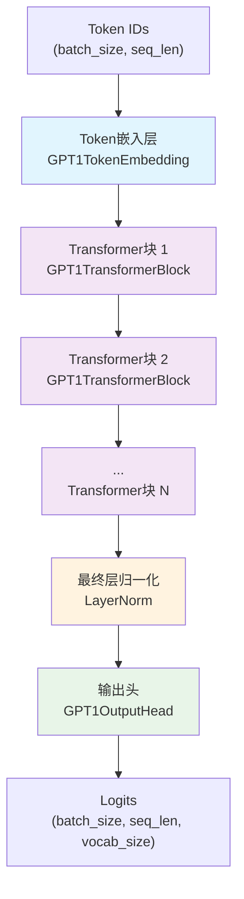
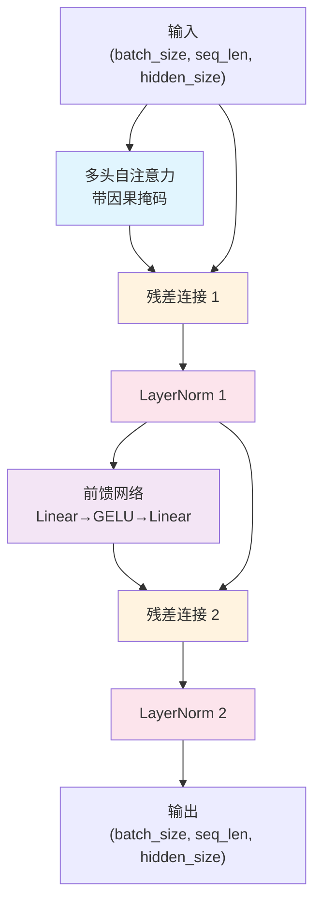
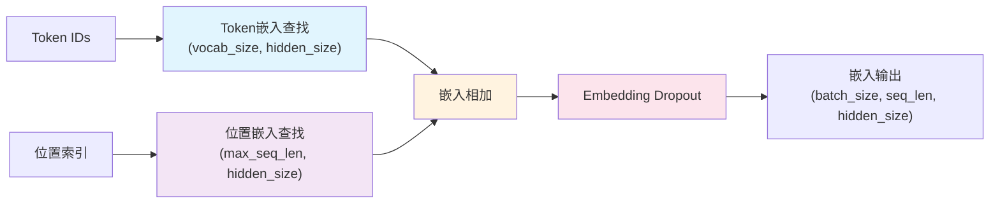
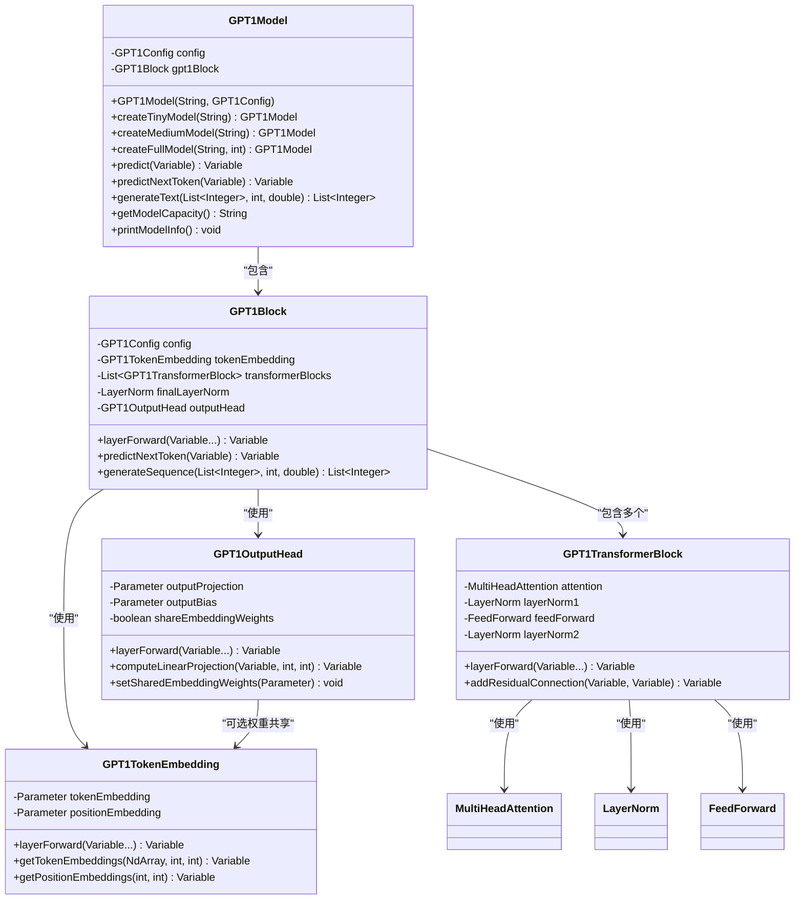

# GPT-1 模型实现

基于TinyAI框架实现的GPT-1语言模型，采用原始Transformer解码器架构，忠实还原了开创性的"Improving Language Understanding by Generative Pre-Training"论文中的模型设计。

## 📁 文件结构

```
tinyai-model-gpt/src/main/java/io/leavesfly/tinyai/gpt1/
├── GPT1Config.java              # GPT-1配置类
├── GPT1Model.java               # GPT-1模型类（继承Model）
├── GPT1Block.java               # GPT-1核心块（继承Block）
├── GPT1TransformerBlock.java    # Transformer解码器块
├── GPT1TokenEmbedding.java      # Token和位置嵌入层
├── GPT1OutputHead.java          # 语言模型输出头
└── GptDemo.java                 # 综合演示程序
```

## 🎯 核心特性

### 1. 原始Transformer架构
- **解码器-only结构**: 专注于自回归语言建模任务
- **Post-LayerNorm架构**: 遵循原始Transformer论文的层归一化位置
- **学习位置嵌入**: 使用可学习的绝对位置编码
- **权重共享**: 支持输入嵌入和输出投影权重共享

### 2. 多规模配置支持
- **小型模型**: 256维, 6层, 8头 (适用于测试和学习)
- **中型模型**: 512维, 8层, 8头 (平衡性能和效率)
- **标准模型**: 768维, 12层, 12头 (原论文配置)

### 3. 历史意义特性
- **首个GPT架构**: Transformer解码器在语言建模的开创性应用
- **无监督预训练**: 奠定了现代大语言模型的基础
- **迁移学习能力**: 为下游任务微调提供强大基础

## 🏗️ 网络架构图

### 整体架构


### GPT1TransformerBlock内部结构 (Post-LayerNorm)


### Token嵌入层结构


### GPT-1 vs GPT-2 架构对比

```mermaid
graph TB
    subgraph GPT1 ["GPT-1 (Post-LayerNorm)"]
        G1Input["输入"] --> G1Attn["Multi-Head Attention"]
        G1Attn --> G1Res1["+ 残差连接"]
        G1Input --> G1Res1
        G1Res1 --> G1LN1["LayerNorm"]
        G1LN1 --> G1FFN["Feed Forward"]
        G1FFN --> G1Res2["+ 残差连接"]
        G1LN1 --> G1Res2
        G1Res2 --> G1LN2["LayerNorm"]
    end
    
    subgraph GPT2 ["GPT-2 (Pre-LayerNorm)"]
        G2Input["输入"] --> G2LN1["LayerNorm"]
        G2LN1 --> G2Attn["Multi-Head Attention"]
        G2Attn --> G2Res1["+ 残差连接"]
        G2Input --> G2Res1
        G2Res1 --> G2LN2["LayerNorm"]
        G2LN2 --> G2FFN["Feed Forward"]
        G2FFN --> G2Res2["+ 残差连接"]
        G2Res1 --> G2Res2
    end
    
    style G1LN1 fill:#ffcdd2
    style G1LN2 fill:#ffcdd2
    style G2LN1 fill:#c8e6c9
    style G2LN2 fill:#c8e6c9
```


### 类图关系


## 🚀 快速开始

### 基本使用

```java
// 创建标准GPT-1模型
GPT1Model model = new GPT1Model("my-gpt1", new GPT1Config());

// 使用预设配置快速创建
GPT1Model tinyModel = GPT1Model.createTinyModel("gpt1-tiny");
GPT1Model mediumModel = GPT1Model.createMediumModel("gpt1-medium");
GPT1Model fullModel = GPT1Model.createFullModel("gpt1-full", 50000);

// 前向传播
Variable tokenIds = new Variable(NdArray.of(new float[][]{{1, 2, 3, 4, 5}}));
Variable output = model.predict(tokenIds);

// 预测下一个token
Variable nextToken = model.predictNextToken(tokenIds);

// 生成文本序列
List<Integer> prompt = Arrays.asList(1, 2, 3);
List<Integer> generated = model.generateText(prompt, 20, 1.0);
```

### 自定义配置

```java
// 创建自定义GPT-1配置
GPT1Config config = new GPT1Config(
    40000,  // vocabSize - 词汇表大小
    512,    // maxSequenceLength - 最大序列长度
    768,    // hiddenSize - 隐藏层维度
    12,     // numLayers - Transformer层数
    12      // numAttentionHeads - 注意力头数
);

// 设置训练相关参数
config.setResidualDropoutProb(0.1);
config.setEmbeddingDropoutProb(0.1);
config.setAttentionDropoutProb(0.1);
config.setActivationFunction("gelu");

// 验证配置
config.validate();

// 创建模型
GPT1Model model = new GPT1Model("custom-gpt1", config);
```

## 📊 模型配置对比

| 配置类型 | 词汇表 | 序列长度 | 隐藏维度 | 层数 | 注意力头 | 前馈维度 | 参数量估算 | 适用场景 |
|----------|--------|----------|----------|------|----------|----------|------------|----------|
| Tiny | 1000 | 128 | 256 | 6 | 8 | 1024 | ~2M | 测试、学习 |
| Medium | 5000 | 256 | 512 | 8 | 8 | 2048 | ~25M | 中等任务 |
| Standard | 40000 | 512 | 768 | 12 | 12 | 3072 | ~117M | 原始论文 |

## 🧪 运行演示

### 1. 综合演示程序
```java
// 运行完整演示
GptDemo.main(new String[0]);

// 运行特定演示模块
GptDemo.runDemo("quick");        // 快速开始
GptDemo.runDemo("detailed");     // 详细功能
GptDemo.runDemo("architecture"); // 架构展示
GptDemo.runDemo("performance");  // 性能测试
```

### 2. 模型信息展示
```java
GPT1Model model = GPT1Model.createMediumModel("demo");
model.printModelInfo();

// 输出示例:
// === GPT-1 模型详细信息 ===
// 模型名称: demo
// 模型类型: GPT-1 (Generative Pre-trained Transformer 1)
// 
// --- 架构配置 ---
// 词汇表大小: 5000
// 最大序列长度: 256
// 隐藏层维度: 512
// Transformer层数: 8
// 注意力头数: 8
// 前馈网络维度: 2048
// 激活函数: gelu
```

### 3. 文本生成示例
```java
GPT1Model model = GPT1Model.createTinyModel("generator");

// 基础生成
List<Integer> prompt = Arrays.asList(1, 2, 3);
List<Integer> result = model.generateText(prompt, 10, 1.0);
System.out.println("生成结果: " + result);

// 不同温度的生成对比
double[] temperatures = {0.5, 1.0, 1.5};
for (double temp : temperatures) {
    List<Integer> generated = model.generateText(prompt, 10, temp);
    System.out.printf("温度%.1f: %s\n", temp, generated);
}
```

### 4. 批量处理示例
```java
// 创建批量输入
float[][] batchData = {
    {1, 2, 3, 4},
    {5, 6, 7, 8},
    {9, 10, 11, 12}
};
Variable batchInput = new Variable(NdArray.of(batchData));

// 批量预测
Variable batchResult = model.batchPredict(batchInput);
System.out.printf("批量输入形状: %s\n", batchInput.getValue().getShape());
System.out.printf("批量输出形状: %s\n", batchResult.getValue().getShape());
```

## 🔧 技术实现细节

### 1. Post-LayerNorm架构
GPT-1采用Post-LayerNorm结构，与原始Transformer保持一致：

```java
// GPT1TransformerBlock的前向传播
Variable attentionOutput = attention.layerForward(x, x, x);
Variable residual1 = addResidualConnection(x, attentionOutput);
Variable norm1Output = layerNorm1.layerForward(residual1);

Variable ffnOutput = feedForward.layerForward(norm1Output);
Variable residual2 = addResidualConnection(norm1Output, ffnOutput);  
Variable norm2Output = layerNorm2.layerForward(residual2);
```

### 2. 因果掩码机制
确保自回归特性，防止未来信息泄露：

```java
// 在MultiHeadAttention中使用因果掩码
MultiHeadAttention attention = new MultiHeadAttention(
    name + "_attention", 
    config.getHiddenSize(), 
    config.getNumAttentionHeads(), 
    true  // 启用因果掩码
);
```

### 3. 权重共享机制
支持输入嵌入和输出投影权重共享，减少参数量：

```java
// 创建共享权重的输出头
GPT1OutputHead outputHead = new GPT1OutputHead(
    name + "_output_head", 
    config, 
    false,  // 不使用偏置
    tokenEmbedding.getTokenEmbedding()  // 共享Token嵌入权重
);
```

### 4. 位置编码
使用学习的绝对位置嵌入：

```java
// 初始化位置嵌入矩阵
positionEmbedding = new Parameter(
    NdArray.likeRandomN(Shape.of(config.getMaxSequenceLength(), config.getHiddenSize()))
           .mulNum((float) config.getInitializerRange())
);

// 嵌入组合
Variable embeddings = tokenEmbeds.add(positionEmbeds);
```

## 📈 历史意义与特点

### GPT-1的创新贡献
- ✅ **首次证明**: Transformer解码器在语言建模上的强大能力
- ✅ **无监督预训练**: 开创了预训练+微调的范式
- ✅ **迁移学习**: 证明了语言模型的通用表示能力
- ✅ **架构简洁**: 纯解码器结构，设计优雅

### 与后续GPT的关系
- **GPT-1 → GPT-2**: 增加模型规模，改用Pre-LayerNorm
- **GPT-1 → GPT-3**: 大幅扩展参数量，引入In-Context Learning
- **架构延续**: 现代大语言模型的基础架构

### 适用场景
- 🎯 **历史研究**: 理解GPT系列模型的演进
- 🎯 **教学演示**: 学习Transformer解码器原理
- 🎯 **基础任务**: 简单的文本生成和语言建模
- 🎯 **概念验证**: 验证架构设计思想

## 🔍 代码示例

### 模型组件访问
```java
GPT1Model model = GPT1Model.createMediumModel("components");

// 获取配置信息
GPT1Config config = model.getConfig();
System.out.println("隐藏维度: " + config.getHiddenSize());
System.out.println("注意力头维度: " + config.getAttentionHeadSize());

// 获取核心组件
GPT1Block gpt1Block = model.getGPT1Block();
GPT1TokenEmbedding tokenEmbed = gpt1Block.getTokenEmbedding();
List<GPT1TransformerBlock> transformerBlocks = gpt1Block.getTransformerBlocks();
GPT1OutputHead outputHead = gpt1Block.getOutputHead();

// 访问Transformer块的内部组件
GPT1TransformerBlock firstBlock = transformerBlocks.get(0);
MultiHeadAttention attention = firstBlock.getAttention();
FeedForward feedForward = firstBlock.getFeedForward();
```

### 输入验证和错误处理
```java
GPT1Model model = GPT1Model.createTinyModel("validator");

// 序列长度验证
if (model.isValidSequenceLength(256)) {
    System.out.println("✅ 序列长度有效");
} else {
    System.out.println("❌ 序列长度超出限制");
}

// Token ID验证
if (model.isValidTokenId(500)) {
    System.out.println("✅ Token ID有效");
} else {
    System.out.println("❌ Token ID超出词汇表范围");
}

// 输入验证
try {
    Variable validInput = new Variable(NdArray.of(new float[][]{{1, 2, 3}}));
    model.validateInput(validInput);
    System.out.println("✅ 输入验证通过");
} catch (IllegalArgumentException e) {
    System.out.println("❌ 输入验证失败: " + e.getMessage());
}
```

### 性能监控
```java
GPT1Model model = GPT1Model.createMediumModel("benchmark");

// 模型容量信息
String capacity = model.getModelCapacity();
System.out.println("模型容量: " + capacity);

// 推理性能测试
long startTime = System.currentTimeMillis();
Variable input = new Variable(NdArray.of(new float[][]{{1, 2, 3, 4, 5}}));
Variable output = model.predict(input);
long endTime = System.currentTimeMillis();

System.out.printf("推理时间: %d ms\n", endTime - startTime);
System.out.printf("输出形状: %s\n", output.getValue().getShape());
```

## 🎓 学习资源

### 核心论文
- **"Improving Language Understanding by Generative Pre-Training"** (GPT-1原论文)
- **"Attention Is All You Need"** (Transformer原论文)
- **"Deep Residual Learning for Image Recognition"** (残差连接)

### 技术博客
- GPT-1架构深度解析
- Post-LayerNorm vs Pre-LayerNorm对比
- 自回归语言模型原理
- Transformer解码器详解

### 相关概念
- **自回归语言建模**: 根据前文预测下一个词
- **因果掩码**: 防止解码器看到未来信息
- **无监督预训练**: 在大量文本上学习语言表示
- **迁移学习**: 将预训练模型用于下游任务

## 🤝 扩展建议

### 可能的改进方向
- [ ] 实现真正的Dropout机制
- [ ] 添加温度采样、Top-k、Top-p解码策略
- [ ] 支持束搜索(Beam Search)解码
- [ ] 实现模型并行和梯度累积
- [ ] 添加注意力权重可视化

### 高级特性
- [ ] 支持不同的位置编码方案
- [ ] 实现知识蒸馏功能
- [ ] 添加模型压缩和量化
- [ ] 支持增量生成优化

### 与其他GPT模型的集成
- [ ] 提供GPT-1到GPT-2的迁移工具
- [ ] 实现架构对比分析功能
- [ ] 支持模型能力基准测试

---

*基于TinyAI框架实现，忠实还原GPT-1原始架构，为理解和学习现代大语言模型的发展历程提供宝贵资源。*