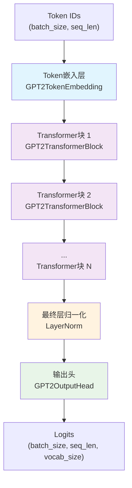
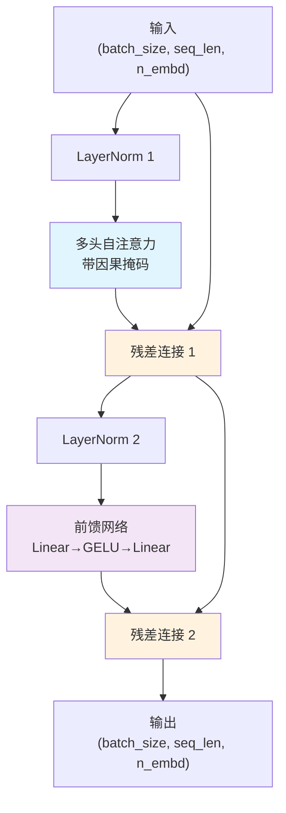
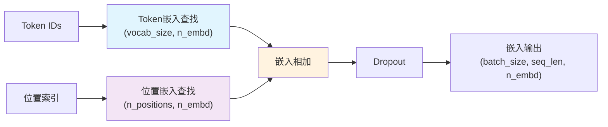
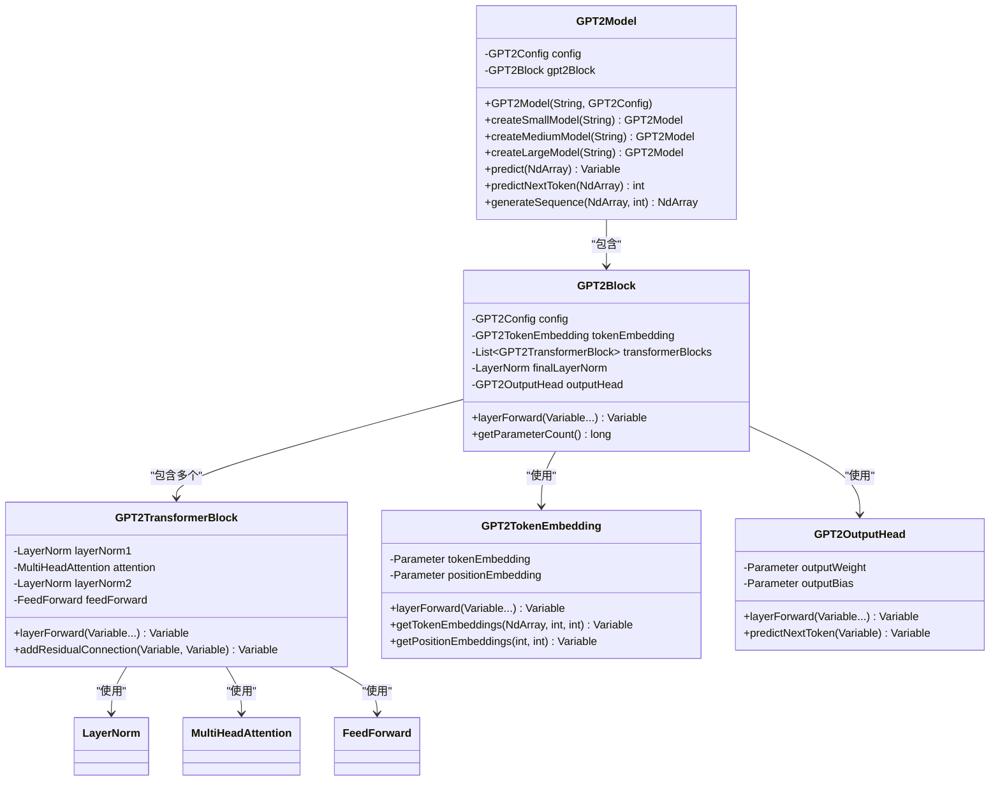

# GPT-2 模型实现

基于TinyAI框架实现的GPT-2语言模型，采用解码器-only Transformer架构，支持多种规模配置和文本生成任务。

## 📁 文件结构

```
tinyai-model-gpt/src/main/java/io/leavesfly/tinyai/gpt2/
├── GPT2Config.java              # GPT-2配置类
├── GPT2Model.java               # GPT-2模型类（继承Model）
├── GPT2Block.java               # GPT-2核心块（继承Block）
├── GPT2TransformerBlock.java    # Transformer解码器块
├── GPT2TokenEmbedding.java      # Token和位置嵌入层
├── GPT2OutputHead.java          # 语言模型输出头
└── test/                        # 测试套件
```

## 🎯 核心特性

### 1. 多规模模型支持
- **小型模型**: 256维, 6层, 8头 (适用于测试和学习)
- **标准模型**: 768维, 12层, 12头 (GPT-2 117M参数)
- **中型模型**: 1024维, 24层, 16头 (GPT-2 345M参数)
- **大型模型**: 1280维, 36层, 20头 (GPT-2 762M参数)

### 2. 架构设计
- **解码器-only Transformer**: 专为自回归语言建模设计
- **Pre-LayerNorm结构**: 层归一化在注意力和前馈网络之前
- **因果掩码**: 保证生成过程中的自回归特性
- **残差连接**: 支持深层网络的梯度传播

### 3. 核心组件
- **Token嵌入**: 可学习的词汇表嵌入和位置嵌入
- **多头自注意力**: 带因果掩码的自注意力机制
- **前馈网络**: 使用GELU激活函数的两层MLP
- **层归一化**: 稳定训练的归一化技术

## 🏗️ 网络架构图

### 整体架构


### GPT2TransformerBlock内部结构


### Token嵌入层结构


### 类图关系


## 🚀 快速开始

### 基本使用

```java
// 创建标准GPT-2模型
GPT2Model model = new GPT2Model("my-gpt2", new GPT2Config());

// 使用预设配置
GPT2Model smallModel = GPT2Model.createSmallModel("gpt2-small");
GPT2Model mediumModel = GPT2Model.createMediumModel("gpt2-medium");
GPT2Model largeModel = GPT2Model.createLargeModel("gpt2-large");

// 前向传播
NdArray tokenIds = NdArray.of(Shape.of(1, 10)); // 输入token序列
Variable output = model.forward(new Variable(tokenIds));

// 预测下一个token
int nextToken = model.predictNextToken(tokenIds);

// 生成文本序列
NdArray generated = model.generateSequence(tokenIds, 20);
```

### 自定义配置

```java
// 创建自定义配置
GPT2Config config = new GPT2Config(
    30000,  // vocabSize - 词汇表大小
    512,    // nPositions - 最大序列长度
    512,    // nEmbd - 嵌入维度
    8,      // nLayer - Transformer层数
    8,      // nHead - 注意力头数
    2048,   // nInner - 前馈网络中间层维度
    "gelu", // activationFunction - 激活函数
    0.1,    // residPdrop - 残差dropout
    0.1,    // embdPdrop - 嵌入dropout
    0.1,    // attnPdrop - 注意力dropout
    1e-5,   // layerNormEpsilon - 层归一化epsilon
    0.02    // initializerRange - 权重初始化范围
);

// 验证配置
config.validate();

// 创建模型
GPT2Model model = new GPT2Model("custom-gpt2", config);
```

## 📊 模型配置对比

| 配置类型 | 嵌入维度 | 层数 | 注意力头 | 前馈维度 | 参数量估算 | 适用场景 |
|----------|----------|------|----------|----------|------------|----------|
| 小型 | 256 | 6 | 8 | 1024 | ~10M | 测试、学习 |
| 标准 | 768 | 12 | 12 | 3072 | ~117M | 中等任务 |
| 中型 | 1024 | 24 | 16 | 4096 | ~345M | 复杂任务 |
| 大型 | 1280 | 36 | 20 | 5120 | ~762M | 高质量生成 |

## 🧪 运行演示

### 1. 模型信息展示
```java
GPT2Model model = GPT2Model.createMediumModel("gpt2-medium");
model.printModelInfo();
// 输出：
// === GPT-2 模型详细信息 ===
// GPT-2模型配置摘要:
// - 词汇表大小: 50,257
// - 嵌入维度: 1024
// - Transformer层数: 24
// - 注意力头数: 16
// - 总参数数量: XXX,XXX
```

### 2. 文本生成示例
```java
// 准备输入
NdArray startTokens = NdArray.of(Shape.of(1, 5));
// 假设token: [1, 15, 23, 8, 42]
startTokens.set(1, 0, 0);
startTokens.set(15, 0, 1);
startTokens.set(23, 0, 2);
startTokens.set(8, 0, 3);
startTokens.set(42, 0, 4);

// 生成20个新token
NdArray generated = model.generateSequence(startTokens, 20);
System.out.println("生成的序列长度: " + generated.getShape().getDimension(1));
```

### 3. 逐步预测
```java
NdArray currentSequence = startTokens;
for (int i = 0; i < 10; i++) {
    int nextToken = model.predictNextToken(currentSequence);
    System.out.println("预测的下一个token: " + nextToken);
    
    // 将新token添加到序列中继续预测
    currentSequence = appendToken(currentSequence, nextToken);
}
```

## 🔧 技术实现细节

### 1. 继承体系
- `GPT2Model` extends `Model` (TinyAI框架核心模型类)
- `GPT2Block` extends `Block` (TinyAI框架核心块类)
- `GPT2TransformerBlock` extends `Block`
- `GPT2TokenEmbedding` extends `Layer`
- `GPT2OutputHead` extends `Layer`

### 2. 核心算法
- **因果自注意力**: 使用下三角掩码确保只能看到当前和之前的位置
- **位置编码**: 可学习的绝对位置嵌入
- **残差连接**: 每个子层都使用残差连接和层归一化
- **权重初始化**: 使用正态分布初始化，标准差为0.02

### 3. 前向传播流程
1. **输入嵌入**: Token ID → Token嵌入 + 位置嵌入
2. **Transformer层**: N个GPT2TransformerBlock的串联
3. **最终归一化**: 在输出前应用层归一化
4. **输出映射**: 线性变换到词汇表维度

## 📈 性能特点

### 优势
- ✅ 模块化设计，易于理解和扩展
- ✅ 支持多种模型规模配置
- ✅ 完整的TinyAI框架集成
- ✅ 规范的参数初始化
- ✅ 详细的输入验证和错误处理

### 适用场景
- 🎯 文本生成和续写
- 🎯 语言模型预训练
- 🎯 对话系统构建
- 🎯 代码生成任务
- 🎯 教学演示和研究

### 内存和计算考虑
- **内存使用**: 与模型大小和序列长度成正比
- **计算复杂度**: O(n²d) 其中n为序列长度，d为模型维度
- **推理速度**: 支持批处理，可并行化处理

## 🔍 代码示例

### 获取模型组件
```java
GPT2Model model = GPT2Model.createSmallModel("gpt2");

// 获取配置信息
GPT2Config config = model.getConfig();
System.out.println("词汇表大小: " + config.getVocabSize());

// 获取核心组件
GPT2Block gpt2Block = model.getGPT2Block();
GPT2TokenEmbedding tokenEmbedding = model.getTokenEmbedding();
GPT2TransformerBlock firstTransformerBlock = model.getTransformerBlock(0);
GPT2OutputHead outputHead = model.getOutputHead();
```

### 输入验证
```java
try {
    NdArray tokenIds = NdArray.of(Shape.of(2, 1025)); // 超过最大长度
    model.validateInput(tokenIds);
} catch (IllegalArgumentException e) {
    System.out.println("输入验证失败: " + e.getMessage());
    // 输出: 序列长度(1025)超过最大支持长度(1024)
}
```

### 参数统计
```java
GPT2Model model = GPT2Model.createMediumModel("gpt2-medium");
long totalParams = model.getGPT2Block().getParameterCount();
System.out.println("模型总参数数量: " + String.format("%,d", totalParams));

// 获取配置摘要
String summary = model.getConfigSummary();
System.out.println(summary);
```

## 📚 相关技术

### GPT-2特色技术
- **Byte Pair Encoding (BPE)**: 子词标记化技术
- **Pre-LayerNorm**: 层归一化在注意力计算之前
- **GELU激活函数**: 比ReLU更平滑的激活函数
- **权重绑定**: 输入嵌入和输出投影共享权重

### 与其他模型的对比
- **vs GPT-1**: 增加了层数和参数量，使用了更大的数据集
- **vs GPT-3**: GPT-2是GPT-3的前身，架构相似但规模更小
- **vs BERT**: GPT-2是解码器-only，BERT是编码器-only

## 🎓 学习资源

### 核心论文
- "Language Models are Unsupervised Multitask Learners" (GPT-2)
- "Attention Is All You Need" (Transformer)
- "Improving Language Understanding by Generative Pre-Training" (GPT-1)

### 技术博客
- GPT-2架构深度解析
- Transformer注意力机制详解
- 自回归语言模型原理

## 🤝 扩展建议

### 可能的改进方向
- [ ] 添加Rotary Position Embedding (RoPE)支持
- [ ] 实现KV缓存优化推理速度
- [ ] 支持模型并行和梯度累积
- [ ] 添加更多激活函数选项
- [ ] 实现渐进式序列长度训练

### 高级特性
- [ ] Top-k和Top-p采样策略
- [ ] 温度控制的概率采样
- [ ] 束搜索 (Beam Search) 解码
- [ ] 重复惩罚机制

---

*基于TinyAI框架实现，遵循标准GPT-2架构设计，提供清晰的模块化实现和完整的功能支持。*