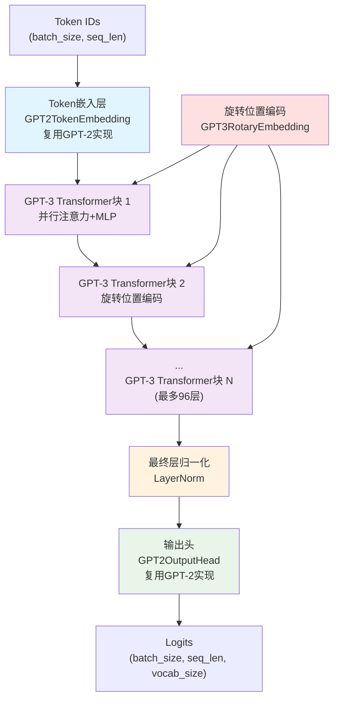
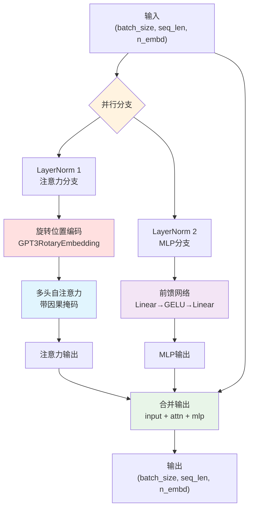
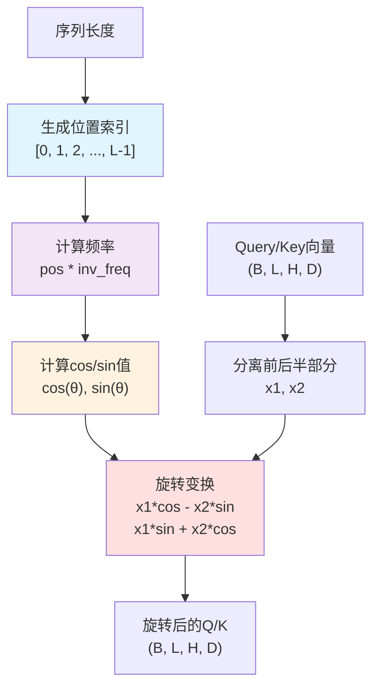
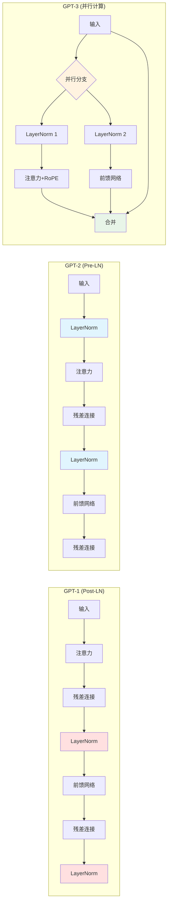
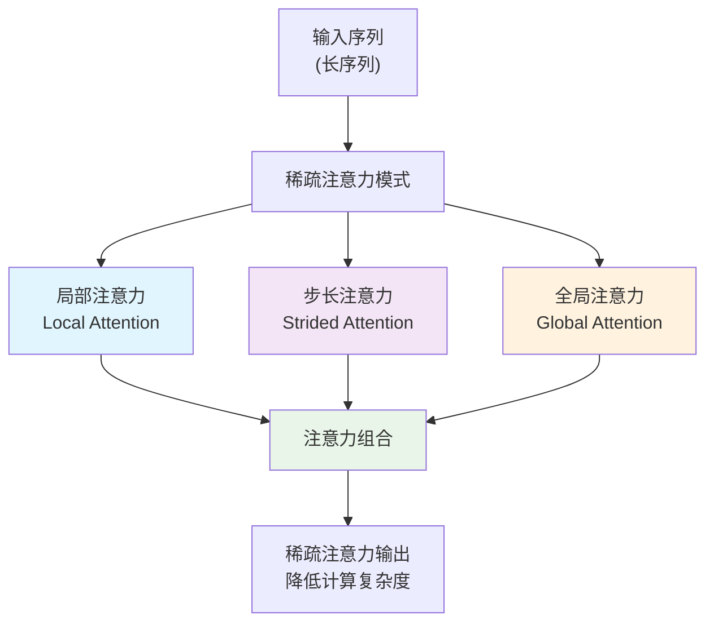
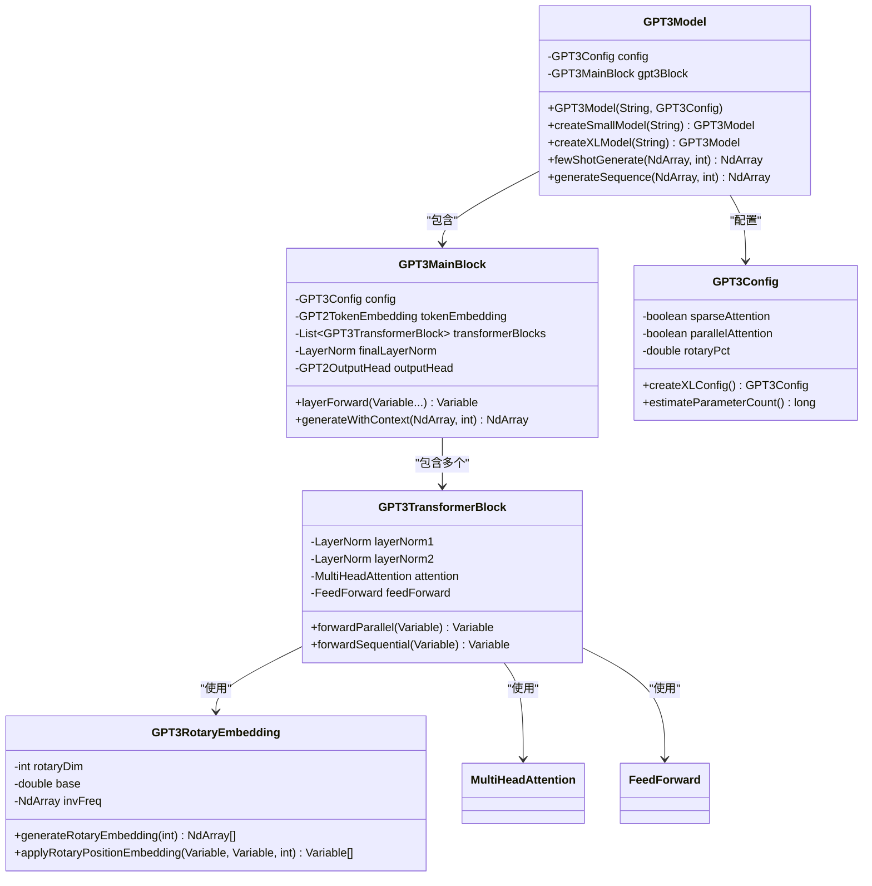

# GPT-3 模型实现

基于TinyAI框架实现的GPT-3语言模型，采用解码器-only Transformer架构，引入了并行注意力计算、旋转位置编码(RoPE)、稀疏注意力等先进技术，支持超大规模参数配置和Few-shot学习能力。

## 📁 文件结构

```
tinyai-model-gpt/src/main/java/io/leavesfly/tinyai/gpt3/
├── GPT3Config.java              # GPT-3配置类（支持175B参数）
├── GPT3Model.java               # GPT-3模型类（继承Model）
├── GPT3MainBlock.java           # GPT-3主体块（继承Block）
├── GPT3TransformerBlock.java    # GPT-3 Transformer解码器块
├── GPT3RotaryEmbedding.java     # 旋转位置编码(RoPE)实现
├── GPT3Demo.java                # 完整演示程序
└── test/                        # 测试套件
```

## 🎯 核心特性

### 1. 多规模超大模型支持
- **小型模型**: 768维, 12层, 12头 (125M参数，学习测试)
- **中型模型**: 1024维, 24层, 16头 (350M参数，实用应用)
- **大型模型**: 2048维, 24层, 32头 (1.3B参数，高质量生成)
- **超大型模型**: 12288维, 96层, 96头 (175B参数，顶级性能)

### 2. 先进架构设计
- **并行注意力与MLP**: 同时计算注意力和前馈网络，提升计算效率
- **旋转位置编码(RoPE)**: 相对位置编码，支持任意长度序列
- **稀疏注意力机制**: 大型模型采用稀疏注意力节省计算和内存
- **梯度检查点**: 训练时节省内存的梯度累积策略
- **Pre-LayerNorm结构**: 稳定的深层网络训练

### 3. Few-shot学习能力
- **零样本学习**: 无需微调即可执行新任务
- **上下文学习**: 基于示例快速理解任务模式  
- **任务泛化**: 支持分类、生成、翻译等多种任务
- **强大推理**: 展现类人的逻辑推理能力

## 🏗️ 网络架构图

### GPT-3整体架构


### GPT3TransformerBlock并行架构


### 旋转位置编码(RoPE)机制


### GPT-3与前代模型架构对比


### 稀疏注意力模式(大型模型)


### 类图关系


## 🚀 快速开始

### 基本使用

```java
// 创建不同规模的GPT-3模型
GPT3Model smallModel = GPT3Model.createSmallModel("gpt3-small");      // 125M参数
GPT3Model mediumModel = GPT3Model.createMediumModel("gpt3-medium");   // 350M参数
GPT3Model largeModel = GPT3Model.createLargeModel("gpt3-large");      // 1.3B参数
GPT3Model xlModel = GPT3Model.createXLModel("gpt3-xl");               // 175B参数

// 标准前向传播
NdArray tokenIds = NdArray.of(Shape.of(1, 20)); // 输入序列
Variable output = model.forward(new Variable(tokenIds));

// 文本生成
NdArray generated = model.generateSequence(tokenIds, 50);

// Few-shot学习生成
NdArray context = createFewShotContext(); // 创建包含示例的上下文
NdArray fewShotResult = model.fewShotGenerate(context, 30);
```

### Few-shot学习示例

```java
// 情感分析Few-shot示例
public class GPT3FewShotExample {
    public static void demonstrateSentimentAnalysis() {
        GPT3Model model = GPT3Model.createMediumModel("gpt3-sentiment");
        
        // 构建Few-shot上下文："句子 -> 情感标签"的示例
        String[] examples = {
            "这部电影真的很棒！ -> 正面",
            "我觉得这个产品很糟糕。 -> 负面", 
            "今天天气不错。 -> 中性"
        };
        
        // 编码上下文为token序列
        NdArray context = encodeExamples(examples);
        
        // 添加新的待分析句子
        NdArray newSentence = encodeText("这家餐厅的服务很差。 ->");
        NdArray fullContext = concatenate(context, newSentence);
        
        // 生成分类结果
        NdArray result = model.fewShotGenerate(fullContext, 5);
        
        System.out.println("Few-shot分类结果: " + decodeTokens(result));
    }
}
```

### 高级配置

```java
// 创建超大型GPT-3配置(175B参数)
GPT3Config xlConfig = new GPT3Config();
xlConfig.setNEmbd(12288);           // 嵌入维度
xlConfig.setNLayer(96);             // 96层Transformer
xlConfig.setNHead(96);              // 96个注意力头
xlConfig.setNInner(49152);          // 前馈网络维度
xlConfig.setSparseAttention(true);   // 启用稀疏注意力
xlConfig.setParallelAttention(true); // 启用并行计算
xlConfig.setGradientCheckpointing(true); // 启用梯度检查点

// 旋转位置编码配置
xlConfig.setRotaryPct(0.25);        // 25%维度使用RoPE
xlConfig.setUseCache(true);         // 启用KV缓存

// 验证并创建模型
xlConfig.validate();
GPT3Model xlModel = new GPT3Model("gpt3-175b", xlConfig);

// 打印模型信息
xlModel.printModelInfo();
System.out.println("估算参数数量: " + xlConfig.estimateParameterCount());
```

### 旋转位置编码使用

```java
// 创建并使用旋转位置编码
GPT3RotaryEmbedding rope = new GPT3RotaryEmbedding("rope", 64, 2048);

// 生成位置编码
NdArray[] cosAndSin = rope.generateRotaryEmbedding(128);
NdArray cos = cosAndSin[0];  // cos值
NdArray sin = cosAndSin[1];  // sin值

// 对Query和Key应用旋转编码
Variable query = new Variable(queryTensor);  // (B, L, H, D)
Variable key = new Variable(keyTensor);      // (B, L, H, D)

Variable[] rotated = rope.applyRotaryPositionEmbedding(query, key, 128);
Variable rotatedQuery = rotated[0];
Variable rotatedKey = rotated[1];
```

## 🔍 核心优势

### 1. 并行计算优化
- **同时计算**: 注意力和MLP并行执行，显著提升训练和推理速度
- **内存效率**: 梯度检查点技术减少大型模型的内存占用
- **硬件友好**: 充分利用现代GPU的并行计算能力

### 2. 位置编码创新
- **相对位置**: RoPE提供更好的位置理解能力
- **长序列支持**: 支持任意长度序列而不损失性能
- **旋转不变**: 保持向量模长不变的优雅数学性质

### 3. 稀疏注意力
- **计算复杂度**: 从O(n²)降低到O(n√n)
- **内存占用**: 大幅减少长序列的内存需求
- **性能保持**: 在减少计算的同时保持模型性能

### 4. Few-shot学习
- **快速适应**: 无需微调即可执行新任务
- **上下文理解**: 从少量示例中学习任务模式
- **任务泛化**: 支持分类、生成、推理等多种任务

## 📊 性能特点

### 模型规模对比
| 模型规模 | 参数量 | 层数 | 维度 | 头数 | 特殊特性 |
|---------|-------|------|------|------|----------|
| 小型    | 125M  | 12   | 768  | 12   | 基础学习 |
| 中型    | 350M  | 24   | 1024 | 16   | 实用应用 |
| 大型    | 1.3B  | 24   | 2048 | 32   | 稀疏注意力 |
| 超大型  | 175B  | 96   | 12288| 96   | 全部优化特性 |

### Few-shot学习能力
- **零样本**: 无示例直接执行任务
- **单样本**: 一个示例快速理解
- **少样本**: 2-10个示例达到良好性能
- **多样本**: 更多示例进一步提升效果

## 🧪 完整演示

运行`GPT3Demo.java`查看完整功能演示：

```java
public class GPT3Demo {
    public static void main(String[] args) {
        // 1. 模型创建演示
        demonstrateModelCreation();
        
        // 2. 架构分析
        demonstrateArchitectureAnalysis();
        
        // 3. 前向传播演示
        demonstrateForwardPass();
        
        // 4. 文本生成演示
        demonstrateTextGeneration();
        
        // 5. Few-shot学习演示
        demonstrateFewShotLearning();
        
        // 6. 旋转位置编码演示
        demonstrateRotaryEmbedding();
    }
}
```

## 🔧 扩展开发

### 自定义注意力机制
```java
// 扩展稀疏注意力模式
public class CustomSparseAttention extends MultiHeadAttention {
    @Override
    protected NdArray computeAttentionMask(int seqLen) {
        // 实现自定义的稀疏注意力模式
        return createCustomSparseMask(seqLen);
    }
}
```

### 自定义位置编码
```java
// 扩展位置编码机制
public class CustomPositionEmbedding extends GPT3RotaryEmbedding {
    @Override
    public Variable[] applyRotaryPositionEmbedding(Variable query, Variable key, int seqLen) {
        // 实现自定义的位置编码逻辑
        return customRotaryTransform(query, key, seqLen);
    }
}
```

## 📚 技术参考

- **论文**: "Language Models are Few-Shot Learners" (GPT-3)
- **架构**: Transformer解码器-only架构
- **位置编码**: Rotary Position Embedding (RoPE)
- **优化技术**: 并行注意力、稀疏注意力、梯度检查点
- **学习范式**: Few-shot学习、上下文学习

---

**注意**: GPT-3是大规模语言模型，完整的175B参数模型需要大量计算资源。本实现提供了完整的架构和多种规模配置，可根据实际资源情况选择合适的模型规模进行实验和应用。