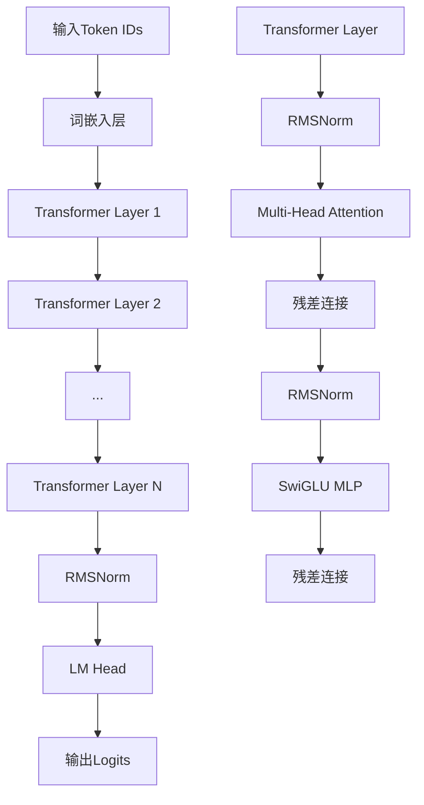

# Qwen3模型 - TinyAI实现

[](https://www.oracle.com/java/)
[](https://github.com/leavesfly/TinyAI)
[](https://opensource.org/licenses/Apache-2.0)

基于TinyAI深度学习框架实现的Qwen3大语言模型，支持现代Transformer架构的所有特性，包括分组查询注意力(GQA)、旋转位置编码(RoPE)、SwiGLU激活函数等。

## ✨ 特性

### 🎯 核心特性
- **现代架构**: 基于Transformer的decoder-only架构
- **分组查询注意力(GQA)**: 减少KV缓存内存占用
- **旋转位置编码(RoPE)**: 支持任意长度序列的相对位置编码
- **SwiGLU激活**: 门控线性单元，提升模型表现
- **RMSNorm归一化**: 简化高效的归一化方法
- **Pre-LayerNorm**: 训练稳定的架构设计

### 🏗️ 架构遵循
- **Qwen3Block**: 继承TinyAI的`Block`类，实现核心神经网络
- **Qwen3Model**: 继承TinyAI的`Model`类，提供完整模型封装
- **组件复用**: 优先使用tinyai-nnet已有实现（LinearLayer、Embedding等）
- **中文文档**: 完整的中文注释和文档支持

### 🚀 功能支持
- ✅ 单序列和批次处理
- ✅ 自回归文本生成
- ✅ 灵活的配置系统
- ✅ 模型保存和加载
- ✅ 完整的测试覆盖
- ✅ 详细的性能统计

## 🚀 快速开始

### 环境要求
- Java 8 或更高版本
- Maven 3.6+
- TinyAI框架依赖

### 安装依赖

在你的`pom.xml`中添加：

```xml
<dependency>
    <groupId>io.leavesfly.tinyai</groupId>
    <artifactId>tinyai-model-qwen</artifactId>
    <version>1.0.0</version>
</dependency>
```

### 基本使用

```java
import io.leavesfly.tinyai.qwen3.*;
import io.leavesfly.tinyai.ndarr.NdArray;
import io.leavesfly.tinyai.func.Variable;

public class Qwen3Example {
    public static void main(String[] args) {
        // 创建小型模型用于测试
        Qwen3Model model = Qwen3Model.createTinyModel("my_qwen3");
        
        // 准备输入序列
        NdArray inputIds = NdArray.of(new float[]{1, 15, 25, 35, 45});
        
        // 执行前向传播
        Variable logits = model.forwardWithLogits(new Variable(inputIds));
        System.out.println("输出形状: " + logits.getValue().getShape());
        
        // 预测下一个token
        int nextToken = model.predictNextToken(inputIds);
        System.out.println("预测的下一个token: " + nextToken);
        
        // 文本生成
        NdArray generated = model.generate(inputIds, 20);
        System.out.println("生成序列长度: " + generated.getShape().getDimension(1));
        
        // 查看模型信息
        model.printModelInfo();
    }
}
```

### 自定义配置

```java
// 创建自定义配置
Qwen3Config customConfig = new Qwen3Config();
customConfig.setVocabSize(50000);
customConfig.setHiddenSize(768);
customConfig.setNumHiddenLayers(12);
customConfig.setNumAttentionHeads(12);

// 使用自定义配置创建模型
Qwen3Model customModel = new Qwen3Model("custom_qwen3", customConfig);
```

## 📊 架构概览

### 模型架构图



### 关键组件

| 组件 | 描述 | 特点 |
|------|------|------|
| **Qwen3Config** | 模型配置管理 | 完整超参数，支持小型测试配置 |
| **Qwen3Block** | 核心网络块 | 继承Block，完整Transformer实现 |
| **Qwen3Model** | 模型封装类 | 继承Model，语言模型头，文本生成 |
| **Qwen3Attention** | 多头注意力 | GQA、RoPE、因果掩码 |
| **Qwen3MLP** | 前馈网络 | SwiGLU激活，门控机制 |
| **RMSNorm** | 归一化层 | 高效的RMS归一化 |
| **SiLULayer** | 激活函数 | 平滑可微的SiLU激活 |
| **RotaryPositionalEmbedding** | 位置编码 | 相对位置的RoPE编码 |

## 🎯 技术特性详解

### 分组查询注意力 (GQA)

传统多头注意力为每个查询头配备独立的键值头，而GQA允许多个查询头共享同一组键值头：

```java
// 配置GQA
config.setNumAttentionHeads(32);  // 查询头数
config.setNumKeyValueHeads(8);    // KV头数，减少内存占用

// 内存节省计算
float memorySaving = 1.0f - (float)config.getNumKeyValueHeads() / config.getNumAttentionHeads();
System.out.println("内存节省: " + (memorySaving * 100) + "%");
```

### 旋转位置编码 (RoPE)

RoPE通过旋转变换将位置信息直接编码到注意力计算中：

```java
// RoPE参数配置
config.setRopeTheta(1000000.0f);  // 基础频率
config.setMaxPositionEmbeddings(32768);  // 支持的最大序列长度

// RoPE的优势：
// 1. 相对位置编码，自然建模相对距离
// 2. 外推能力，支持训练长度外的序列
// 3. 计算效率，直接融入注意力计算
```

### SwiGLU激活函数

结合了Swish激活和门控机制：

```java
// SwiGLU计算公式
// gate = SiLU(gate_proj(x))
// up = up_proj(x)
// output = down_proj(gate ⊙ up)

// 相比传统FFN的优势：
// 1. 更强的表达能力
// 2. 门控机制提供选择性
// 3. 大模型中表现优异
```

## 📖 文档

我们提供了完整的中文文档：

- **[API参考文档](doc/API_Reference.md)** - 详细的API接口说明
- **[架构设计文档](doc/Architecture.md)** - 深入的架构设计和技术细节
- **[使用指南](doc/User_Guide.md)** - 从入门到进阶的完整教程
- **[开发指南](doc/Development_Guide.md)** - 开发规范和最佳实践
- **[部署指南](doc/Deployment_Guide.md)** - 生产环境部署完整方案

## 🧪 测试

运行完整的测试套件：

```bash
# 编译项目
mvn clean compile

# 运行所有测试
mvn test

# 运行特定测试
mvn test -Dtest=Qwen3Test

# 查看测试报告
open target/surefire-reports/index.html
```

### 测试覆盖

- ✅ **基本功能测试** - 模型创建、配置验证
- ✅ **架构测试** - 组件初始化、接口兼容
- ✅ **前向传播测试** - 单序列、批次处理
- ✅ **文本生成测试** - 贪心生成、逐步生成
- ✅ **组件单元测试** - RMSNorm、SiLU、RoPE等
- ✅ **性能基准测试** - 推理速度、内存使用

## 🔧 配置参数

### 预设配置

| 配置类型 | 词汇表 | 隐藏维度 | 层数 | 注意力头 | 参数量 | 适用场景 |
|----------|--------|----------|------|----------|--------|----------|
| **Tiny** | 1,000 | 256 | 4 | 8 | ~1.2M | 开发测试 |
| **Small** | 32,000 | 768 | 12 | 12 | ~85M | 轻量部署 |
| **Medium** | 50,000 | 1024 | 24 | 16 | ~340M | 标准应用 |
| **Large** | 151,936 | 4096 | 32 | 32 | ~7B | 生产环境 |

### 性能对比

| 模型大小 | 推理速度 | 内存占用 | 生成质量 | 推荐用途 |
|----------|----------|----------|----------|----------|
| Tiny | 🚀🚀🚀🚀🚀 | 💾 | ⭐⭐ | 开发调试 |
| Small | 🚀🚀🚀🚀 | 💾💾 | ⭐⭐⭐ | 原型验证 |
| Medium | 🚀🚀🚀 | 💾💾💾 | ⭐⭐⭐⭐ | 产品部署 |
| Large | 🚀🚀 | 💾💾💾💾💾 | ⭐⭐⭐⭐⭐ | 高质量应用 |

## 🚀 示例项目

### 简单聊天机器人

```java
public class SimpleChatBot {
    private final Qwen3Model model;
    
    public SimpleChatBot() {
        this.model = Qwen3Model.createTinyModel("chatbot");
    }
    
    public String chat(String message) {
        // 简化的tokenization（实际需要proper tokenizer）
        NdArray inputIds = tokenize(message);
        NdArray response = model.generate(inputIds, 50);
        return detokenize(response);
    }
}
```

### 文本补全工具

```java
public class TextCompletion {
    private final Qwen3Model model;
    
    public TextCompletion() {
        this.model = Qwen3Model.createTinyModel("completion");
    }
    
    public String complete(String prompt, int maxLength) {
        NdArray promptIds = tokenize(prompt);
        NdArray completed = model.generate(promptIds, maxLength);
        return detokenize(completed);
    }
}
```

## 🎨 最佳实践

### 1. 模型选择

```java
// 开发阶段：使用Tiny配置
Qwen3Model devModel = Qwen3Model.createTinyModel("development");

// 生产环境：根据资源选择合适配置
Qwen3Config prodConfig = new Qwen3Config();
prodConfig.setHiddenSize(1024);  // 根据硬件调整
prodConfig.setNumHiddenLayers(16);
Qwen3Model prodModel = new Qwen3Model("production", prodConfig);
```

### 2. 内存优化

```java
// 使用GQA减少内存
config.setNumKeyValueHeads(config.getNumAttentionHeads() / 2);

// 限制序列长度
config.setMaxPositionEmbeddings(2048);

// 小批次处理
int batchSize = 1;  // 根据内存情况调整
```

### 3. 性能监控

```java
// 性能测试示例
public void benchmarkModel() {
    long startTime = System.currentTimeMillis();
    
    for (int i = 0; i < 100; i++) {
        model.forwardWithLogits(new Variable(testInput));
    }
    
    long endTime = System.currentTimeMillis();
    double avgTime = (endTime - startTime) / 100.0;
    System.out.println("平均推理时间: " + avgTime + "ms");
}
```

## 🤝 贡献

欢迎贡献代码和建议！请遵循以下步骤：

1. Fork 项目
2. 创建功能分支 (`git checkout -b feature/AmazingFeature`)
3. 提交更改 (`git commit -m 'Add some AmazingFeature'`)
4. 推送到分支 (`git push origin feature/AmazingFeature`)
5. 开启 Pull Request

### 开发规范

- **代码规范**: 遵循Java编码规范，使用中文注释
- **测试覆盖**: 新功能必须包含完整测试
- **文档更新**: 同步更新相关文档
- **性能验证**: 确保不引入性能回归

## 📄 许可证

本项目基于 Apache License 2.0 许可证开源 - 查看 [LICENSE](LICENSE) 文件了解详情。

## 🙏 致谢

- **TinyAI框架**: 提供了强大的深度学习基础设施
- **Qwen团队**: 原始Qwen3模型的设计和实现
- **开源社区**: 各种优秀的开源项目和工具

## 📞 联系方式

- **作者**: 山泽
- **项目主页**: [TinyAI Qwen3 Implementation](https://github.com/leavesfly/TinyAI)
- **问题反馈**: [Issues](https://github.com/leavesfly/TinyAI/issues)
- **技术讨论**: [Discussions](https://github.com/leavesfly/TinyAI/discussions)

---

⭐ 如果这个项目对你有帮助，请给我们一个星标！