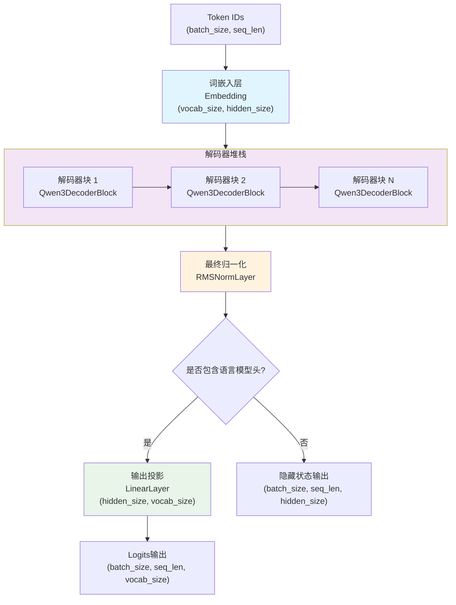
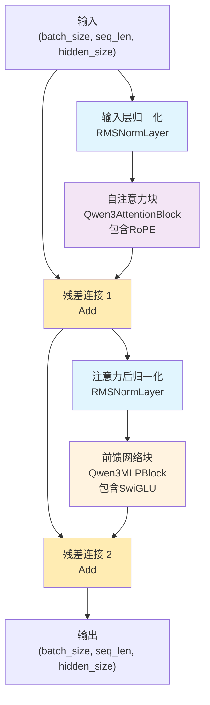
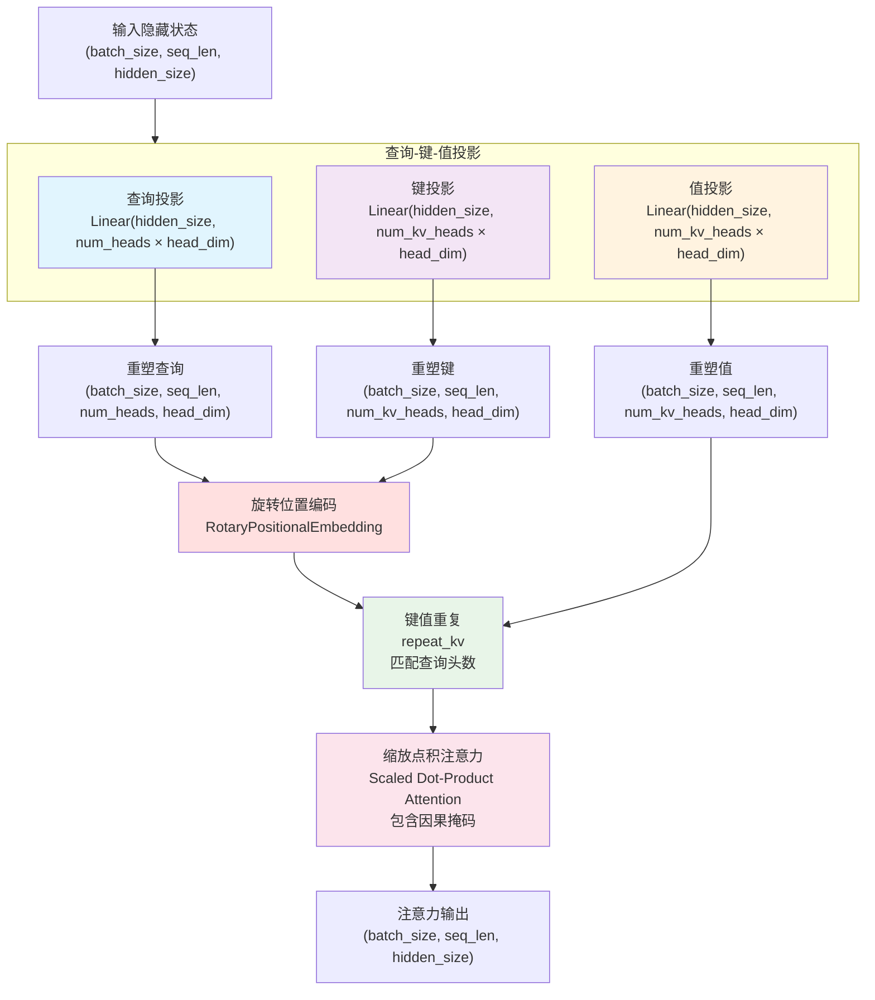
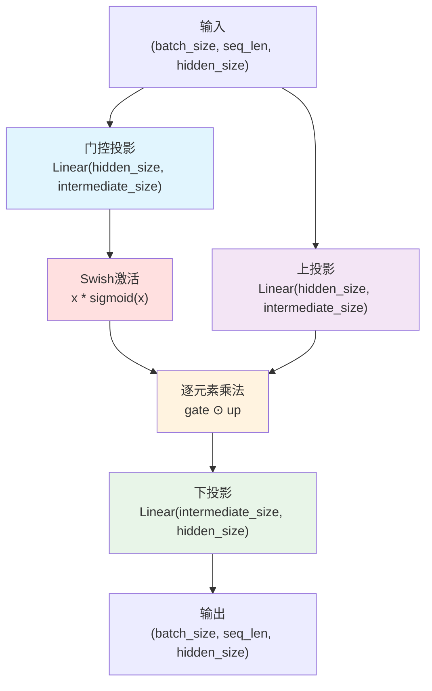
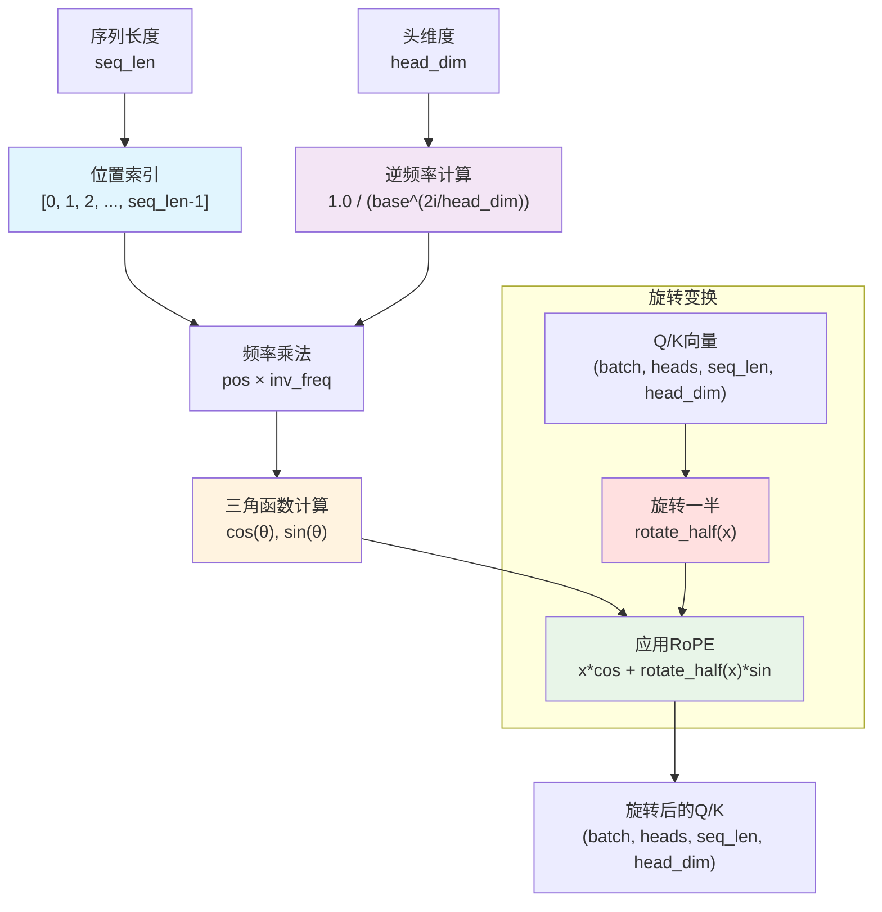
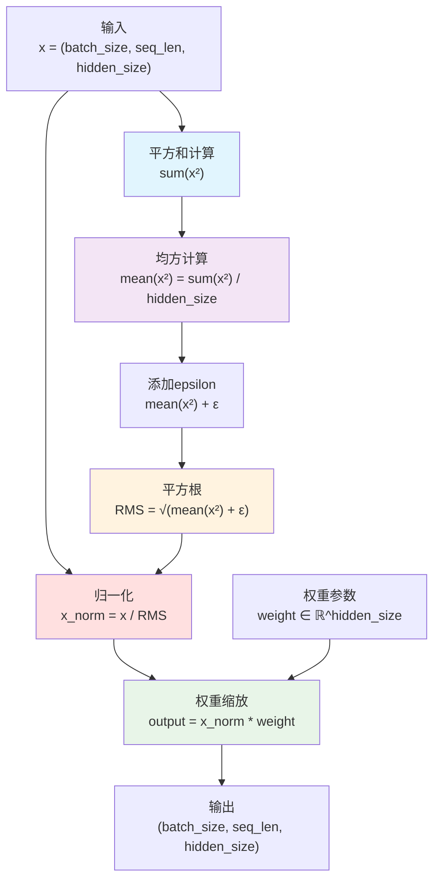
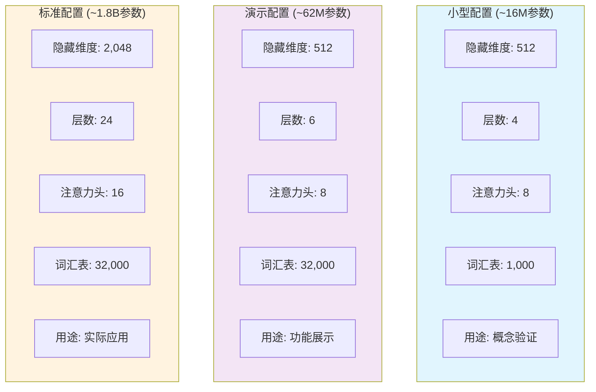
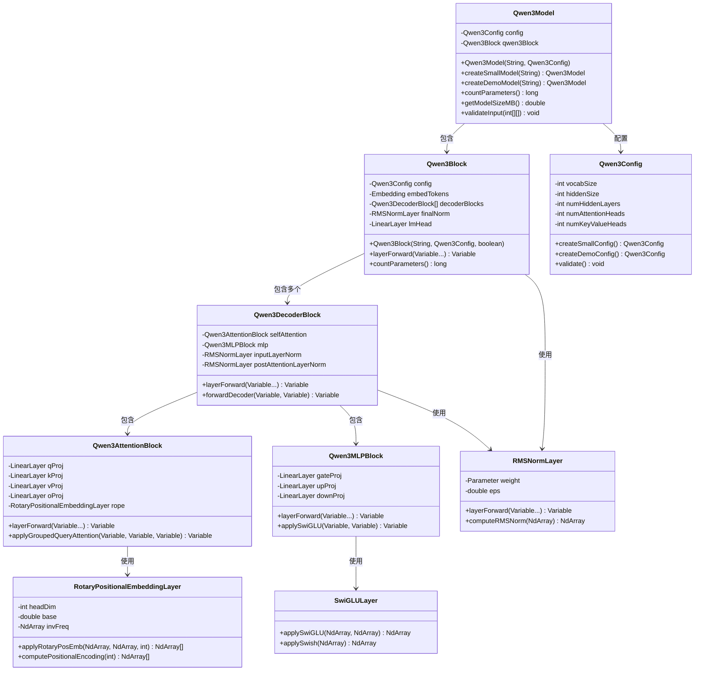

# Qwen3 模型实现

基于TinyAI框架实现的Qwen3大语言模型，采用现代Transformer解码器架构，集成了RMSNorm归一化、旋转位置编码(RoPE)、SwiGLU激活函数、分组查询注意力(GQA)等先进技术，提供完整的大语言模型解决方案。

## 📁 项目结构

```
tinyai-model-qwen/
├── src/main/java/io/leavesfly/tinyai/qwen3/
│   ├── Qwen3Model.java                          # Qwen3主模型类
│   ├── Qwen3Block.java                          # Qwen3核心网络块
│   ├── Qwen3Config.java                         # 模型配置类
│   ├── Qwen3Demo.java                           # 综合演示程序
│   ├── Qwen3QuickDemo.java                      # 快速演示程序
│   ├── block/                                   # 核心网络块
│   │   ├── Qwen3DecoderBlock.java              # 解码器块
│   │   ├── Qwen3AttentionBlock.java            # 多头注意力块
│   │   └── Qwen3MLPBlock.java                  # 前馈网络块
│   └── layer/                                   # 自定义层实现
│       ├── RMSNormLayer.java                   # RMS归一化层
│       ├── RotaryPositionalEmbeddingLayer.java # 旋转位置编码层
│       └── SwiGLULayer.java                    # SwiGLU激活层
├── doc/                                         # 文档目录
│   ├── User_Guide.md                           # 用户使用指南
│   └── 技术架构文档.md                          # 详细技术文档
└── pom.xml                                      # Maven配置文件
```

## 🎯 核心特性

### 1. 现代Transformer架构
- **解码器-only设计**: 专为自回归语言建模优化
- **Pre-LayerNorm结构**: 采用RMSNorm实现更稳定的训练
- **残差连接**: 支持深层网络的梯度传播
- **因果掩码**: 确保自回归生成的正确性

### 2. 先进技术集成
- **RMSNorm归一化**: 更简单高效的层归一化方法
- **旋转位置编码(RoPE)**: 相对位置编码，支持任意长度序列
- **SwiGLU激活函数**: 门控线性单元，提升模型表达能力
- **分组查询注意力(GQA)**: 平衡性能与计算效率

### 3. 灵活配置支持
- **多规模配置**: 从16M到1.8B参数的多种预设
- **可定制架构**: 支持自定义层数、维度、注意力头数等
- **特殊标记配置**: 完整的BOS/EOS/PAD标记支持

## 🏗️ 网络架构图

### Qwen3整体架构


### Qwen3DecoderBlock内部结构


### 分组查询注意力(GQA)机制


### SwiGLU前馈网络结构


### 旋转位置编码(RoPE)机制


### RMSNorm归一化计算


### 模型配置对比


### 类关系图


## 🚀 快速开始

### 基本使用

```java
// 创建不同规模的Qwen3模型
Qwen3Model smallModel = Qwen3Model.createSmallModel("qwen3-small");    // ~16M参数
Qwen3Model demoModel = Qwen3Model.createDemoModel("qwen3-demo");       // ~62M参数

// 使用自定义配置
Qwen3Config config = new Qwen3Config();
config.setHiddenSize(1024);
config.setNumHiddenLayers(12);
config.setNumAttentionHeads(16);
Qwen3Model customModel = new Qwen3Model("qwen3-custom", config);

// 前向传播
NdArray inputIds = NdArray.of(Shape.of(2, 10)); // [batch_size=2, seq_len=10]
Variable output = model.forward(new Variable(inputIds));

// 打印模型信息
System.out.println(model.getModelSummary());
System.out.println("参数数量: " + model.countParameters());
System.out.println("模型大小: " + model.getModelSizeMB() + " MB");
```

### 配置管理

```java
// 创建和验证配置
Qwen3Config config = new Qwen3Config();
config.setVocabSize(32000);              // 词汇表大小
config.setHiddenSize(2048);              // 隐藏层维度  
config.setIntermediateSize(5632);        // 前馈网络中间维度
config.setNumHiddenLayers(24);           // 解码器层数
config.setNumAttentionHeads(16);         // 注意力头数
config.setNumKeyValueHeads(16);          // 键值头数(GQA)
config.setMaxPositionEmbeddings(8192);   // 最大序列长度
config.setRopeTheta(10000.0);            // RoPE基础频率
config.setRmsNormEps(1e-6);              // RMSNorm epsilon

// 特殊标记配置
config.setPadTokenId(0);                 // 填充标记
config.setBosTokenId(1);                 // 开始标记
config.setEosTokenId(2);                 // 结束标记
config.setTieWordEmbeddings(false);      // 是否共享嵌入权重

// 验证配置有效性
config.validate();

// 查看配置信息
System.out.println(config.toString());
System.out.println("头维度: " + config.getHeadDim());
System.out.println("键值组数: " + config.getNumKeyValueGroups());
```

### 模型组件访问

```java
// 访问模型内部组件
Qwen3Block qwenBlock = model.getQwen3Block();
Qwen3Config config = model.getConfig();

// 访问Block内部组件
Embedding tokenEmbedding = qwenBlock.getEmbedTokens();
Qwen3DecoderBlock[] decoderBlocks = qwenBlock.getDecoderBlocks();
RMSNormLayer finalNorm = qwenBlock.getFinalNorm();
LinearLayer lmHead = qwenBlock.getLmHead();

// 访问解码器块组件
Qwen3DecoderBlock firstDecoder = decoderBlocks[0];
Qwen3AttentionBlock attention = firstDecoder.getSelfAttention();
Qwen3MLPBlock mlp = firstDecoder.getMlp();
RMSNormLayer inputNorm = firstDecoder.getInputLayerNorm();
RMSNormLayer postAttnNorm = firstDecoder.getPostAttentionLayerNorm();
```

### 自定义层使用

```java
// 使用RMSNorm层
RMSNormLayer rmsNorm = new RMSNormLayer("rms_norm", 512, 1e-6);
Variable normalizedOutput = rmsNorm.layerForward(hiddenStates);

// 使用旋转位置编码
RotaryPositionalEmbeddingLayer rope = new RotaryPositionalEmbeddingLayer("rope", 64);
NdArray[] rotatedQK = rope.applyRotaryPosEmb(queryTensor, keyTensor, seqLen);

// 使用SwiGLU激活
NdArray gateOutput = SwiGLULayer.applySwiGLU(gateProjection, upProjection);
NdArray swishOutput = SwiGLULayer.applySwish(inputTensor);
```

## 🔍 技术创新

### 1. RMSNorm归一化
- **简化计算**: 相比LayerNorm去掉了均值中心化步骤
- **数值稳定**: 更好的数值稳定性和训练稳定性  
- **计算高效**: 减少计算开销，提升训练和推理速度

### 2. 旋转位置编码(RoPE)
- **相对位置**: 提供相对位置信息而非绝对位置
- **长度外推**: 支持超出训练长度的序列推理
- **旋转不变**: 保持向量模长不变的数学特性

### 3. SwiGLU激活函数
- **门控机制**: 结合Swish激活和门控线性单元
- **表达能力**: 增强模型的非线性表达能力
- **性能提升**: 在大规模语言模型中表现优异

### 4. 分组查询注意力(GQA)
- **计算效率**: 减少键值头数量，降低计算复杂度
- **内存优化**: 显著减少KV缓存的内存占用
- **性能保持**: 在保持性能的同时提升效率

## 📊 性能特点

### 配置对比
| 配置类型 | 参数量 | 隐藏维度 | 层数 | 注意力头 | 键值头 | 序列长度 | 用途场景 |
|---------|--------|----------|------|----------|--------|----------|----------|
| 小型配置 | ~16M | 512 | 4 | 8 | 8 | 1024 | 概念验证、测试 |
| 演示配置 | ~62M | 512 | 6 | 8 | 8 | 2048 | 功能展示、学习 |
| 标准配置 | ~1.8B | 2048 | 24 | 16 | 16 | 8192 | 实际应用 |

### 技术优势
- **现代架构**: 集成最新的Transformer技术
- **高效计算**: 优化的注意力和归一化机制
- **灵活配置**: 支持多种规模和应用场景
- **完整实现**: 基于TinyAI框架的完整实现

## 🧪 演示程序

### 综合演示程序
```java
// 运行完整功能演示
public class Qwen3Demo {
    public static void main(String[] args) {
        // 1. 模型信息演示
        modelInfoDemo();
        
        // 2. 分词器功能演示  
        tokenizerDemo();
        
        // 3. 文本生成演示
        textGenerationDemo();
        
        // 4. 聊天对话演示
        chatDemo();
    }
}

// 使用聊天机器人
Qwen3Model model = Qwen3Model.createDemoModel("chatbot");
Qwen3Demo.SimpleTokenizer tokenizer = new Qwen3Demo.SimpleTokenizer();
Qwen3Demo.Qwen3ChatBot chatbot = new Qwen3Demo.Qwen3ChatBot(model, tokenizer);

String response = chatbot.chat("你好，请介绍一下自己");
System.out.println("回复: " + response);
```

### 快速演示程序
```java
// 运行快速演示
public class Qwen3QuickDemo {
    public static void main(String[] args) {
        // 基础使用演示
        quickStart();
        
        // 配置对比演示
        configDemo();
        
        // 性能测试演示
        performanceDemo();
    }
}
```

## 🔧 扩展开发

### 自定义注意力机制
```java
// 扩展注意力块
public class CustomAttentionBlock extends Qwen3AttentionBlock {
    @Override
    protected Variable computeAttention(Variable query, Variable key, Variable value, Variable mask) {
        // 实现自定义注意力计算
        return customAttentionLogic(query, key, value, mask);
    }
}
```

### 自定义激活函数
```java
// 扩展MLP块
public class CustomMLPBlock extends Qwen3MLPBlock {
    @Override
    protected Variable applyActivation(Variable gate, Variable up) {
        // 实现自定义激活函数
        return customActivationFunction(gate, up);
    }
}
```

### 自定义配置
```java
// 创建特殊用途配置
public static Qwen3Config createLargeConfig() {
    Qwen3Config config = new Qwen3Config();
    config.setVocabSize(100000);
    config.setHiddenSize(4096);
    config.setNumHiddenLayers(32);
    config.setNumAttentionHeads(32);
    config.setNumKeyValueHeads(8);  // 使用GQA优化
    config.setMaxPositionEmbeddings(16384);
    return config;
}
```

## 📚 相关资源

### 技术文档
- [用户使用指南](doc/User_Guide.md) - 详细的使用说明和API文档
- [技术架构文档](doc/技术架构文档.md) - 深入的技术实现细节

### 参考论文
- **RMSNorm**: "Root Mean Square Layer Normalization"
- **RoPE**: "RoFormer: Enhanced Transformer with Rotary Position Embedding"
- **SwiGLU**: "GLU Variants Improve Transformer"
- **GQA**: "GQA: Training Generalized Multi-Query Transformer Models"

### 核心技术
- **Transformer架构**: 注意力机制和解码器设计
- **位置编码**: 旋转位置编码的数学原理
- **归一化技术**: RMSNorm vs LayerNorm对比
- **激活函数**: SwiGLU的门控机制

---

**注意事项**: 
1. 本实现基于TinyAI框架，需要正确配置TinyAI依赖
2. 大规模模型需要充足的计算资源和内存
3. 生产环境使用前请进行充分的测试和验证
4. 可以根据实际需求调整配置参数和模型结构

**贡献指南**: 欢迎提交Issue和Pull Request，共同完善Qwen3模型实现！