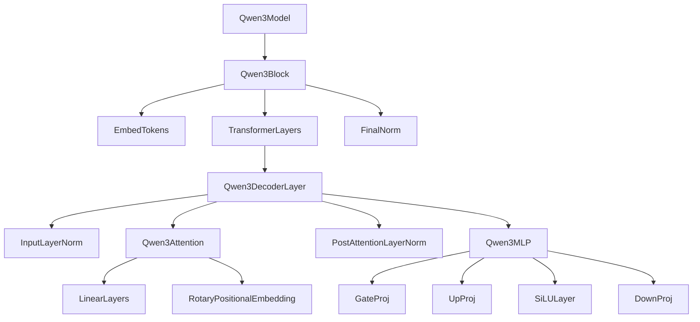

# Qwen3模型架构设计文档

## 整体架构概述

Qwen3模型基于TinyAI深度学习框架实现，采用现代Transformer架构，集成了多项前沿技术，包括分组查询注意力(GQA)、旋转位置编码(RoPE)、SwiGLU激活函数等。

## 架构层次结构



## 核心组件设计

### 1. 模型封装层 (Qwen3Model)

**设计原则**: 继承TinyAI的Model类，提供统一的模型管理接口

**主要职责**:
- 模型生命周期管理
- 前向传播协调
- 文本生成逻辑
- 接口适配

**关键设计**:
```java
public class Qwen3Model extends Model {
    private Qwen3Config config;
    private Qwen3Block qwen3Block;
    private LinearLayer lmHead;
}
```

### 2. 核心网络层 (Qwen3Block)

**设计原则**: 继承TinyAI的Block类，实现完整的神经网络计算图

**架构特点**:
- **Pre-LayerNorm**: 训练稳定性更好
- **残差连接**: 解决深层网络梯度消失
- **模块化设计**: 便于扩展和维护

**数据流**:
```
Input(token_ids) 
    ↓
EmbedTokens(vocab_size → hidden_size)
    ↓
Layer0(hidden_size → hidden_size)
    ↓
Layer1(hidden_size → hidden_size)
    ↓
...
    ↓
LayerN(hidden_size → hidden_size)
    ↓
FinalNorm(hidden_size → hidden_size)
    ↓
Output(hidden_states)
```

### 3. 解码器层 (Qwen3DecoderLayer)

**架构模式**: Pre-LayerNorm + 残差连接

```
输入 → LayerNorm → SelfAttention → 残差连接 → LayerNorm → MLP → 残差连接 → 输出
```

**关键特性**:
- **Pre-LN架构**: 避免梯度消失和爆炸
- **双重残差**: 注意力块和MLP块都有残差连接
- **RMSNorm**: 简化且高效的归一化方法

### 4. 注意力机制 (Qwen3Attention)

**创新特性**:

#### 4.1 分组查询注意力 (Grouped Query Attention)
- **目的**: 减少KV缓存内存占用
- **机制**: 多个查询头共享同一组键值头
- **优势**: 在保持性能的同时显著降低内存需求

```
Q: [batch, num_heads, seq_len, head_dim]
K: [batch, num_kv_heads, seq_len, head_dim] 
V: [batch, num_kv_heads, seq_len, head_dim]

# K,V重复扩展以匹配Q的头数
K_expanded: [batch, num_heads, seq_len, head_dim]
V_expanded: [batch, num_heads, seq_len, head_dim]
```

#### 4.2 旋转位置编码 (RoPE)
- **优势**: 相对位置信息，支持任意长度外推
- **实现**: 在查询和键上应用旋转变换
- **公式**: 
  ```
  q_m = q * cos(mθ) + rotate(q) * sin(mθ)
  k_n = k * cos(nθ) + rotate(k) * sin(nθ)
  ```

#### 4.3 因果掩码
- **用途**: 确保自回归生成的因果性
- **实现**: 上三角掩码，防止看到未来信息

### 5. 前馈网络 (Qwen3MLP)

**SwiGLU激活机制**:
```
gate = SiLU(gate_proj(x))
up = up_proj(x)
output = down_proj(gate ⊙ up)
```

**设计优势**:
- **门控机制**: 提供更强的表达能力
- **SiLU激活**: 平滑可微，梯度流畅
- **三层结构**: hidden_size → intermediate_size → hidden_size

### 6. 位置编码设计

**RoPE实现细节**:

```java
// 计算逆频率
inv_freq[i] = 1.0 / (base ^ (2*i / dim))

// 生成旋转矩阵
freqs = position * inv_freq
cos_vals = cos(freqs)
sin_vals = sin(freqs)

// 应用旋转变换
x1_new = x1 * cos - x2 * sin
x2_new = x1 * sin + x2 * cos
```

**优势**:
- **相对位置**: 自然建模相对距离
- **外推能力**: 训练长度外的序列处理
- **计算效率**: 直接在注意力计算中融入

### 7. 归一化设计

**RMSNorm vs LayerNorm**:

| 特性 | RMSNorm | LayerNorm |
|------|---------|-----------|
| 参数量 | N | 2N |
| 计算复杂度 | 更低 | 较高 |
| 性能 | 相当 | 相当 |
| 数值稳定性 | 良好 | 良好 |

**RMSNorm公式**:
```
RMSNorm(x) = x / RMS(x) * weight
RMS(x) = sqrt(mean(x²) + ε)
```

## 性能优化设计

### 1. 内存优化

**GQA优化**:
- 标准MHA: `2 * num_heads * seq_len * head_dim`
- GQA: `2 * num_kv_heads * seq_len * head_dim`
- 内存节省: `1 - num_kv_heads/num_heads`

**KV缓存优化**:
- 增量计算：只计算新位置的K,V
- 缓存复用：历史K,V直接拼接

### 2. 计算优化

**张量重塑策略**:
```java
// 批量线性变换
(batch, seq_len, hidden) → (batch*seq_len, hidden)
LinearLayer.forward(reshaped_input)
(batch*seq_len, output) → (batch, seq_len, output)
```

**并行计算**:
- 多头并行：注意力头间无依赖
- 层内并行：QKV投影可并行计算
- 激活并行：门控和上投影可并行

### 3. 数值稳定性

**Softmax稳定化**:
```java
// 避免数值溢出
scores = scores - max(scores)
attention_weights = softmax(scores)
```

**梯度裁剪**:
- 防止梯度爆炸
- 保证训练稳定

## 扩展性设计

### 1. 配置驱动

所有模型超参数通过`Qwen3Config`统一管理：
- 模型规模可配置
- 架构变体支持
- 训练/推理参数分离

### 2. 模块化架构

每个组件独立实现：
- 单独测试
- 独立优化
- 灵活替换

### 3. 接口标准化

遵循TinyAI框架规范：
- Layer接口统一
- Block组合模式
- Model封装标准

## 与TinyAI框架集成

### 1. 继承关系

```
Layer (TinyAI)
├── RMSNorm
├── SiLULayer  
├── RotaryPositionalEmbedding
├── Qwen3Attention
├── Qwen3MLP
└── Qwen3DecoderLayer

Block (TinyAI)
└── Qwen3Block

Model (TinyAI)
└── Qwen3Model
```

### 2. 参数管理

利用TinyAI的参数系统：
- 自动梯度计算
- 参数序列化
- 优化器集成

### 3. 计算图集成

融入TinyAI的自动微分：
- Variable包装
- 前向/反向传播
- 梯度累积

## 设计决策记录

### 1. 为什么选择Pre-LayerNorm？

**原因**:
- 训练稳定性更好
- 梯度流更顺畅
- 大模型训练的标准选择

### 2. 为什么使用RMSNorm而非LayerNorm？

**原因**:
- 参数量减半
- 计算更简单
- 性能相当甚至更好

### 3. 为什么采用SwiGLU？

**原因**:
- 表达能力更强
- 大模型中表现优异
- 门控机制提供选择性

### 4. 为什么使用GQA？

**原因**:
- 显著减少内存占用
- 推理速度提升
- 性能损失较小

## 未来扩展方向

### 1. 架构改进
- FlashAttention集成
- MoE (Mixture of Experts)
- 更高效的位置编码

### 2. 性能优化
- 量化支持
- 并行化改进
- 硬件加速

### 3. 功能扩展
- 多模态支持
- 长序列处理
- 增量学习