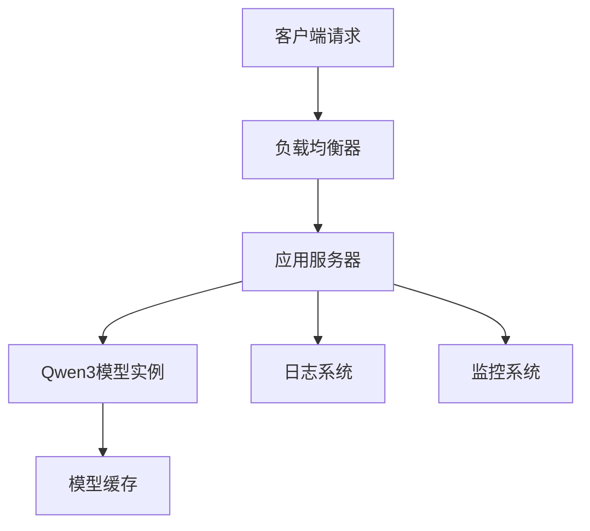
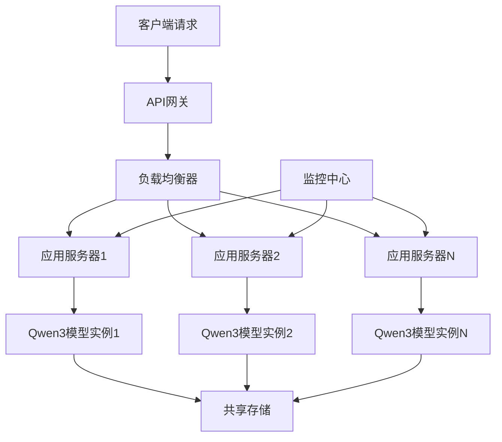

# Qwen3模型部署指南

## 概述

本文档详细介绍了如何在不同环境中部署Qwen3模型，包括开发环境、测试环境和生产环境的部署策略、配置优化和监控方案。

## 部署架构

### 1. 单机部署架构



### 2. 分布式部署架构



## 环境准备

### 系统要求

#### 最小配置
- **CPU**: 4核心（推荐8核心）
- **内存**: 8GB（推荐16GB）
- **存储**: 10GB可用空间
- **网络**: 100Mbps（推荐1Gbps）

#### 推荐配置
- **CPU**: 16核心或更多
- **内存**: 32GB或更多
- **存储**: SSD 50GB+
- **网络**: 10Gbps
- **GPU**: 可选，用于加速计算

#### 软件要求
- **操作系统**: Linux (Ubuntu 18.04+, CentOS 7+), Windows 10+, macOS 10.14+
- **Java**: OpenJDK 8+ 或 Oracle JDK 8+
- **Maven**: 3.6+
- **Docker**: 19.03+（可选）

### 依赖安装

#### Ubuntu/Debian
```bash
# 更新包列表
sudo apt update

# 安装OpenJDK 11
sudo apt install openjdk-11-jdk

# 安装Maven
sudo apt install maven

# 验证安装
java -version
mvn -version
```

#### CentOS/RHEL
```bash
# 安装OpenJDK 11
sudo yum install java-11-openjdk-devel

# 安装Maven
sudo yum install maven

# 验证安装
java -version
mvn -version
```

#### Windows
```powershell
# 使用Chocolatey安装
choco install openjdk11
choco install maven

# 验证安装
java -version
mvn -version
```

## 应用打包

### 1. 标准JAR打包

```bash
# 编译项目
cd /path/to/tinyai-model-qwen
mvn clean compile

# 运行测试
mvn test

# 打包JAR
mvn package

# 打包结果
ls target/tinyai-model-qwen-1.0.0.jar
```

### 2. 包含依赖的Fat JAR

修改`pom.xml`添加Maven Assembly插件：

```xml
<plugin>
    <groupId>org.apache.maven.plugins</groupId>
    <artifactId>maven-assembly-plugin</artifactId>
    <version>3.3.0</version>
    <configuration>
        <descriptorRefs>
            <descriptorRef>jar-with-dependencies</descriptorRef>
        </descriptorRefs>
        <archive>
            <manifest>
                <mainClass>io.leavesfly.tinyai.qwen3.Qwen3Demo</mainClass>
            </manifest>
        </archive>
    </configuration>
    <executions>
        <execution>
            <id>make-assembly</id>
            <phase>package</phase>
            <goals>
                <goal>single</goal>
            </goals>
        </execution>
    </executions>
</plugin>
```

```bash
# 打包Fat JAR
mvn clean package

# 运行Fat JAR
java -jar target/tinyai-model-qwen-1.0.0-jar-with-dependencies.jar
```

### 3. Spring Boot打包

如果集成Spring Boot，添加Spring Boot Maven插件：

```xml
<plugin>
    <groupId>org.springframework.boot</groupId>
    <artifactId>spring-boot-maven-plugin</artifactId>
    <version>2.7.0</version>
    <executions>
        <execution>
            <goals>
                <goal>repackage</goal>
            </goals>
        </execution>
    </executions>
</plugin>
```

```bash
# 打包Spring Boot应用
mvn clean package spring-boot:repackage

# 运行Spring Boot应用
java -jar target/tinyai-model-qwen-1.0.0.jar
```

## Docker容器化部署

### 1. 创建Dockerfile

```dockerfile
# 基础镜像
FROM openjdk:11-jre-slim

# 维护者信息
LABEL maintainer="shanze <shanze@example.com>"

# 设置工作目录
WORKDIR /app

# 复制JAR文件
COPY target/tinyai-model-qwen-1.0.0-jar-with-dependencies.jar app.jar

# 创建非root用户
RUN groupadd -r qwen && useradd -r -g qwen qwen
RUN chown -R qwen:qwen /app
USER qwen

# 暴露端口
EXPOSE 8080

# 设置JVM参数
ENV JAVA_OPTS="-Xmx4g -Xms2g -XX:+UseG1GC"

# 健康检查
HEALTHCHECK --interval=30s --timeout=3s --start-period=5s --retries=3 \
    CMD curl -f http://localhost:8080/health || exit 1

# 启动命令
ENTRYPOINT ["sh", "-c", "java $JAVA_OPTS -jar app.jar"]
```

### 2. 构建Docker镜像

```bash
# 构建镜像
docker build -t qwen3-model:1.0.0 .

# 查看镜像
docker images | grep qwen3-model

# 运行容器
docker run -d \
    --name qwen3-app \
    -p 8080:8080 \
    -e JAVA_OPTS="-Xmx6g -Xms3g" \
    qwen3-model:1.0.0

# 查看日志
docker logs -f qwen3-app
```

### 3. Docker Compose编排

创建`docker-compose.yml`：

```yaml
version: '3.8'

services:
  qwen3-app:
    build: .
    image: qwen3-model:1.0.0
    container_name: qwen3-app
    ports:
      - "8080:8080"
    environment:
      - JAVA_OPTS=-Xmx6g -Xms3g -XX:+UseG1GC
      - SPRING_PROFILES_ACTIVE=production
    volumes:
      - ./logs:/app/logs
      - ./models:/app/models
    restart: unless-stopped
    healthcheck:
      test: ["CMD", "curl", "-f", "http://localhost:8080/health"]
      interval: 30s
      timeout: 10s
      retries: 3
      start_period: 40s

  nginx:
    image: nginx:alpine
    container_name: qwen3-nginx
    ports:
      - "80:80"
      - "443:443"
    volumes:
      - ./nginx.conf:/etc/nginx/nginx.conf:ro
      - ./ssl:/etc/nginx/ssl:ro
    depends_on:
      - qwen3-app
    restart: unless-stopped

volumes:
  logs:
  models:
```

启动服务：

```bash
# 启动所有服务
docker-compose up -d

# 查看服务状态
docker-compose ps

# 查看日志
docker-compose logs -f qwen3-app

# 停止服务
docker-compose down
```

## Kubernetes部署

### 1. 基础部署配置

创建`qwen3-deployment.yaml`：

```yaml
apiVersion: apps/v1
kind: Deployment
metadata:
  name: qwen3-deployment
  labels:
    app: qwen3
spec:
  replicas: 3
  selector:
    matchLabels:
      app: qwen3
  template:
    metadata:
      labels:
        app: qwen3
    spec:
      containers:
      - name: qwen3-app
        image: qwen3-model:1.0.0
        ports:
        - containerPort: 8080
        env:
        - name: JAVA_OPTS
          value: "-Xmx4g -Xms2g -XX:+UseG1GC"
        resources:
          requests:
            memory: "3Gi"
            cpu: "1000m"
          limits:
            memory: "6Gi"
            cpu: "2000m"
        livenessProbe:
          httpGet:
            path: /health
            port: 8080
          initialDelaySeconds: 60
          periodSeconds: 30
        readinessProbe:
          httpGet:
            path: /ready
            port: 8080
          initialDelaySeconds: 30
          periodSeconds: 10
        volumeMounts:
        - name: model-storage
          mountPath: /app/models
        - name: log-storage
          mountPath: /app/logs
      volumes:
      - name: model-storage
        persistentVolumeClaim:
          claimName: qwen3-model-pvc
      - name: log-storage
        emptyDir: {}
---
apiVersion: v1
kind: Service
metadata:
  name: qwen3-service
spec:
  selector:
    app: qwen3
  ports:
    - protocol: TCP
      port: 80
      targetPort: 8080
  type: LoadBalancer
```

### 2. 持久化存储配置

创建`qwen3-pvc.yaml`：

```yaml
apiVersion: v1
kind: PersistentVolumeClaim
metadata:
  name: qwen3-model-pvc
spec:
  accessModes:
    - ReadWriteMany
  storageClassName: fast-ssd
  resources:
    requests:
      storage: 50Gi
```

### 3. 配置管理

创建`qwen3-configmap.yaml`：

```yaml
apiVersion: v1
kind: ConfigMap
metadata:
  name: qwen3-config
data:
  application.properties: |
    # 模型配置
    qwen3.model.vocab-size=151936
    qwen3.model.hidden-size=4096
    qwen3.model.num-layers=32
    
    # 服务配置
    server.port=8080
    server.max-threads=200
    
    # 日志配置
    logging.level.io.leavesfly.tinyai=INFO
    logging.file.path=/app/logs/qwen3.log
  
  logback-spring.xml: |
    <?xml version="1.0" encoding="UTF-8"?>
    <configuration>
        <appender name="STDOUT" class="ch.qos.logback.core.ConsoleAppender">
            <encoder>
                <pattern>%d{yyyy-MM-dd HH:mm:ss} - %msg%n</pattern>
            </encoder>
        </appender>
        
        <appender name="FILE" class="ch.qos.logback.core.rolling.RollingFileAppender">
            <file>/app/logs/qwen3.log</file>
            <rollingPolicy class="ch.qos.logback.core.rolling.TimeBasedRollingPolicy">
                <fileNamePattern>/app/logs/qwen3.%d{yyyy-MM-dd}.log</fileNamePattern>
                <maxHistory>30</maxHistory>
            </rollingPolicy>
            <encoder>
                <pattern>%d{yyyy-MM-dd HH:mm:ss} [%thread] %-5level %logger{36} - %msg%n</pattern>
            </encoder>
        </appender>
        
        <root level="INFO">
            <appender-ref ref="STDOUT" />
            <appender-ref ref="FILE" />
        </root>
    </configuration>
```

### 4. 部署执行

```bash
# 创建命名空间
kubectl create namespace qwen3

# 应用配置
kubectl apply -f qwen3-configmap.yaml -n qwen3
kubectl apply -f qwen3-pvc.yaml -n qwen3
kubectl apply -f qwen3-deployment.yaml -n qwen3

# 查看部署状态
kubectl get pods -n qwen3
kubectl get services -n qwen3

# 查看日志
kubectl logs -f deployment/qwen3-deployment -n qwen3

# 端口转发（测试用）
kubectl port-forward service/qwen3-service 8080:80 -n qwen3
```

## 性能优化配置

### 1. JVM参数调优

#### 垃圾回收优化
```bash
# G1GC配置（推荐）
JAVA_OPTS="-XX:+UseG1GC \
           -XX:MaxGCPauseMillis=200 \
           -XX:G1HeapRegionSize=16m \
           -XX:+G1UseAdaptiveIHOP \
           -XX:G1MixedGCCountTarget=8"

# 并行GC配置（高吞吐量）
JAVA_OPTS="-XX:+UseParallelGC \
           -XX:ParallelGCThreads=8 \
           -XX:+UseAdaptiveSizePolicy"

# ZGC配置（低延迟）
JAVA_OPTS="-XX:+UnlockExperimentalVMOptions \
           -XX:+UseZGC \
           -XX:+UseLargePages"
```

#### 内存配置
```bash
# 堆内存设置
JAVA_OPTS="-Xms4g -Xmx8g"

# 直接内存设置
JAVA_OPTS="$JAVA_OPTS -XX:MaxDirectMemorySize=2g"

# 元空间设置
JAVA_OPTS="$JAVA_OPTS -XX:MetaspaceSize=256m -XX:MaxMetaspaceSize=512m"

# 压缩指针
JAVA_OPTS="$JAVA_OPTS -XX:+UseCompressedOops"
```

#### 监控和调试
```bash
# JVM监控
JAVA_OPTS="$JAVA_OPTS -XX:+PrintGC \
           -XX:+PrintGCDetails \
           -XX:+PrintGCTimeStamps \
           -Xloggc:/app/logs/gc.log"

# JMX监控
JAVA_OPTS="$JAVA_OPTS -Dcom.sun.management.jmxremote \
           -Dcom.sun.management.jmxremote.port=9999 \
           -Dcom.sun.management.jmxremote.authenticate=false \
           -Dcom.sun.management.jmxremote.ssl=false"
```

### 2. 应用级优化

#### 模型配置优化
```java
// 生产环境配置示例
public class ProductionConfig {
    
    public static Qwen3Config createProductionConfig() {
        Qwen3Config config = new Qwen3Config();
        
        // 根据硬件资源调整
        config.setVocabSize(32000);      // 减小词汇表
        config.setHiddenSize(2048);      // 适中的隐藏维度
        config.setNumHiddenLayers(16);   // 适中的层数
        config.setNumAttentionHeads(16); // 适中的注意力头数
        
        // 使用GQA减少内存
        config.setNumKeyValueHeads(8);   // KV头数为注意力头数的一半
        
        return config;
    }
}
```

#### 连接池配置
```java
// 线程池配置
@Configuration
public class ThreadPoolConfig {
    
    @Bean
    public TaskExecutor modelExecutor() {
        ThreadPoolTaskExecutor executor = new ThreadPoolTaskExecutor();
        executor.setCorePoolSize(8);
        executor.setMaxPoolSize(16);
        executor.setQueueCapacity(100);
        executor.setThreadNamePrefix("Qwen3-");
        executor.setRejectedExecutionHandler(new ThreadPoolExecutor.CallerRunsPolicy());
        return executor;
    }
}
```

### 3. 系统级优化

#### 操作系统参数
```bash
# 修改/etc/sysctl.conf
# 网络优化
net.core.rmem_max = 134217728
net.core.wmem_max = 134217728
net.ipv4.tcp_rmem = 4096 87380 134217728
net.ipv4.tcp_wmem = 4096 65536 134217728

# 文件描述符限制
fs.file-max = 65536

# 应用配置
echo "* soft nofile 65536" >> /etc/security/limits.conf
echo "* hard nofile 65536" >> /etc/security/limits.conf

# 重新加载配置
sysctl -p
```

#### 磁盘I/O优化
```bash
# 设置I/O调度器为deadline（SSD）
echo deadline > /sys/block/sda/queue/scheduler

# 设置读取提前量
echo 256 > /sys/block/sda/queue/read_ahead_kb

# 挂载选项优化
mount -o noatime,nodiratime,defaults /dev/sda1 /app
```

## 监控和运维

### 1. 应用监控

#### JVM监控
```java
// 使用Micrometer进行指标收集
@Component
public class Qwen3Metrics {
    
    private final MeterRegistry meterRegistry;
    private final Counter requestCounter;
    private final Timer responseTimer;
    private final Gauge memoryGauge;
    
    public Qwen3Metrics(MeterRegistry meterRegistry) {
        this.meterRegistry = meterRegistry;
        this.requestCounter = Counter.builder("qwen3.requests.total")
            .description("Total requests to Qwen3 model")
            .register(meterRegistry);
        this.responseTimer = Timer.builder("qwen3.response.time")
            .description("Response time of Qwen3 model")
            .register(meterRegistry);
        this.memoryGauge = Gauge.builder("qwen3.memory.used")
            .description("Memory used by Qwen3 model")
            .register(meterRegistry, this, Qwen3Metrics::getUsedMemory);
    }
    
    public void recordRequest() {
        requestCounter.increment();
    }
    
    public Timer.Sample startTimer() {
        return Timer.start(meterRegistry);
    }
    
    private double getUsedMemory() {
        Runtime runtime = Runtime.getRuntime();
        return runtime.totalMemory() - runtime.freeMemory();
    }
}
```

#### 业务监控
```java
@RestController
public class Qwen3Controller {
    
    private final Qwen3Model model;
    private final Qwen3Metrics metrics;
    
    @PostMapping("/generate")
    public ResponseEntity<String> generate(@RequestBody GenerateRequest request) {
        metrics.recordRequest();
        Timer.Sample sample = metrics.startTimer();
        
        try {
            String result = model.generate(request.getPrompt(), request.getMaxLength());
            sample.stop("qwen3.response.time");
            return ResponseEntity.ok(result);
        } catch (Exception e) {
            sample.stop("qwen3.response.time");
            return ResponseEntity.status(500).body("Generation failed: " + e.getMessage());
        }
    }
    
    @GetMapping("/health")
    public ResponseEntity<Map<String, Object>> health() {
        Map<String, Object> health = new HashMap<>();
        health.put("status", "UP");
        health.put("timestamp", System.currentTimeMillis());
        health.put("model", model.getName());
        return ResponseEntity.ok(health);
    }
}
```

### 2. 日志配置

#### Logback配置
```xml
<!-- logback-spring.xml -->
<?xml version="1.0" encoding="UTF-8"?>
<configuration>
    <!-- 控制台输出 -->
    <appender name="CONSOLE" class="ch.qos.logback.core.ConsoleAppender">
        <encoder class="net.logstash.logback.encoder.LoggingEventCompositeJsonEncoder">
            <providers>
                <timestamp/>
                <logLevel/>
                <loggerName/>
                <message/>
                <mdc/>
                <stackTrace/>
            </providers>
        </encoder>
    </appender>
    
    <!-- 文件输出 -->
    <appender name="FILE" class="ch.qos.logback.core.rolling.RollingFileAppender">
        <file>/app/logs/qwen3.log</file>
        <rollingPolicy class="ch.qos.logback.core.rolling.TimeBasedRollingPolicy">
            <fileNamePattern>/app/logs/qwen3.%d{yyyy-MM-dd}.log</fileNamePattern>
            <maxHistory>30</maxHistory>
            <totalSizeCap>10GB</totalSizeCap>
        </rollingPolicy>
        <encoder class="net.logstash.logback.encoder.LoggingEventCompositeJsonEncoder">
            <providers>
                <timestamp/>
                <logLevel/>
                <loggerName/>
                <message/>
                <mdc/>
                <stackTrace/>
            </providers>
        </encoder>
    </appender>
    
    <!-- 异步日志 -->
    <appender name="ASYNC_FILE" class="ch.qos.logback.classic.AsyncAppender">
        <appender-ref ref="FILE"/>
        <queueSize>512</queueSize>
        <discardingThreshold>0</discardingThreshold>
    </appender>
    
    <!-- 根日志配置 -->
    <root level="INFO">
        <appender-ref ref="CONSOLE"/>
        <appender-ref ref="ASYNC_FILE"/>
    </root>
    
    <!-- 特定包日志级别 -->
    <logger name="io.leavesfly.tinyai.qwen3" level="DEBUG"/>
</configuration>
```

### 3. 告警配置

#### Prometheus告警规则
```yaml
# qwen3-alerts.yml
groups:
- name: qwen3-alerts
  rules:
  - alert: Qwen3HighMemoryUsage
    expr: qwen3_memory_used / qwen3_memory_max > 0.9
    for: 5m
    labels:
      severity: warning
    annotations:
      summary: "Qwen3模型内存使用率过高"
      description: "Qwen3模型内存使用率超过90%，当前为{{ $value }}%"

  - alert: Qwen3HighResponseTime
    expr: histogram_quantile(0.95, qwen3_response_time_seconds) > 5
    for: 2m
    labels:
      severity: critical
    annotations:
      summary: "Qwen3模型响应时间过长"
      description: "Qwen3模型95%分位响应时间超过5秒，当前为{{ $value }}秒"

  - alert: Qwen3ServiceDown
    expr: up{job="qwen3"} == 0
    for: 1m
    labels:
      severity: critical
    annotations:
      summary: "Qwen3服务不可用"
      description: "Qwen3服务已停止响应"
```

## 负载均衡配置

### 1. Nginx配置

```nginx
# nginx.conf
upstream qwen3_backend {
    least_conn;
    server qwen3-app1:8080 max_fails=3 fail_timeout=30s;
    server qwen3-app2:8080 max_fails=3 fail_timeout=30s;
    server qwen3-app3:8080 max_fails=3 fail_timeout=30s;
}

server {
    listen 80;
    server_name qwen3.example.com;
    
    # 重定向到HTTPS
    return 301 https://$server_name$request_uri;
}

server {
    listen 443 ssl http2;
    server_name qwen3.example.com;
    
    # SSL配置
    ssl_certificate /etc/nginx/ssl/qwen3.crt;
    ssl_certificate_key /etc/nginx/ssl/qwen3.key;
    ssl_protocols TLSv1.2 TLSv1.3;
    ssl_ciphers ECDHE-RSA-AES256-GCM-SHA384:ECDHE-RSA-AES128-GCM-SHA256;
    
    # 限流配置
    limit_req_zone $binary_remote_addr zone=qwen3_limit:10m rate=10r/s;
    limit_req zone=qwen3_limit burst=20 nodelay;
    
    # 超时配置
    proxy_connect_timeout 10s;
    proxy_read_timeout 300s;
    proxy_send_timeout 10s;
    
    # 缓冲配置
    proxy_buffering on;
    proxy_buffer_size 8k;
    proxy_buffers 16 8k;
    
    location / {
        proxy_pass http://qwen3_backend;
        proxy_set_header Host $host;
        proxy_set_header X-Real-IP $remote_addr;
        proxy_set_header X-Forwarded-For $proxy_add_x_forwarded_for;
        proxy_set_header X-Forwarded-Proto $scheme;
        
        # 健康检查
        proxy_next_upstream error timeout invalid_header http_500 http_502 http_503;
    }
    
    # 健康检查端点
    location /health {
        access_log off;
        proxy_pass http://qwen3_backend/health;
    }
    
    # 监控端点
    location /metrics {
        access_log off;
        allow 192.168.1.0/24;  # 仅允许内网访问
        deny all;
        proxy_pass http://qwen3_backend/metrics;
    }
}
```

### 2. HAProxy配置

```
# haproxy.cfg
global
    daemon
    maxconn 4096
    log stdout local0

defaults
    mode http
    timeout connect 10s
    timeout client 300s
    timeout server 300s
    option httplog

# 前端配置
frontend qwen3_frontend
    bind *:80
    bind *:443 ssl crt /etc/ssl/certs/qwen3.pem
    redirect scheme https if !{ ssl_fc }
    
    # 限流
    stick-table type ip size 100k expire 30s store http_req_rate(10s)
    http-request track-sc0 src
    http-request reject if { sc_http_req_rate(0) gt 20 }
    
    default_backend qwen3_backend

# 后端配置
backend qwen3_backend
    balance roundrobin
    option httpchk GET /health
    
    server qwen3-1 qwen3-app1:8080 check inter 10s
    server qwen3-2 qwen3-app2:8080 check inter 10s
    server qwen3-3 qwen3-app3:8080 check inter 10s

# 统计页面
frontend stats
    bind *:8404
    stats enable
    stats uri /stats
    stats refresh 30s
    stats admin if TRUE
```

## 安全配置

### 1. 网络安全

#### 防火墙配置
```bash
# UFW配置示例
sudo ufw enable
sudo ufw default deny incoming
sudo ufw default allow outgoing

# 允许SSH
sudo ufw allow ssh

# 允许HTTP/HTTPS
sudo ufw allow 80/tcp
sudo ufw allow 443/tcp

# 允许应用端口（仅内网）
sudo ufw allow from 192.168.1.0/24 to any port 8080

# 查看状态
sudo ufw status
```

#### SSL/TLS配置
```bash
# 生成自签名证书（开发环境）
openssl req -x509 -nodes -days 365 -newkey rsa:2048 \
    -keyout /etc/ssl/private/qwen3.key \
    -out /etc/ssl/certs/qwen3.crt \
    -subj "/C=CN/ST=Beijing/L=Beijing/O=YourOrg/CN=qwen3.example.com"

# 设置权限
chmod 600 /etc/ssl/private/qwen3.key
chmod 644 /etc/ssl/certs/qwen3.crt
```

### 2. 应用安全

#### 认证和授权
```java
@Configuration
@EnableWebSecurity
public class SecurityConfig extends WebSecurityConfigurerAdapter {
    
    @Override
    protected void configure(HttpSecurity http) throws Exception {
        http
            .csrf().disable()
            .authorizeRequests()
                .antMatchers("/health", "/metrics").permitAll()
                .antMatchers("/api/**").authenticated()
                .anyRequest().denyAll()
            .and()
            .oauth2ResourceServer()
                .jwt();
    }
    
    @Bean
    public JwtDecoder jwtDecoder() {
        return JwtDecoders.fromIssuerLocation("https://your-auth-server.com");
    }
}
```

#### 输入验证
```java
@RestController
@Validated
public class Qwen3Controller {
    
    @PostMapping("/generate")
    public ResponseEntity<String> generate(
            @Valid @RequestBody GenerateRequest request) {
        
        // 输入长度限制
        if (request.getPrompt().length() > 1000) {
            throw new IllegalArgumentException("Prompt too long");
        }
        
        // 输入内容过滤
        if (containsHarmfulContent(request.getPrompt())) {
            throw new IllegalArgumentException("Harmful content detected");
        }
        
        // 执行生成
        return ResponseEntity.ok(model.generate(request));
    }
    
    private boolean containsHarmfulContent(String text) {
        // 实现内容过滤逻辑
        return false;
    }
}
```

### 3. 数据安全

#### 敏感数据处理
```java
@Component
public class DataSanitizer {
    
    private static final Pattern EMAIL_PATTERN = 
        Pattern.compile("[a-zA-Z0-9._%+-]+@[a-zA-Z0-9.-]+\\.[a-zA-Z]{2,}");
    private static final Pattern PHONE_PATTERN = 
        Pattern.compile("\\b\\d{3}-\\d{3}-\\d{4}\\b");
    
    public String sanitizeInput(String input) {
        // 移除邮箱
        input = EMAIL_PATTERN.matcher(input).replaceAll("[EMAIL]");
        
        // 移除电话号码
        input = PHONE_PATTERN.matcher(input).replaceAll("[PHONE]");
        
        // 其他敏感信息处理...
        
        return input;
    }
}
```

## 故障排除

### 常见问题及解决方案

1. **内存溢出**
   ```bash
   # 检查内存使用
   docker stats qwen3-app
   
   # 调整内存限制
   docker run -m 8g qwen3-model:1.0.0
   ```

2. **响应超时**
   ```bash
   # 检查网络连接
   curl -v http://localhost:8080/health
   
   # 调整超时配置
   proxy_read_timeout 600s;
   ```

3. **模型加载失败**
   ```bash
   # 检查模型文件
   ls -la /app/models/
   
   # 检查权限
   chown -R qwen:qwen /app/models/
   ```

### 日志分析

```bash
# 查看错误日志
grep "ERROR" /app/logs/qwen3.log | tail -20

# 分析响应时间
grep "response_time" /app/logs/qwen3.log | awk '{print $5}' | sort -n

# 监控内存使用
grep "memory_usage" /app/logs/qwen3.log | tail -10
```

### 性能调优

```bash
# JVM调优
java -XX:+PrintGCDetails -XX:+PrintGCTimeStamps \
     -Xloggc:/app/logs/gc.log \
     -jar app.jar

# 系统调优
echo 'vm.swappiness=1' >> /etc/sysctl.conf
echo 'net.core.somaxconn=65535' >> /etc/sysctl.conf
sysctl -p
```

这份部署指南涵盖了从基础环境搭建到生产环境部署的完整流程，包括容器化、编排、监控、安全等各个方面，为Qwen3模型的稳定运行提供了全面的指导。