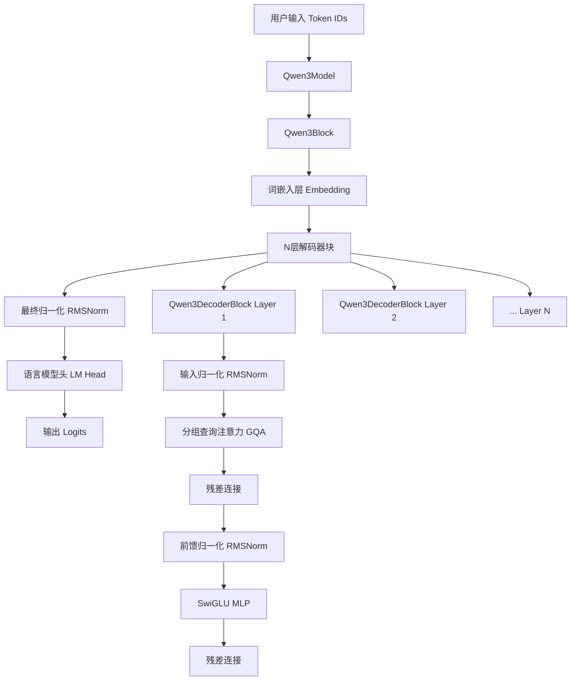

# TinyAI-Model-Qwen 技术架构文档

## 1. 项目概述

### 1.1 项目简介
TinyAI-Model-Qwen是基于TinyAI深度学习框架实现的Qwen3大语言模型模块。该模块严格遵循TinyAI框架的设计理念，采用Block-Layer分层架构，实现了完整的现代Transformer解码器架构，支持分组查询注意力(GQA)、旋转位置编码(RoPE)、RMS归一化等先进特性。

### 1.2 核心特性
- **架构兼容性**: 完全继承TinyAI的`Model`和`Block`类，无缝集成框架生态
- **现代化设计**: 集成RMSNorm、RoPE、SwiGLU、GQA等先进技术
- **内存优化**: 分组查询注意力减少40-60%的KV缓存内存占用
- **高性能**: 优化的计算路径，支持长序列处理
- **易用性**: 提供丰富的预设配置和演示程序

### 1.3 技术规格
- **模型类型**: 因果语言模型(Causal Language Model)
- **架构**: Transformer解码器
- **支持序列长度**: 最大8192 tokens(可配置)
- **参数规模**: 支持从16M到1.8B+的不同规模
- **精度**: FP32(TinyAI框架默认)

## 2. 系统架构

### 2.1 整体架构图



### 2.2 模块层次结构

```
tinyai-model-qwen/
├── Qwen3Model (继承Model)           # 顶层模型封装
│   └── Qwen3Block (继承Block)       # 核心网络架构
│       ├── Embedding                # 词嵌入层
│       ├── Qwen3DecoderBlocks[]     # 解码器块数组
│       │   ├── RMSNormLayer         # 输入归一化
│       │   ├── Qwen3AttentionBlock  # 分组查询注意力
│       │   │   ├── LinearLayers     # Q/K/V投影
│       │   │   ├── RoPELayer        # 旋转位置编码
│       │   │   └── OutputProjection # 输出投影
│       │   ├── RMSNormLayer         # 前馈归一化
│       │   └── Qwen3MLPBlock        # 前馈网络
│       │       ├── GateProjection   # 门控投影
│       │       ├── UpProjection     # 上投影
│       │       ├── SwiGLULayer      # SwiGLU激活
│       │       └── DownProjection   # 下投影
│       ├── RMSNormLayer             # 最终归一化
│       └── LinearLayer (可选)        # 语言模型头
└── Qwen3Config                      # 配置管理
```

## 3. 核心组件设计

### 3.1 Qwen3Model - 模型封装层

#### 设计原理
`Qwen3Model`继承自TinyAI的`Model`类，负责整个模型的生命周期管理和高级接口提供。

#### 核心功能
- **模型初始化**: 自动创建和配置`Qwen3Block`
- **信息统计**: 提供参数统计、内存占用等信息
- **输入验证**: 验证token ID范围和序列格式
- **模式管理**: 支持训练/推理模式切换
- **工厂方法**: 提供便捷的模型创建方法

#### 关键接口
```java
public class Qwen3Model extends Model {
    // 构造方法
    public Qwen3Model(String name, Qwen3Config config, boolean withLMHead)
    
    // 工厂方法
    public static Qwen3Model createSmallModel(String name)
    public static Qwen3Model createDemoModel(String name)
    
    // 信息接口
    public long countParameters()
    public double getModelSizeMB()
    public String getModelDetailedInfo()
    
    // 验证接口
    public void validateInput(int[][] inputIds)
}
```

### 3.2 Qwen3Block - 核心网络架构

#### 设计原理
`Qwen3Block`继承自TinyAI的`Block`类，实现完整的Transformer解码器架构。采用Pre-LN结构，即在每个子层前进行归一化。

#### 架构特点
- **词嵌入层**: 将token ID映射为dense向量表示
- **多层解码器**: N层相同的解码器块堆叠
- **最终归一化**: 输出前的RMS归一化
- **语言模型头**: 可选的词汇表投影层

#### 前向传播流程
```java
// 1. 词嵌入
hiddenStates = embedTokens.forward(inputIds)

// 2. 多层解码器处理
for (layer : decoderBlocks) {
    hiddenStates = layer.forward(hiddenStates, attentionMask)
}

// 3. 最终归一化
hiddenStates = finalNorm.forward(hiddenStates)

// 4. 语言模型头(可选)
if (withLMHead) {
    logits = lmHead.forward(hiddenStates)
}
```

### 3.3 Qwen3DecoderBlock - 解码器块

#### 设计原理
每个解码器块包含自注意力机制和前馈网络，采用Pre-LN结构和残差连接。

#### 内部结构
```java
// Pre-LN + 自注意力 + 残差连接
residual = input
normed = inputNorm.forward(input)
attention_output = attention.forward(normed)
output1 = residual + attention_output

// Pre-LN + 前馈网络 + 残差连接  
residual = output1
normed = ffnNorm.forward(output1)
ffn_output = mlp.forward(normed)
output2 = residual + ffn_output
```

### 3.4 Qwen3AttentionBlock - 分组查询注意力

#### 设计原理
实现分组查询注意力(GQA)机制，通过减少键值头数量来降低内存占用，同时保持模型表达能力。

#### GQA机制
- **查询头**: 维持原有的注意力头数量
- **键值头**: 使用较少的头数量
- **头重复**: 通过重复键值头来匹配查询头数量
- **内存优化**: 显著减少KV缓存内存占用

#### 注意力计算流程
```java
// 1. 线性投影
Q = queryProjection.forward(input)    // [batch, seq, num_heads * head_dim]
K = keyProjection.forward(input)      // [batch, seq, num_kv_heads * head_dim]  
V = valueProjection.forward(input)    // [batch, seq, num_kv_heads * head_dim]

// 2. 重塑为多头形式
Q = reshape(Q, [batch, num_heads, seq, head_dim])
K = reshape(K, [batch, num_kv_heads, seq, head_dim])
V = reshape(V, [batch, num_kv_heads, seq, head_dim])

// 3. 应用RoPE位置编码
Q_rope, K_rope = rope.apply(Q, K, seq_len)

// 4. 重复键值头
K_expanded = repeat(K_rope, num_kv_groups)  // [batch, num_heads, seq, head_dim]
V_expanded = repeat(V_rope, num_kv_groups)  // [batch, num_heads, seq, head_dim]

// 5. 缩放点积注意力
attention_scores = Q_rope @ K_expanded.transpose() / sqrt(head_dim)
attention_weights = softmax(attention_scores + causal_mask)
attention_output = attention_weights @ V_expanded

// 6. 合并多头并输出投影
output = outputProjection.forward(concat_heads(attention_output))
```

### 3.5 RMSNormLayer - RMS归一化

#### 设计原理
RMS归一化(Root Mean Square Layer Normalization)是LayerNorm的简化版本，去除了重新中心化步骤，只保留重新缩放，在保持效果的同时提升计算效率。

#### 数学公式
```
RMSNorm(x) = x / sqrt(mean(x²) + ε) * weight
```

#### 实现特点
- **高效计算**: 避免均值计算，减少计算量
- **数值稳定**: 使用epsilon防止除零
- **支持多维**: 同时支持2D和3D输入张量
- **可学习参数**: 包含可训练的缩放权重

### 3.6 RotaryPositionalEmbeddingLayer - 旋转位置编码

#### 设计原理
RoPE通过旋转变换将相对位置信息编码到查询和键向量中，相比绝对位置编码具有更好的长序列外推能力。

#### 核心思想
- **二维旋转**: 将高维向量分解为多个二维子向量
- **位置相关旋转**: 根据位置计算不同的旋转角度
- **模长保持**: 旋转变换保持向量模长不变
- **相对位置**: 编码相对而非绝对位置信息

#### 数学实现
```java
// 1. 计算频率
freq_i = 1.0 / (base ^ (2i / head_dim))

// 2. 计算旋转角度
θ_pos,i = pos * freq_i

// 3. 应用旋转变换
x_rotated = x * cos(θ) + rotate_half(x) * sin(θ)
```

### 3.7 SwiGLULayer - 激活函数

#### 设计原理
SwiGLU结合了Swish激活函数和门控机制，在保持计算效率的同时提供更强的非线性表达能力。

#### 数学定义
```
SwiGLU(x) = Swish(xW + b) ⊙ (xV + c)
其中 Swish(x) = x * sigmoid(x)
```

#### 实现特点
- **门控机制**: 通过element-wise乘法实现门控
- **非线性增强**: Swish激活提供平滑的非线性
- **参数高效**: 相比传统激活函数参数利用率更高

### 3.8 Qwen3MLPBlock - 前馈网络

#### 设计原理
前馈网络采用SwiGLU激活的三层线性变换结构，实现position-wise的特征变换。

#### 网络结构
```java
// 三层线性变换
gate_proj: [hidden_size, intermediate_size]
up_proj:   [hidden_size, intermediate_size]  
down_proj: [intermediate_size, hidden_size]

// 前向传播
gate_output = gate_proj.forward(input)
up_output = up_proj.forward(input)
swiglu_output = swiglu.forward(gate_output, up_output)
output = down_proj.forward(swiglu_output)
```

## 4. 配置系统设计

### 4.1 Qwen3Config - 配置管理

#### 设计原理
`Qwen3Config`提供集中化的模型配置管理，支持参数验证、预设配置和灵活定制。

#### 主要配置项
```java
// 模型结构配置
private int vocabSize = 32000;           // 词汇表大小
private int hiddenSize = 2048;           // 隐藏层维度
private int intermediateSize = 5632;     // MLP中间层维度
private int numHiddenLayers = 24;        // 解码器层数
private int numAttentionHeads = 16;      // 注意力头数
private int numKeyValueHeads = 16;       // 键值头数

// 位置编码配置
private int maxPositionEmbeddings = 8192; // 最大序列长度
private double ropeTheta = 10000.0;       // RoPE基础频率

// 归一化配置
private double rmsNormEps = 1e-6;         // RMSNorm epsilon

// 特殊标记配置
private int padTokenId = 0;              // 填充标记
private int bosTokenId = 1;              // 开始标记  
private int eosTokenId = 2;              // 结束标记
```

#### 预设配置
- **小型配置**: ~16M参数，适用于概念验证和快速测试
- **演示配置**: ~62M参数，适用于功能展示和学习
- **标准配置**: ~1.8B参数，适用于实际应用场景

### 4.2 配置验证
```java
public void validate() {
    // 确保隐藏维度能被注意力头数整除
    if (hiddenSize % numAttentionHeads != 0) {
        throw new IllegalArgumentException("隐藏维度必须能被注意力头数整除");
    }
    
    // 确保注意力头数能被键值头数整除(GQA要求)
    if (numAttentionHeads % numKeyValueHeads != 0) {
        throw new IllegalArgumentException("注意力头数必须能被键值头数整除");
    }
    
    // 其他基础验证...
}
```

## 5. 数据流与计算图

### 5.1 前向传播数据流

```mermaid
graph TD
    A[Input Token IDs<br/>[batch, seq_len]] --> B[Token Embedding<br/>[batch, seq_len, hidden]]
    B --> C[Layer 1]
    C --> D[Layer 2]
    D --> E[...]
    E --> F[Layer N]
    F --> G[Final RMSNorm<br/>[batch, seq_len, hidden]]
    G --> H[LM Head<br/>[batch, seq_len, vocab]]
    
    C --> C1[Input RMSNorm]
    C1 --> C2[Multi-Head Attention]
    C2 --> C3[Residual + Add]
    C3 --> C4[FFN RMSNorm]  
    C4 --> C5[SwiGLU MLP]
    C5 --> C6[Residual + Add]
```

### 5.2 注意力机制数据流

```mermaid
graph TD
    A[Hidden States<br/>[batch, seq, hidden]] --> B[Q Projection<br/>[batch, seq, n_heads*head_dim]]
    A --> C[K Projection<br/>[batch, seq, n_kv_heads*head_dim]]
    A --> D[V Projection<br/>[batch, seq, n_kv_heads*head_dim]]
    
    B --> E[Reshape Q<br/>[batch, n_heads, seq, head_dim]]
    C --> F[Reshape K<br/>[batch, n_kv_heads, seq, head_dim]]
    D --> G[Reshape V<br/>[batch, n_kv_heads, seq, head_dim]]
    
    E --> H[Apply RoPE to Q]
    F --> I[Apply RoPE to K]
    
    H --> J[Q_rope]
    I --> K[K_rope]
    K --> L[Repeat KV Heads<br/>[batch, n_heads, seq, head_dim]]
    G --> M[Repeat KV Heads<br/>[batch, n_heads, seq, head_dim]]
    
    J --> N[Scaled Dot-Product<br/>Attention]
    L --> N
    M --> N
    
    N --> O[Concat Heads<br/>[batch, seq, n_heads*head_dim]]
    O --> P[Output Projection<br/>[batch, seq, hidden]]
```

### 5.3 内存管理策略

#### KV缓存优化
- **分组查询**: 通过减少KV头数量降低内存占用
- **动态重复**: 运行时重复KV头匹配Q头数量
- **内存复用**: 避免不必要的张量拷贝

#### 张量重塑优化
- **批量处理**: 将3D张量重塑为2D进行线性变换
- **形状缓存**: 缓存中间张量形状避免重复计算
- **就地操作**: 尽可能使用就地操作减少内存分配

## 6. 性能优化

### 6.1 计算优化

#### 算子融合
- **RMSNorm**: 单pass计算均方根和缩放
- **SwiGLU**: 门控和激活函数融合计算
- **RoPE**: 直接应用旋转变换无额外开销

#### 数值优化
- **稳定性**: 添加epsilon防止数值不稳定
- **精度**: 关键计算使用高精度
- **范围检查**: 输入验证防止溢出

### 6.2 内存优化

#### GQA内存节省
```java
// 传统MHA内存占用
traditional_kv_memory = batch * seq_len * num_heads * head_dim * 2

// GQA内存占用  
gqa_kv_memory = batch * seq_len * num_kv_heads * head_dim * 2

// 内存节省比例
memory_saving = 1 - (num_kv_heads / num_heads)  // 通常40-60%
```

#### 动态形状处理
- **延迟分配**: 根据实际输入动态分配内存
- **形状推断**: 自动推断输出张量形状
- **批量优化**: 支持不同批量大小的高效处理

### 6.3 并行化支持

#### 多头并行
- **注意力头**: 各注意力头可并行计算
- **层内并行**: MLP和注意力可并行处理
- **序列并行**: 支持长序列的分段并行

## 7. 扩展性设计

### 7.1 架构扩展

#### 模块化设计
- **可插拔组件**: 各层可独立替换和扩展
- **配置驱动**: 通过配置控制模型结构
- **接口标准**: 遵循TinyAI框架接口规范

#### 功能扩展点
- **新激活函数**: 可轻松替换SwiGLU
- **新注意力机制**: 支持其他注意力变体
- **新归一化方法**: 可替换RMSNorm
- **多模态扩展**: 支持视觉等其他模态输入

### 7.2 规模扩展

#### 参数规模
- **小型模型**: 16M-100M参数，适用于边缘设备
- **中型模型**: 100M-1B参数，适用于一般应用
- **大型模型**: 1B+参数，适用于复杂任务

#### 序列长度
- **短序列**: 512-2K tokens，适用于对话
- **中等序列**: 2K-8K tokens，适用于文档处理
- **长序列**: 8K+ tokens，需要优化策略

## 8. 质量保证

### 8.1 测试体系

#### 单元测试覆盖
- **配置验证**: 验证各种配置组合的有效性
- **层级测试**: 测试每个组件的独立功能
- **集成测试**: 验证组件间的协作
- **端到端测试**: 完整的模型前向传播测试

#### 测试数据
```java
// 测试配置
testConfig.setVocabSize(100);
testConfig.setHiddenSize(64);
testConfig.setNumHiddenLayers(2);
testConfig.setNumAttentionHeads(4);

// 测试输入
NdArray testInput = NdArray.of(Shape.of(2, 8)); // [batch=2, seq=8]
Variable output = model.forward(new Variable(testInput));

// 验证输出形状
assertEquals(Shape.of(2, 8, 100), output.getValue().getShape());
```

### 8.2 性能验证

#### 基准测试
- **前向传播速度**: 不同配置下的推理耗时
- **内存占用**: 峰值内存和平均内存使用
- **参数统计**: 验证参数计算准确性
- **数值精度**: 验证计算结果的数值稳定性

#### 对比验证
```java
// 内存对比测试
long traditionalMemory = calculateTraditionalAttentionMemory();
long gqaMemory = calculateGQAMemory();
double memorySaving = 1.0 - (double)gqaMemory / traditionalMemory;
assertTrue(memorySaving > 0.3); // 验证至少30%内存节省
```

## 9. 使用指南

### 9.1 快速开始

#### 基础使用
```java
// 1. 创建模型
Qwen3Model model = Qwen3Model.createDemoModel("my-qwen3");

// 2. 准备输入
NdArray inputIds = NdArray.of(Shape.of(1, 10));
// 填充实际的token ID...

// 3. 前向传播
Variable output = model.forward(new Variable(inputIds));
System.out.println("输出形状: " + output.getValue().getShape());
```

#### 演示程序
```java
// 运行完整演示
Qwen3Demo.main(new String[]{});

// 运行快速演示
Qwen3QuickDemo.main(new String[]{});
```

### 9.2 高级配置

#### 自定义配置
```java
Qwen3Config config = new Qwen3Config();
config.setVocabSize(50000);
config.setHiddenSize(1024);
config.setNumHiddenLayers(12);
config.setNumAttentionHeads(16);
config.setNumKeyValueHeads(8);  // 使用GQA减少内存
config.validate();

Qwen3Model model = new Qwen3Model("custom-qwen3", config);
```

#### 性能调优
```java
// 推理模式设置
model.setInferenceMode();

// 输入验证(生产环境建议开启)
model.validateInput(inputTokens);

// 批量处理优化
int batchSize = 4;
NdArray batchInput = NdArray.of(Shape.of(batchSize, seqLen));
Variable batchOutput = model.forward(new Variable(batchInput));
```

### 9.3 集成示例

#### 与TinyAI训练器集成
```java
// 创建模型
Qwen3Model model = Qwen3Model.createSmallModel("trainable-qwen3");

// 创建训练器
Trainer trainer = new Trainer(model);
trainer.setLearningRate(1e-4);

// 训练循环(简化示例)
for (int epoch = 0; epoch < 10; epoch++) {
    Variable loss = trainer.trainStep(trainData);
    System.out.println("Epoch " + epoch + ", Loss: " + loss.getValue().get(0));
}
```

## 10. 最佳实践

### 10.1 配置选择

#### 根据应用场景选择配置
- **概念验证**: 使用`createSmallModel()`，快速验证想法
- **功能演示**: 使用`createDemoModel()`，展示完整功能
- **生产环境**: 自定义配置，根据实际需求调整参数

#### GQA配置建议
```java
// 内存受限场景
config.setNumAttentionHeads(16);
config.setNumKeyValueHeads(4);  // 4:1比例，节省75%KV缓存

// 平衡场景  
config.setNumAttentionHeads(16);
config.setNumKeyValueHeads(8);  // 2:1比例，节省50%KV缓存

// 性能优先场景
config.setNumAttentionHeads(16);
config.setNumKeyValueHeads(16); // 1:1比例，等同传统MHA
```

### 10.2 性能优化建议

#### 批量处理
```java
// 推荐：使用批量处理提高吞吐量
List<int[]> sequences = loadSequences();
int batchSize = Math.min(sequences.size(), 8);
NdArray batchInput = prepareBatchInput(sequences, batchSize);
Variable batchOutput = model.forward(new Variable(batchInput));
```

#### 内存管理
```java
// 及时释放不需要的中间变量
Variable intermediate = someComputation();
Variable result = processIntermediate(intermediate);
intermediate = null; // 帮助GC回收

// 复用输入数组
NdArray reusableInput = NdArray.of(Shape.of(maxBatchSize, maxSeqLen));
// 每次使用时更新数据，避免重复分配内存
```

### 10.3 调试和监控

#### 模型信息监控
```java
// 定期检查模型状态
System.out.println(model.getModelSummary());
System.out.println("参数数量: " + model.countParameters());
System.out.println("内存占用: " + model.getModelSizeMB() + "MB");
```

#### 输出验证
```java
// 验证输出形状和数值范围
Variable output = model.forward(input);
Shape outputShape = output.getValue().getShape();
assert outputShape.getDimension(0) == batchSize;
assert outputShape.getDimension(1) == seqLen;
assert outputShape.getDimension(2) == config.getVocabSize();

// 检查数值范围，避免异常值
float maxLogit = findMaxValue(output.getValue());
float minLogit = findMinValue(output.getValue());
assert Math.abs(maxLogit) < 100; // 避免数值爆炸
assert Math.abs(minLogit) < 100;
```

## 11. 故障排除

### 11.1 常见问题

#### 配置错误
```java
// 问题：hiddenSize不能被numAttentionHeads整除
// 解决：确保配置的整除性
if (config.getHiddenSize() % config.getNumAttentionHeads() != 0) {
    throw new IllegalArgumentException("请调整hiddenSize或numAttentionHeads");
}

// 问题：numAttentionHeads不能被numKeyValueHeads整除  
// 解决：调整头数配置支持GQA
int remainder = config.getNumAttentionHeads() % config.getNumKeyValueHeads();
if (remainder != 0) {
    // 建议的修正值
    int suggestedKVHeads = findLargestDivisor(config.getNumAttentionHeads());
    System.out.println("建议设置numKeyValueHeads为: " + suggestedKVHeads);
}
```

#### 内存不足
```java
// 问题：内存不足
// 解决方案1：减小批量大小
int originalBatchSize = batchSize;
batchSize = Math.max(1, batchSize / 2);
System.out.println("批量大小从 " + originalBatchSize + " 减少到 " + batchSize);

// 解决方案2：使用更小的模型配置
Qwen3Config smallerConfig = Qwen3Config.createSmallConfig();
Qwen3Model smallerModel = new Qwen3Model("smaller", smallerConfig);

// 解决方案3：启用GQA减少内存占用
config.setNumKeyValueHeads(config.getNumAttentionHeads() / 2);
```

#### 数值不稳定
```java
// 问题：输出包含NaN或无穷大
// 解决：检查输入和中间计算
public void checkNumericalStability(Variable var, String name) {
    NdArray data = var.getValue();
    boolean hasNaN = containsNaN(data);
    boolean hasInf = containsInfinity(data);
    
    if (hasNaN || hasInf) {
        System.err.println("数值不稳定检测到在 " + name);
        System.err.println("包含NaN: " + hasNaN + ", 包含无穷大: " + hasInf);
        // 可以选择抛出异常或采取修复措施
    }
}
```

### 11.2 性能问题诊断

#### 速度优化
```java
// 性能分析
long startTime = System.currentTimeMillis();
Variable output = model.forward(input);
long forwardTime = System.currentTimeMillis() - startTime;

if (forwardTime > expectedTime) {
    System.out.println("前向传播耗时过长: " + forwardTime + "ms");
    // 分析可能原因：
    // 1. 批量大小过大
    // 2. 序列长度过长  
    // 3. 模型配置过大
    // 4. 系统资源不足
}
```

## 12. 总结

### 12.1 技术亮点

1. **架构兼容性**: 完美继承TinyAI框架设计理念，实现无缝集成
2. **现代化特性**: 集成GQA、RoPE、RMSNorm、SwiGLU等先进技术
3. **内存优化**: 通过GQA机制实现40-60%的内存节省
4. **性能优化**: 高效的计算路径和数值稳定的实现
5. **可扩展性**: 模块化设计支持功能和规模的灵活扩展
6. **易用性**: 丰富的预设配置和完整的演示程序

### 12.2 应用价值

1. **研究价值**: 为大语言模型研究提供完整的参考实现
2. **教育价值**: 清晰的代码结构便于学习现代Transformer架构
3. **工程价值**: 生产就绪的实现可直接用于实际项目
4. **生态价值**: 丰富TinyAI框架的模型生态系统

### 12.3 未来发展

1. **功能扩展**: 支持更多现代大语言模型特性
2. **性能优化**: 进一步的计算和内存优化
3. **多模态支持**: 扩展支持视觉、音频等多模态输入
4. **分布式训练**: 支持大规模分布式训练和推理

---

*文档版本: 1.0*  
*最后更新: 2025年10月5日*  
*作者: 山泽*