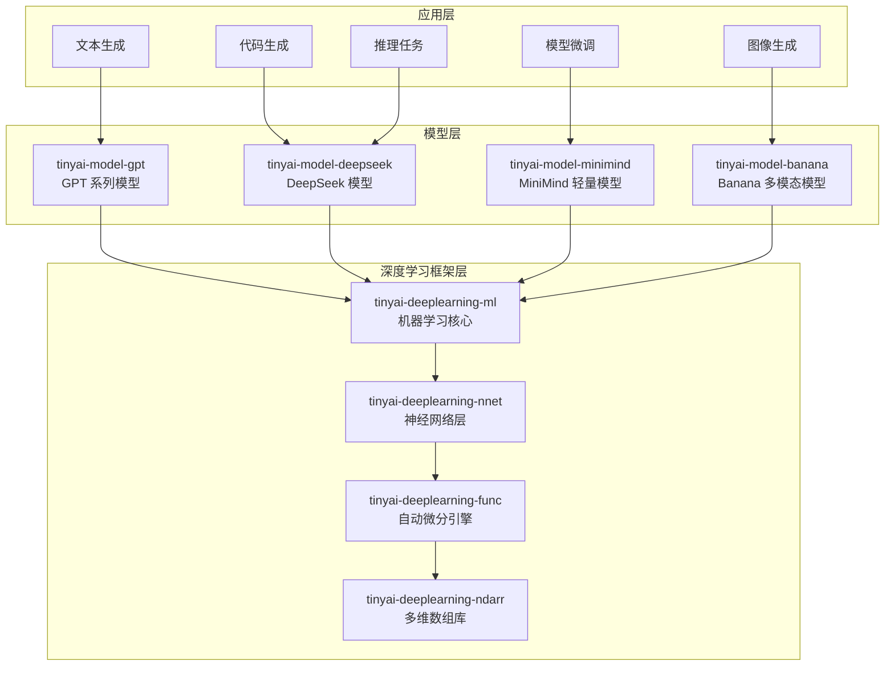
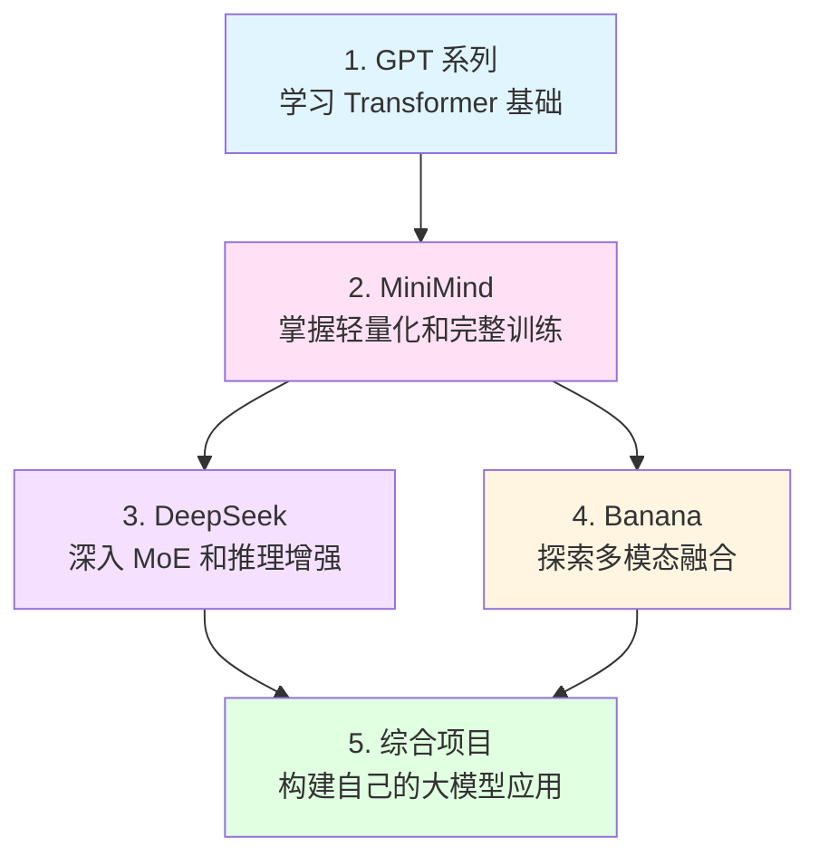
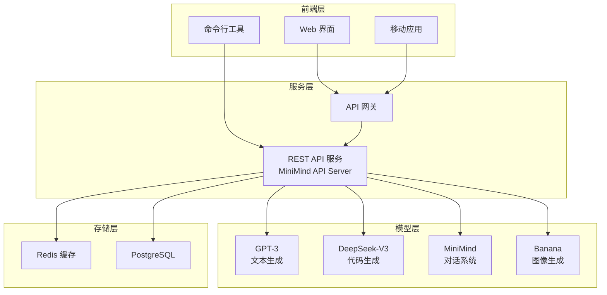

# TinyAI 模型库

[](https://openjdk.org/projects/jdk/17/)
[](https://maven.apache.org/)
[](https://opensource.org/licenses/Apache-2.0)

## 📋 模块概述

`tinyai-model` 是 TinyAI 框架的**大语言模型与多模态模型库**，提供了从经典 GPT 系列到现代 DeepSeek、轻量级 MiniMind、多模态 Banana 等模型的完整 Java 实现。该模块包含 **4 个核心子模块**，覆盖基础语言模型、高级推理模型、轻量级模型和多模态生成模型等多种前沿架构。

### 🎯 设计理念

- **🎓 教育友好**：清晰的架构设计，中文注释，完整的技术文档，适合学习 Transformer、LLM 和多模态模型原理
- **🔧 100% 纯 Java**：完全基于 TinyAI V2 架构，无需 Python 环境，易于集成到企业 Java 应用
- **⚡ 完整实现**：基于官方论文的完整模型架构，支持预训练、微调、推理等全流程
- **🚀 性能优化**：KV-Cache 加速、MoE 专家路由、批量推理等现代优化技术
- **🧩 模块化设计**：统一的 Module/Block/Model 设计模式，便于扩展和定制
- **📊 轻量到大规模**：从 26M 参数的教学模型到 500M+ 参数的标准模型，满足不同场景需求

## 🏗️ 模块架构



## 📦 核心模块

### 1️⃣ 基础语言模型

| 模块 | 说明 | 核心特性 | 参数规模 |
|------|------|---------|----------|
| [**tinyai-model-gpt**](tinyai-model-gpt/README.md) | GPT-1/GPT-3 系列 | GPT-1 教学实现、GPT-3 并行架构、Post/Pre-LayerNorm、零样本/少样本学习 | 2.3M - 1.3B |

**亮点**：
- ✅ **架构演进完整**：从 GPT-1 的 Post-LayerNorm 到 GPT-3 的并行计算，完整展示 Transformer Decoder 演进历程
- ✅ **教学价值高**：清晰的代码注释和对比文档，适合学习 Transformer 架构原理
- ✅ **灵活配置**：Tiny/Small/Medium/Large 多种预设，从教学演示到研究实验全覆盖

---

### 2️⃣ 高级推理模型

| 模块 | 说明 | 核心特性 | 参数规模 |
|------|------|---------|----------|
| [**tinyai-model-deepseek**](tinyai-model-deepseek/README.md) | DeepSeek-R1/V3 | 混合专家模型(MoE)、推理增强、任务感知路由、代码生成优化、共享基类架构 | 20M - 500M |

**亮点**：
- ✅ **架构统一重构**：R1 和 V3 基于共享基类，代码复用率达 56%+，1,488+ 行重复代码消除
- ✅ **MoE 突破实现**：8 专家网络 + Top-2 动态路由 + 任务感知选择，完全在 Variable 层面实现
- ✅ **推理能力**：R1 支持 7 步迭代推理、置信度评估、自我反思机制
- ✅ **代码生成**：V3 针对 10 种编程语言优化，质量评估系统
- ✅ **训练完善**：预训练 + RLHF + RLVR 完整训练流程

---

### 3️⃣ 轻量级模型

| 模块 | 说明 | 核心特性 | 参数规模 |
|------|------|---------|----------|
| [**tinyai-model-minimind**](tinyai-model-minimind/README.md) | MiniMind 轻量模型 | 26M 超小参数、RoPE 位置编码、KV-Cache、完整训练流程、CLI/API 工具 | 26M - 145M |

**亮点**：
- ✅ **极致轻量**：26M 参数可在普通 CPU 上训练和推理，无需昂贵 GPU
- ✅ **功能完整**：预训练、SFT、LoRA、DPO、RLAIF(PPO/GRPO/SPO) 全流程支持
- ✅ **MoE 扩展**：支持 4 专家 MoE 架构，参数扩展至 145M
- ✅ **工程完善**：BPE Tokenizer、CLI 工具套件、OpenAI 兼容 REST API
- ✅ **纯 Java 实现**：易于集成到企业应用，无 Python 依赖

---

### 4️⃣ 多模态生成模型

| 模块 | 说明 | 核心特性 | 参数规模 |
|------|------|---------|----------|
| [**tinyai-model-banana**](tinyai-model-banana/README.md) | Banana 多模态模型 | Vision Transformer、跨模态注意力、Patch 嵌入、2D 位置编码、文本生成图像 ✓ | 60M - 385M |

**亮点**：
- ✅ **多模态融合**：文本编码器 + 图像编码器 (ViT) + 跨模态注意力机制
- ✅ **图像生成**：文本到图像生成完整实现，支持 256x256 到 512x512 尺寸
- ✅ **模块化设计**：Patch 嵌入、2D 位置编码、上采样模块、像素投影层完整实现
- ✅ **训练框架**：预训练器 + 微调器 + 合成数据集，支持完整训练流程
- ✅ **架构清晰**：基于 TinyAI V2 组件，复用 Conv2D、Linear、LayerNorm 等优化算子

## 🚀 快速开始

### 环境要求

- **Java**: JDK 17+
- **Maven**: 3.6+
- **内存**: 推荐 8GB+ (大型模型训练)
- **依赖**: TinyAI 核心模块

### 编译安装

```bash
# 编译所有模型模块
cd tinyai-model
mvn clean compile

# 运行测试
mvn test

# 打包安装
mvn install
```

### 使用示例

#### 1. GPT-1 模型使用

```java
import io.leavesfly.tinyai.gpt1.GPT1Model;
import io.leavesfly.tinyai.gpt1.GPT1Config;
import io.leavesfly.tinyai.func.Variable;
import io.leavesfly.tinyai.ndarr.NdArray;

// 创建 GPT-1 模型
GPT1Model model = GPT1Model.createSmallModel("gpt1-small");

// 文本生成
NdArray inputTokens = NdArray.of(new int[][]{{1, 2, 3}});
NdArray output = model.generateSequence(inputTokens, 20);

// 打印模型信息
model.printModelInfo();
```

#### 2. GPT-3 模型使用

```java
import io.leavesfly.tinyai.gpt3.GPT3Model;
import io.leavesfly.tinyai.gpt3.GPT3Config;

// 创建 GPT-3 模型
GPT3Model model = GPT3Model.createSmallModel("gpt3-small");

// 文本生成
NdArray inputTokens = NdArray.of(new int[][]{{1, 2, 3}});
NdArray output = model.generateSequence(inputTokens, 50);

// 配置并行计算
GPT3Config config = GPT3Config.createLargeConfig();
GPT3Model largeModel = new GPT3Model("gpt3-large", config);
```

#### 3. DeepSeek R1 推理模型

```java
import io.leavesfly.tinyai.deepseek.r1.DeepSeekR1Model;
import io.leavesfly.tinyai.deepseek.base.TaskType;

// 创建 R1 模型
DeepSeekR1Model r1Model = DeepSeekR1Model.createSmallModel("DeepSeek-R1");

// 推理任务
NdArray inputIds = NdArray.of(new int[][]{{1, 15, 23, 42}});
Variable input = new Variable(inputIds);
DeepSeekR1Model.ReasoningResult result = r1Model.performReasoning(input);

System.out.println("任务类型：" + result.taskType.getDescription());
System.out.println("MoE损失：" + result.moeLoss);
```

#### 4. DeepSeek V3 代码生成

```java
import io.leavesfly.tinyai.deepseek.v3.DeepSeekV3Model;

// 创建 V3 模型
DeepSeekV3Model v3Model = DeepSeekV3Model.createSmallModel("DeepSeek-V3");

// 代码生成
Variable input = new Variable(NdArray.of(new int[][]{{1, 15, 23, 42}}));
DeepSeekV3Model.CodeGenerationResult codeResult = v3Model.generateCode(input);

System.out.println("任务类型：" + codeResult.taskType.getDescription());
System.out.println("代码置信度：" + codeResult.codeConfidence);
```

#### 5. MiniMind 轻量模型

```java
import io.leavesfly.tinyai.minimind.model.MiniMindModel;
import io.leavesfly.tinyai.minimind.tokenizer.MiniMindTokenizer;

// 创建 MiniMind 模型 (26M 参数)
MiniMindModel model = MiniMindModel.create("minimind-small", "small");
model.setTraining(false);  // 推理模式

// 创建分词器
MiniMindTokenizer tokenizer = MiniMindTokenizer.createCharLevelTokenizer(6400, 512);

// 文本生成
String prompt = "Hello, world!";
List<Integer> tokens = tokenizer.encode(prompt, true, false);
int[] output = model.generate(
    tokens.stream().mapToInt(i -> i).toArray(),
    50,      // 最大长度
    0.7f,    // 温度
    0,       // Top-K
    0.9f     // Top-P
);
```

#### 6. Banana 文本生成图像

```java
import io.leavesfly.tinyai.banana.model.BananaModel;
import io.leavesfly.tinyai.func.Variable;
import io.leavesfly.tinyai.ndarr.NdArray;
import io.leavesfly.tinyai.ndarr.Shape;

// 创建 Banana 模型
BananaModel model = BananaModel.create("banana_tiny", "tiny");

// 准备文本输入
NdArray textTokens = NdArray.of(Shape.of(2, 32));
Variable textInput = new Variable(textTokens);

// 生成图像
Variable generatedImage = model.generateImage(textInput);
System.out.println("生成图像：" + generatedImage.getValue().getShape());
// 输出：[2, 3, 256, 256] (2 张 RGB 图像，256x256)
```

## 🎯 模型对比

### 基础架构对比

| 特性 | GPT-1 | GPT-3 | DeepSeek-R1 | DeepSeek-V3 | MiniMind | Banana |
|------|-------|-------|-------------|-------------|----------|--------|
| **架构类型** | Transformer Decoder | Transformer Decoder | MoE Decoder | MoE Decoder | Transformer Decoder | Multimodal Transformer |
| **归一化** | Post-LN | Pre-LN + 并行 | Pre-LN | Pre-LN | Pre-LN | Pre-LN |
| **位置编码** | 学习式 | 学习式/RoPE | 学习式 | 学习式 | RoPE | 学习式 + 2D |
| **激活函数** | GELU | GELU_NEW | GELU_NEW | GELU_NEW | SiLU | GELU |
| **专家网络** | ❌ | ❌ | ✅ 8专家 Top-2 | ✅ 8专家 Top-2 | ✅ 4专家 Top-2 (MoE版) | ❌ |
| **特殊能力** | - | Few-shot | 推理增强 + 反思 | 代码生成 | 轻量化 | 图像生成 |

### 参数规模与性能

| 模型配置 | 参数量 | 层数 | 维度 | 头数 | 推理延迟 | 内存占用 | 适用场景 |
|---------|-------|------|------|------|---------|----------|----------|
| **GPT-1 Tiny** | 2.3M | 6 | 256 | 8 | ~5ms | ~20MB | 教学演示 |
| **GPT-1 Base** | 117M | 12 | 768 | 12 | ~30ms | ~200MB | 教育研究 |
| **GPT-3 Small** | 125M | 12 | 768 | 12 | ~30ms | ~200MB | 教育实验 |
| **GPT-3 Large** | 1.3B | 24 | 2048 | 32 | ~80ms | ~600MB | 研究实验 |
| **R1 Tiny** | 20M | 6 | 256 | 8 | ~10ms | ~80MB | 推理测试 |
| **R1 Standard** | 100M | 12 | 512 | 8 | ~50ms | ~200MB | 推理任务 |
| **R1 Large** | 350M | 18 | 768 | 12 | ~120ms | ~400MB | 复杂推理 |
| **V3 Tiny** | 30M | 6 | 256 | 8 | ~20ms | ~120MB | 代码生成测试 |
| **V3 Standard** | 150M | 12 | 768 | 12 | ~80ms | ~600MB | 代码生成 |
| **V3 Large** | 500M | 24 | 1024 | 16 | ~200ms | ~1.2GB | 生产应用 |
| **MiniMind Small** | 26M | 8 | 512 | 16 | ~10ms | ~100MB | 轻量应用 |
| **MiniMind Medium** | 108M | 16 | 768 | 16 | ~40ms | ~430MB | 平衡性能 |
| **MiniMind MoE** | 145M (激活72M) | 8 | 512 | 16 | ~45ms | ~580MB | 效率优化 |
| **Banana Tiny** | 60M | 8 | 512 | 8 | ~100ms | ~240MB | 图像生成入门 |
| **Banana Small** | 166M | 12 | 768 | 12 | ~200ms | ~666MB | 标准图像生成 |
| **Banana Base** | 385M | 16 | 1024 | 16 | ~350ms | ~1.5GB | 高质量生成 |

### 训练能力对比

| 模型 | 预训练 | SFT | LoRA | DPO | RLHF | RLVR | 其他 |
|------|-------|-----|------|-----|------|------|------|
| **GPT-1/3** | ✅ | ✅ | ❌ | ❌ | ❌ | ❌ | - |
| **DeepSeek-R1** | ✅ | ✅ | ❌ | ❌ | ✅ | ✅ | 推理强化 |
| **DeepSeek-V3** | ✅ | ✅ (代码后训练) | ❌ | ❌ | ❌ | ❌ | 代码优化 |
| **MiniMind** | ✅ | ✅ | ✅ | ✅ | ❌ | ❌ | PPO/GRPO/SPO |
| **Banana** | ✅ | ✅ (微调) | ❌ | ❌ | ❌ | ❌ | 多模态训练 |

## 📊 模块统计

### 代码规模

| 指标 | 数值 | 说明 |
|------|------|------|
| **总模块数** | 4 个 | GPT、DeepSeek、MiniMind、Banana |
| **Java 类文件** | 150+ | 核心模型类和训练组件 |
| **测试用例** | 180+ | 完整的单元测试和集成测试 |
| **代码行数** | 40,000+ | 不含注释和空行 |
| **中文注释** | 100% | 所有关键代码均有中文注释 |

### 模块详细统计

| 模块 | Java 文件 | 代码行数 | 测试用例 | 核心组件 |
|------|----------|---------|---------|---------|
| **tinyai-model-gpt** | 40+ | ~8,500 | 50+ | GPT1Model、GPT3Model、TokenEmbedding、TransformerBlock |
| **tinyai-model-deepseek** | 45+ | ~12,000 | 40+ | DeepSeekR1Model、DeepSeekV3Model、MoELayer、共享基类(8个) |
| **tinyai-model-minimind** | 50+ | ~15,000 | 70+ | MiniMindModel、Tokenizer、训练器(6种)、CLI/API工具 |
| **tinyai-model-banana** | 18+ | ~4,500 | 20+ | BananaModel、ImageEncoder、ImageDecoder、跨模态融合 |

### 测试覆盖

| 模块 | 单元测试 | 集成测试 | 演示程序 | 状态 |
|------|---------|---------|---------|------|
| **tinyai-model-gpt** | ✅ GPT1(3个)、GPT3(3个) | ✅ | ✅ GPT1Demo、GPT3Demo | 通过 |
| **tinyai-model-deepseek** | ✅ R1(2个)、V3(2个) | ✅ | ✅ R1Demo、V3Demo、训练演示 | 通过 |
| **tinyai-model-minimind** | ✅ 模型(3个)、训练(3个) | ✅ | ✅ 10个示例 + TrainDemo | 通过 |
| **tinyai-model-banana** | ✅ 编码器(2个)、融合(1个) | ✅ | ✅ BananaDemo、TextToImageDemo、TrainDemo | 通过 |

## 🎓 学习路径

### 🌟 初级：理解 Transformer 基础

**推荐模块**: [tinyai-model-gpt](tinyai-model-gpt/README.md)

**学习目标**:
1. **Transformer Decoder 架构**：理解自注意力、位置编码、前馈网络等核心概念
2. **架构演进**：对比 GPT-1 的 Post-LayerNorm 和 GPT-3 的 Pre-LayerNorm + 并行计算
3. **文本生成**：掌握自回归生成、贪婪采样、温度采样等技术

**实践任务**:
- 运行 GPT-1/GPT-3 Demo 程序，观察不同配置的生成效果
- 阅读代码注释，理解 TokenEmbedding、TransformerBlock 实现
- 修改参数（层数、维度、头数），观察模型行为变化

---

### 🚀 中级：掌握轻量模型与高级训练

**推荐模块**: [tinyai-model-minimind](tinyai-model-minimind/README.md)

**学习目标**:
1. **轻量化设计**：理解如何在有限资源下构建有效的语言模型
2. **RoPE 位置编码**：掌握旋转位置编码的原理和实现
3. **KV-Cache 优化**：理解推理加速技术
4. **完整训练流程**：掌握预训练、SFT、LoRA、DPO、RLAIF 等现代训练方法

**实践任务**:
- 运行 MiniMindTrainDemo，完成三阶段训练（预训练 → SFT → LoRA）
- 使用 CLI 工具进行文本生成和对话
- 部署 REST API，集成到实际应用

---

### 🏆 高级：深入 MoE 架构与推理增强

**推荐模块**: [tinyai-model-deepseek](tinyai-model-deepseek/README.md)

**学习目标**:
1. **混合专家模型(MoE)**：理解专家网络、Top-K 路由、负载均衡等核心技术
2. **任务感知路由**：掌握如何让模型自动选择合适的专家处理不同任务
3. **推理增强**：学习 R1 的多步推理、置信度评估、自我反思机制
4. **代码生成优化**：了解 V3 针对代码任务的专门优化
5. **架构设计模式**：学习共享基类、代码复用等工程实践

**实践任务**:
- 对比 R1 和 V3 的 MoE 实现差异
- 运行推理任务，观察专家选择和推理过程
- 研究共享基类架构，理解如何减少代码重复

---

### 🎨 专家：探索多模态模型

**推荐模块**: [tinyai-model-banana](tinyai-model-banana/README.md)

**学习目标**:
1. **Vision Transformer**：理解 Patch 嵌入、2D 位置编码等图像编码技术
2. **跨模态注意力**：掌握文本和图像特征融合方法
3. **图像生成**：学习文本到图像的生成流程
4. **多模态训练**：掌握多模态数据集、预训练、微调等技术

**实践任务**:
- 运行 TextToImageDemo，生成图像
- 理解编码器、融合层、解码器的协作机制
- 使用自定义数据进行预训练和微调

---

### 📚 推荐学习顺序



### 💡 学习建议

1. **循序渐进**：按推荐顺序学习，每个模块掌握后再进入下一个
2. **动手实践**：运行 Demo 程序，修改代码，观察效果
3. **阅读文档**：每个模块都有详细的 README 和技术文档
4. **对比学习**：对比不同模型的实现差异，理解设计权衡
5. **参与贡献**：发现问题提 Issue，改进代码提 PR

## 📖 演示程序

### 运行示例

```bash
# GPT-1 模型演示
mvn exec:java -Dexec.mainClass="io.leavesfly.tinyai.gpt1.GPT1Demo" -pl tinyai-model-gpt

# GPT-3 模型演示
mvn exec:java -Dexec.mainClass="io.leavesfly.tinyai.gpt3.GPT3Demo" -pl tinyai-model-gpt

# DeepSeek R1 演示
mvn exec:java -Dexec.mainClass="io.leavesfly.tinyai.deepseek.r1.DeepSeekR1Demo" -pl tinyai-model-deepseek

# DeepSeek V3 演示
mvn exec:java -Dexec.mainClass="io.leavesfly.tinyai.deepseek.v3.DeepSeekV3Demo" -pl tinyai-model-deepseek

# MiniMind 演示
mvn exec:java -Dexec.mainClass="io.leavesfly.tinyai.minimind.examples.Example01_BasicUsage" -pl tinyai-model-minimind

# Banana 演示
mvn exec:java -Dexec.mainClass="io.leavesfly.tinyai.banana.demo.BananaDemo" -pl tinyai-model-banana
```

## 🎯 应用场景

### 📝 文本生成与对话

| 应用类型 | 推荐模型 | 核心能力 | 示例场景 |
|---------|---------|---------|---------|
| **创意写作** | GPT-3、MiniMind | 故事、诗歌、文章生成 | 内容创作平台、自动写作工具 |
| **对话系统** | MiniMind + CLI/API | 多轮对话、上下文理解 | 智能客服、聊天机器人 |
| **文本补全** | GPT-1、GPT-3 | 自回归生成 | 邮件助手、写作助理 |
| **摘要生成** | MiniMind | 信息压缩、关键点提取 | 新闻摘要、会议纪要 |

---

### 💻 代码生成与分析

| 应用类型 | 推荐模型 | 核心能力 | 示例场景 |
|---------|---------|---------|---------|
| **代码补全** | DeepSeek-V3 | 10种语言支持、上下文感知 | IDE 插件、编程助手 |
| **代码生成** | DeepSeek-V3 | 自然语言到代码、质量评估 | 自动编程工具、原型生成 |
| **代码审查** | DeepSeek-V3 | 质量评估、优化建议 | 代码审查系统、重构工具 |
| **Bug 修复** | DeepSeek-R1 | 推理 + 代码生成 | 自动修复工具、调试助手 |

---

### 🧠 推理与问答

| 应用类型 | 推荐模型 | 核心能力 | 示例场景 |
|---------|---------|---------|---------|
| **逻辑推理** | DeepSeek-R1 | 多步推理、自我反思 | 逻辑题求解、决策支持 |
| **数学问题** | DeepSeek-R1 | 公式推导、步骤生成 | 数学教育、习题解答 |
| **知识问答** | MiniMind、DeepSeek-R1 | 事实检索、推理结合 | 问答系统、知识库 |
| **任务规划** | DeepSeek-R1 | 分步规划、目标分解 | 项目管理、流程优化 |

---

### 🎨 多模态应用

| 应用类型 | 推荐模型 | 核心能力 | 示例场景 |
|---------|---------|---------|---------|
| **文本生成图像** | Banana | 文本到图像生成 | 创意设计、内容创作 |
| **图像理解** | Banana (扩展) | 图像编码、特征提取 | 图像标注、内容审核 |
| **图像编辑** | Banana (扩展) | 跨模态融合、图像生成 | 图像修复、风格迁移 |
| **多模态搜索** | Banana | 文本-图像匹配 | 图像搜索、相似推荐 |

---

### 🏢 企业应用集成

| 场景 | 方案 | 优势 |
|-----|------|------|
| **Java 微服务** | MiniMind + REST API | 纯 Java 实现，易于集成 Spring Boot |
| **教育平台** | GPT-1/3 + MiniMind | 轻量级部署，适合教学演示 |
| **AI 编程助手** | DeepSeek-V3 | 代码生成优化，支持多语言 |
| **智能客服** | MiniMind + CLI 工具 | 低资源消耗，快速响应 |
| **内容创作平台** | GPT-3 + Banana | 文本和图像生成结合 |

---

### 💡 典型应用架构



## 🔧 扩展开发

### 自定义语言模型

```java
public class CustomLanguageModel extends Model {
    private Block transformerBlock;
    
    public CustomLanguageModel(String name, int vocabSize, int dModel) {
        super(name);
        // 实现自定义模型架构
        this.transformerBlock = new CustomTransformerBlock("transformer", dModel);
    }
    
    @Override
    public Variable modelForward(Variable... inputs) {
        // 实现前向传播逻辑
        return transformerBlock.blockForward(inputs);
    }
}
```

### 自定义注意力机制

```java
public class CustomAttention extends Module {
    @Override
    public Variable moduleForward(Variable... inputs) {
        // 实现自定义注意力计算
        Variable query = inputs[0];
        Variable key = inputs[1];
        Variable value = inputs[2];
        
        // 自定义注意力逻辑
        return computeCustomAttention(query, key, value);
    }
}
```

## 📚 技术文档

### 📖 核心文档

| 文档类型 | 链接 | 说明 |
|---------|------|------|
| **GPT 系列** | [GPT README](tinyai-model-gpt/README.md) | GPT-1/GPT-3 完整实现文档 |
| **GPT-1 详细说明** | [GPT-1 README](tinyai-model-gpt/doc/gpt1_README.md) | GPT-1 架构详解 |
| **GPT-3 详细说明** | [GPT-3 README](tinyai-model-gpt/doc/gpt3_README.md) | GPT-3 并行架构详解 |
| **DeepSeek 系列** | [DeepSeek README](tinyai-model-deepseek/README.md) | DeepSeek-R1/V3 完整实现文档 |
| **DeepSeek-R1** | [R1 README](tinyai-model-deepseek/doc/r1_README.md) | R1 推理增强详解 |
| **DeepSeek-V3** | [V3 README](tinyai-model-deepseek/doc/V3_README.md) | V3 代码生成详解 |
| **DeepSeek 重构** | [REFACTOR_PLAN](tinyai-model-deepseek/REFACTOR_PLAN.md) | 架构统一重构文档 |
| **MiniMind 系列** | [MiniMind README](tinyai-model-minimind/README.md) | MiniMind 完整实现文档 |
| **MiniMind 设计** | [模型设计](tinyai-model-minimind/doc/MiniMind模型设计.md) | 轻量化设计详解 |
| **MiniMind 训练** | [训练演示说明](tinyai-model-minimind/doc/MiniMindTrainDemo使用说明.md) | 三阶段训练流程 |
| **Banana 系列** | [Banana README](tinyai-model-banana/README.md) | Banana 完整实现文档 |
| **Banana 架构** | [技术架构](tinyai-model-banana/doc/技术架构文档.md) | 多模态架构详解 |
| **Banana 训练** | [训练指南](tinyai-model-banana/doc/训练指南.md) | 预训练和微调流程 |

### 🎓 学习资源

**教程文档**:
- [快速开始指南](tinyai-model-minimind/doc/快速开始指南.md) - MiniMind 5分钟上手
- [CLI 工具指南](tinyai-model-minimind/doc/CLI-GUIDE.md) - 命令行工具使用
- [API 服务指南](tinyai-model-minimind/doc/API-GUIDE.md) - REST API 部署

**示例代码**:
- [MiniMind 示例](tinyai-model-minimind/src/main/java/io/leavesfly/tinyai/minimind/examples/) - 10个完整示例
- [GPT Demo](tinyai-model-gpt/src/main/java/io/leavesfly/tinyai/) - GPT-1/GPT-3 演示
- [DeepSeek Demo](tinyai-model-deepseek/src/main/java/io/leavesfly/tinyai/deepseek/) - R1/V3 演示
- [Banana Demo](tinyai-model-banana/src/main/java/io/leavesfly/tinyai/banana/demo/) - 多模态演示

### 📄 参考论文

| 模型 | 论文标题 | 链接 |
|------|---------|------|
| **GPT-1** | Improving Language Understanding by Generative Pre-Training | [arxiv.org/abs/1](https://arxiv.org) |
| **GPT-3** | Language Models are Few-Shot Learners | [arxiv.org/abs/2005.14165](https://arxiv.org) |
| **Transformer** | Attention Is All You Need | [arxiv.org/abs/1706.03762](https://arxiv.org) |
| **RoPE** | RoFormer: Enhanced Transformer with Rotary Position Embedding | [arxiv.org/abs/2104.09864](https://arxiv.org) |
| **LoRA** | LoRA: Low-Rank Adaptation of Large Language Models | [arxiv.org/abs/2106.09685](https://arxiv.org) |
| **DPO** | Direct Preference Optimization | [arxiv.org/abs/2305.18290](https://arxiv.org) |
| **ViT** | An Image is Worth 16x16 Words | [arxiv.org/abs/2010.11929](https://arxiv.org) |

## 🤝 贡献指南

### 开发规范

| 规范类型 | 要求 |
|---------|------|
| **代码规范** | 遵循 Java 编码规范，添加详细中文注释 |
| **V2 组件优先** | 强制使用 `nnet.v2.*` 组件，禁用 V1 组件 |
| **测试覆盖** | 新功能必须包含完整的单元测试和集成测试 |
| **文档更新** | 重要功能需要更新 README 和技术文档 |
| **性能优化** | 注意内存使用和推理延迟，避免性能退化 |

### 提交流程

1. **Fork 项目**: 创建自己的分支
2. **创建功能分支**: `git checkout -b feature/YourFeature`
3. **编写代码**: 遵循开发规范，添加测试和文档
4. **编译验证**: `mvn clean compile test`
5. **提交更改**: `git commit -m 'Add: YourFeature description'`
6. **推送分支**: `git push origin feature/YourFeature`
7. **创建 Pull Request**: 详细描述改动内容和测试结果

### 贡献方向

- 🐛 **Bug 修复**: 发现问题提 Issue，修复问题提 PR
- ✨ **新功能**: 实现新模型、新训练方法、新优化技术
- 📖 **文档改进**: 完善技术文档、添加使用示例
- 🎨 **代码优化**: 重构代码、提升性能、改进架构
- 🧪 **测试增强**: 添加单元测试、集成测试、性能测试

## 📄 许可证

本项目采用 **Apache License 2.0** 开源许可证。详情请参阅 [LICENSE](../LICENSE) 文件。

## 🙏 致谢

感谢以下项目和团队的贡献：

- **OpenAI**: GPT 系列模型的开创性工作
- **DeepSeek**: 提供了优秀的 MoE 架构和推理增强方案
- **MiniMind**: 轻量级语言模型的优秀实现
- **Google**: Vision Transformer 和多模态技术
- **TinyAI 社区**: 所有贡献者和使用者的反馈与支持

---

<div align="center">

**🎯 构建下一代大语言模型！**

**如果这个项目对您有帮助，请给我们一个 ⭐️**

[⚡ 快速开始](#🚀-快速开始) | [📖 查看文档](#📚-技术文档) | [🤝 参与贡献](#🤝-贡献指南)

**版本**: 1.0-SNAPSHOT  
**最后更新**: 2026-02  
**维护者**: TinyAI Team

</div>
